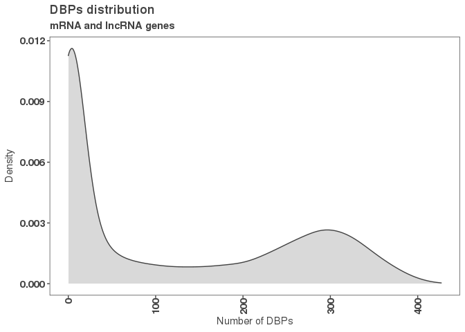
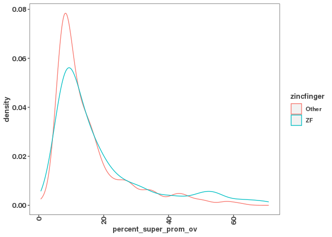
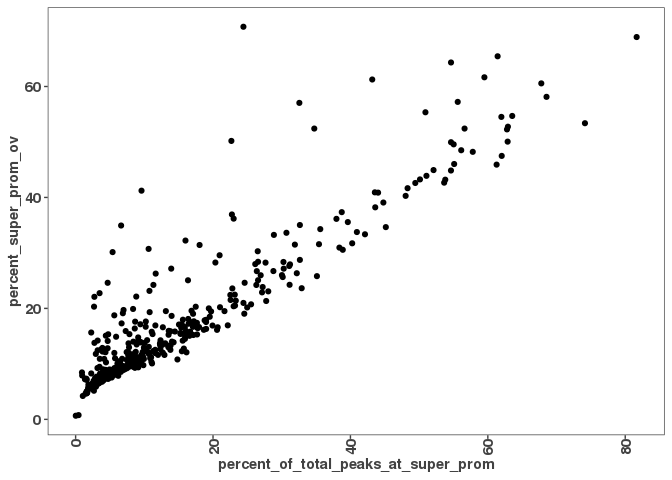

Load Filtered Consensus Peaks, Promoter Regions, & Gene Body
============================================================

``` r
filtered_consensus_peaks_files <- list.files("/scratch/Shares/rinnclass/tardigrades/CLASS_2021/analysis/00_consensus_peaks/results/filtered_consensus", 
                                             pattern = "*.bed",
                                             full.names = TRUE)

filtered_consensus_peaks <- lapply(filtered_consensus_peaks_files, rtracklayer::import)

names(filtered_consensus_peaks) <- gsub("/scratch/Shares/rinnclass/tardigrades/CLASS_2021/analysis/00_consensus_peaks/results/filtered_consensus/|_filtered_consensus_peaks.bed", "", filtered_consensus_peaks_files)

# Import annotations
lncrna_mrna_promoters <- rtracklayer::import("/scratch/Shares/rinnclass/tardigrades/CLASS_2021/analysis/00_consensus_peaks/results/promoters/lncrna_mrna_promoters.gtf")
lncrna_mrna_genebody <- rtracklayer::import("/scratch/Shares/rinnclass/tardigrades/CLASS_2021/analysis/00_consensus_peaks/results/genebody/lncrna_mrna_genebody.gtf")

lncrna_gene_ids <- lncrna_mrna_genebody$gene_id[lncrna_mrna_genebody$gene_type == "lncRNA"]
mrna_gene_ids <- lncrna_mrna_genebody$gene_id[lncrna_mrna_genebody$gene_type == "protein_coding"]
```

Make Data Frame: DBP, Number of Genes Bound, and Peak Length
============================================================

``` r
num_peaks_df <- data.frame("dbp" = names(filtered_consensus_peaks),
                           "num_peaks" = sapply(filtered_consensus_peaks, length))


#get peak lengths for each dbp
num_peaks_df$total_peak_length <- sapply(filtered_consensus_peaks, function(x) sum(width(x)))
```

Generate Promoter Peak Counts & Overlapping Promoters
=====================================================

``` r
promoter_peak_counts <- count_peaks_per_feature(lncrna_mrna_promoters, filtered_consensus_peaks, type = "counts")

num_peaks_df$peaks_overlapping_promoters <- rowSums(promoter_peak_counts)

num_peaks_df$peaks_overlapping_lncrna_promoters <- rowSums(promoter_peak_counts[,lncrna_gene_ids])

num_peaks_df$peaks_overlapping_mrna_promoters <- rowSums(promoter_peak_counts[,mrna_gene_ids])
```

Generate Gene Body Peak Counts
==============================

``` r
genebody_peak_counts <- count_peaks_per_feature(lncrna_mrna_genebody, 
                                                filtered_consensus_peaks, 
                                                type = "counts")

num_peaks_df$peaks_overlapping_genebody <- rowSums(genebody_peak_counts)
num_peaks_df$peaks_overlapping_lncrna_genebody <- rowSums(genebody_peak_counts[,lncrna_gene_ids])
num_peaks_df$peaks_overlapping_mrna_genebody <- rowSums(genebody_peak_counts[,mrna_gene_ids])

#The counts produced here are not directly used in the pipeline, however, this data is useful for other analysis.
```

Merge with Human TF Database
============================

``` r
# The human TFs
# https://www.cell.com/cms/10.1016/j.cell.2018.01.029/attachment/ede37821-fd6f-41b7-9a0e-9d5410855ae6/mmc2.xlsx

human_tfs <- readxl::read_excel("/scratch/Shares/rinnclass/data/mmc2.xlsx",
                                sheet = 2, skip = 1)
```

    ## Warning in read_fun(path = enc2native(normalizePath(path)), sheet_i = sheet, : Expecting logical in M1006 / R1006C13: got
    ## 'Contains a SANT and multiple DNA-binding C2H2 domains. Motif is 99% AA ID from mouse (Transfac).'

    ## Warning in read_fun(path = enc2native(normalizePath(path)), sheet_i = sheet, : Expecting logical in M1021 / R1021C13: got 'Close
    ## ortholog (PP1RA) binds to mRNA; single-stranded DNA (ssDNA); poly(A) and poly(G) homopolymers (Uniprot)'

    ## Warning in read_fun(path = enc2native(normalizePath(path)), sheet_i = sheet, : Expecting logical in M1542 / R1542C13: got
    ## 'Contains 1 SANT domain'

    ## Warning in read_fun(path = enc2native(normalizePath(path)), sheet_i = sheet, : Expecting logical in M1543 / R1543C13: got
    ## 'Contains 2 Myb DBDs. Sources of Hocomoco/Transfac motifs are unclear. However these sequences look similar to in vitro sites
    ## selected by SELEX (PMID:11082045)'

    ## Warning in read_fun(path = enc2native(normalizePath(path)), sheet_i = sheet, : Expecting logical in M1544 / R1544C13: got
    ## 'Although CHD2 has weak similarity to a Myb domain (PMID:9326634), it's more closely related to the non-DNA-binding SANT domain
    ## based on our alignment analysis. The data showing that show that CHD2 binding histone H3.3 (PMID:22569126) further support the
    ## conclusion that the Myb domain is probably a SANT domain facilitating the histone interaction'

    ## Warning in read_fun(path = enc2native(normalizePath(path)), sheet_i = sheet, : Expecting logical in M1545 / R1545C13: got
    ## 'Contains a single SANT domain, no evidence for sequence-specific DNA binding'

    ## Warning in read_fun(path = enc2native(normalizePath(path)), sheet_i = sheet, : Expecting logical in M1546 / R1546C13: got
    ## 'Contains 2 Myb DBDs'

    ## Warning in read_fun(path = enc2native(normalizePath(path)), sheet_i = sheet, : Expecting logical in M1547 / R1547C13: got
    ## 'Contains 2 SANT domains, and no other putative DNA-binding domains'

    ## Warning in read_fun(path = enc2native(normalizePath(path)), sheet_i = sheet, : Expecting logical in M1548 / R1548C13: got
    ## 'Contains 2 SANT domains, and no other putative DNA-binding domains'

    ## Warning in read_fun(path = enc2native(normalizePath(path)), sheet_i = sheet, : Expecting logical in M1549 / R1549C13: got
    ## 'Contains a single SANT domain, no evidence for sequence-specific DNA binding'

    ## Warning in read_fun(path = enc2native(normalizePath(path)), sheet_i = sheet, : Expecting logical in M1550 / R1550C13: got 'Domain
    ## is truncated, and there is nothing known about this gene'

    ## Warning in read_fun(path = enc2native(normalizePath(path)), sheet_i = sheet, : Expecting logical in M1551 / R1551C13: got
    ## 'Contains a single SANT domain, no evidence for sequence-specific DNA binding'

    ## Warning in read_fun(path = enc2native(normalizePath(path)), sheet_i = sheet, : Expecting logical in M1552 / R1552C13: got
    ## 'MIER2's Myb domain is more similar to the non-DNA-binding SANT domain'

    ## Warning in read_fun(path = enc2native(normalizePath(path)), sheet_i = sheet, : Expecting logical in M1553 / R1553C13: got
    ## 'MIER3's Myb domain is more similar to the non-DNA-binding SANT domain'

    ## Warning in read_fun(path = enc2native(normalizePath(path)), sheet_i = sheet, : Expecting logical in M1554 / R1554C13: got
    ## 'Contains 1 SANT domain, and a SANTA domain'

    ## Warning in read_fun(path = enc2native(normalizePath(path)), sheet_i = sheet, : Expecting logical in M1555 / R1555C13: got
    ## 'Contains a single Myb-like domain with an insertion in the middle. It is ambiguous whether Myb-like domains are DNA or protein
    ## binding. Since it has a single domain it's likely non-specific, but future experiments should be performed to assay it's
    ## specificity'

    ## Warning in read_fun(path = enc2native(normalizePath(path)), sheet_i = sheet, : Expecting logical in M1556 / R1556C13: got
    ## 'Contains 3 Myb DBDs'

    ## Warning in read_fun(path = enc2native(normalizePath(path)), sheet_i = sheet, : Expecting logical in M1557 / R1557C13: got
    ## 'Contains 3 Myb DBDs'

    ## Warning in read_fun(path = enc2native(normalizePath(path)), sheet_i = sheet, : Expecting logical in M1558 / R1558C13: got
    ## 'Contains 3 Myb DBDs'

    ## Warning in read_fun(path = enc2native(normalizePath(path)), sheet_i = sheet, : Expecting logical in M1559 / R1559C13: got
    ## 'Contains a single Myb-like domain. Mouse ortholog has motif'

    ## Warning in read_fun(path = enc2native(normalizePath(path)), sheet_i = sheet, : Expecting logical in M1560 / R1560C13: got
    ## 'MYSM1 has been shown to bind DNA ? interaction with DNA requires the MYSM1 Myb but not the SWIRM domain (PMID:17428495). Domain
    ## sequence alignment places it near DNA-binding Myb domains but scores slightly higher as a SANT rather than Myb domain based
    ## on Prosite patterns. Given that most Myb proteins that bind DNA sequence specifically have multiple Myb domains in an array
    ## this protein could bind DNA sequence non-specifically with it?s single Myb domain. Future experiments should assay MYSM1?s
    ## specificity'

    ## Warning in read_fun(path = enc2native(normalizePath(path)), sheet_i = sheet, : Expecting logical in M1561 / R1561C13: got
    ## 'Contains 2 SANT domains, and no other putative DNA-binding domains'

    ## Warning in read_fun(path = enc2native(normalizePath(path)), sheet_i = sheet, : Expecting logical in M1562 / R1562C13: got
    ## 'Contains 2 SANT domains, and no other putative DNA-binding domains'

    ## Warning in read_fun(path = enc2native(normalizePath(path)), sheet_i = sheet, : Expecting logical in M1564 / R1564C13: got
    ## 'Contains 2 SANT domains, and no other putative DNA-binding domains'

    ## Warning in read_fun(path = enc2native(normalizePath(path)), sheet_i = sheet, : Expecting logical in M1565 / R1565C13: got
    ## 'Contains 2 SANT domains, and no other putative DNA-binding domains'

    ## Warning in read_fun(path = enc2native(normalizePath(path)), sheet_i = sheet, : Expecting logical in M1566 / R1566C13: got
    ## 'Contains 2 SANT domains, and no other putative DNA-binding domains. RCOR3 SANT domains are known to facilitate PPIs'

    ## Warning in read_fun(path = enc2native(normalizePath(path)), sheet_i = sheet, : Expecting logical in M1567 / R1567C13: got
    ## 'SMARCA1 contains a truncated Myb-like and SANT domain. Given the presence of the Myb-like domain, and other domains known to
    ## associated with DNA (DEAD box helicase) it likely associates with DNA non-sequence-specifically'

    ## Warning in read_fun(path = enc2native(normalizePath(path)), sheet_i = sheet, : Expecting logical in M1568 / R1568C13: got
    ## 'Contains a SANT, and Myb-like domain'

    ## Warning in read_fun(path = enc2native(normalizePath(path)), sheet_i = sheet, : Expecting logical in M1569 / R1569C13: got
    ## 'Contains 1 SANT domain, and no other putative DNA-binding domains. Motif logos look like bZIP dimeric binding sites, and are
    ## thus likely specificifities of SMARCC1 interactors'

    ## Warning in read_fun(path = enc2native(normalizePath(path)), sheet_i = sheet, : Expecting logical in M1570 / R1570C13: got
    ## 'Contains 1 SANT domain, and no other putative DNA-binding domains. Motif logos ares likely specificifities of SMARCC2
    ## interactors'

    ## Warning in read_fun(path = enc2native(normalizePath(path)), sheet_i = sheet, : Expecting logical in M1571 / R1571C13: got
    ## 'Contains only Myb DBDs'

    ## Warning in read_fun(path = enc2native(normalizePath(path)), sheet_i = sheet, : Expecting logical in M1572 / R1572C13: got
    ## 'Contains 1 SANT domain'

    ## Warning in read_fun(path = enc2native(normalizePath(path)), sheet_i = sheet, : Expecting logical in M1573 / R1573C13: got 'TADA2B
    ## contains a single SANT domain and is thus unlikely to bind DNA'

    ## Warning in read_fun(path = enc2native(normalizePath(path)), sheet_i = sheet, : Expecting logical in M1574 / R1574C13: got
    ## 'Contains a single Myb domain (with slightly less simialrity to a SANT domain.) This domain has been shown to be involved in PPIs
    ## but this may not be mutually exclusive with DNA-binding. The sequence-specificity of CCDC79 should be investigated in the future'

    ## Warning in read_fun(path = enc2native(normalizePath(path)), sheet_i = sheet, : Expecting logical in M1575 / R1575C13: got
    ## 'Contains 1 Myb domain, and has structural evidence of DNA-binding'

    ## Warning in read_fun(path = enc2native(normalizePath(path)), sheet_i = sheet, : Expecting logical in M1576 / R1576C13: got 'Motif
    ## is inferred from mouse (92% DBD AA ID)'

    ## Warning in read_fun(path = enc2native(normalizePath(path)), sheet_i = sheet, : Expecting logical in M1577 / R1577C13: got
    ## 'TERF2IP contains a single Myb-like domain. While it's unclear if TERF2IP (Human Rap1) contacts DNA directly it has been shown to
    ## affect the DNA binding activity of TRF2'

    ## Warning in read_fun(path = enc2native(normalizePath(path)), sheet_i = sheet, : Expecting logical in M1578 / R1578C13: got 'This
    ## protein contains Myb, and Myb-like domains and is annotated as a Pol1 terminator. TTF1 DNA-binding has been demonstrated in vitro
    ## (PMID: 7597036), but it's specificity has not been determined'

    ## Warning in read_fun(path = enc2native(normalizePath(path)), sheet_i = sheet, : Expecting logical in M1579 / R1579C13: got
    ## 'Contains 1 Myb DBD'

    ## Warning in read_fun(path = enc2native(normalizePath(path)), sheet_i = sheet, : Expecting logical in M1580 / R1580C13: got
    ## 'Contains a GATA and SANT domain. Unclear whether the GATA domain is a bona fide DBD as the MTA/RERE family domains are atypical
    ## to human GATA domains (see alignment). In CIS-BP there is one protein from C.elegans that shares domain homology and binds a
    ## GATA motif (elg-27, ChIP-seq). The GATA ZnF domain of MTA1 is required for it's interaction with RBBP4 and RBBP7 (PMID:18067919).
    ## Full-length protein has been tried in HT-SELEX and did not yield a motif'

    ## Warning in read_fun(path = enc2native(normalizePath(path)), sheet_i = sheet, : Expecting logical in M1581 / R1581C13: got
    ## 'Contains a GATA and SANT domain. Unclear whether the GATA domain is a bona fide DBD as the MTA/RERE family domains are atypical
    ## to human GATA domains (see alignment). In CIS-BP there is one protein from C.elegans that shares domain homology and binds a GATA
    ## motif (elg-27, ChIP-seq). Full-length protein has been tried in HT-SELEX, and DBD has been tried on PBM - neither yielded motifs'

    ## Warning in read_fun(path = enc2native(normalizePath(path)), sheet_i = sheet, : Expecting logical in M1582 / R1582C13: got
    ## 'Contains a GATA and SANT domain. Unclear whether the GATA domain is a bona fide DBD as the MTA/RERE family domains are atypical
    ## to human GATA domains (see alignment). In CIS-BP there is one protein from C.elegans that shares domain homology and binds a GATA
    ## motif (elg-27, ChIP-seq). Hasn't been tried in any in vitro assays'

    ## Warning in read_fun(path = enc2native(normalizePath(path)), sheet_i = sheet, : Expecting logical in M1583 / R1583C13: got
    ## 'Contains a GATA and SANT domain. Unclear whether the GATA domain is a bona fide DBD as the MTA/RERE family domains are atypical
    ## to human GATA domains (see alignment). In CIS-BP there is one protein from C.elegans that shares domain homology and binds a GATA
    ## motif (elg-27, ChIP-seq). Has been tried as a DBD in HT-SELEX but did not yield a motif'

    ## Warning in read_fun(path = enc2native(normalizePath(path)), sheet_i = sheet, : Expecting logical in M1791 / R1791C13: got 'CNOT3
    ## is a part of the CCR4-NOT complex involved in mRNA decay'

    ## Warning in read_fun(path = enc2native(normalizePath(path)), sheet_i = sheet, : Expecting logical in M1932 / R1932C13: got
    ## '"Prosite identifies a low-confidence Myb-like domain (e.g. can?t decide between Myb and SANT) so it?s probably not a TF"'

    ## New names:
    ## * `` -> ...4

``` r
names(human_tfs)[4] <- "is_tf"

length(which(tolower(num_peaks_df$dbp) %in% tolower(human_tfs$Name)))
```

    ## [1] 438

``` r
human_tfs <- human_tfs[tolower(human_tfs$Name) %in% tolower(num_peaks_df$dbp), 1:4]
names(human_tfs) <- c("ensembl_id",
                      "dbp",
                      "dbd",
                      "tf")

num_peaks_df <- merge(num_peaks_df, human_tfs, all.x = T)

# Let's check how many NAs -- we should have some missing values.

write_csv(num_peaks_df, "/scratch/Shares/rinnclass/tardigrades/CLASS_2021/analysis/01_global_peak_properties/results/num_peaks_df.csv")
```

Generate Promoter Peak Occurence Data Frame
===========================================

``` r
promoter_peak_occurence <- count_peaks_per_feature(lncrna_mrna_promoters, filtered_consensus_peaks, 
                                               type = "occurrence")
# Output to promoter_peak_occurence_matrix
write.table(promoter_peak_occurence, "/scratch/Shares/rinnclass/tardigrades/CLASS_2021/analysis/01_global_peak_properties/results/lncrna_mrna_promoter_peak_occurence_matrix.tsv")


# First make sure promoter_peak_occurence and lncrna_mrna_promoters are in the same order
stopifnot(all(colnames(promoter_peak_occurence) == lncrna_mrna_promoters$gene_id))


# We are going to use the promoter peak occurence matrix above to keep adding onto in future files.

peak_occurence_df <- data.frame("gene_id" = colnames(promoter_peak_occurence),
                                "gene_name" = lncrna_mrna_promoters$gene_name,
                                "gene_type" = lncrna_mrna_promoters$gene_type,
                                #"gene_length" = 
                                "chr" = lncrna_mrna_promoters@seqnames,   
                                "3kb_up_tss_start" = lncrna_mrna_promoters@ranges@start,
                                "strand" = lncrna_mrna_promoters@strand,
                                "number_of_dbp" = colSums(promoter_peak_occurence))

write_csv(peak_occurence_df, "/scratch/Shares/rinnclass/tardigrades/CLASS_2021/analysis/01_global_peak_properties/results/peak_occurence_dataframe.csv")
```

Find unbound promoters
======================

``` r
unbound_promoters <- peak_occurence_df %>% filter(peak_occurence_df$number_of_dbp < 1)

summary(unbound_promoters)
```

    ##                      gene_id          gene_name             gene_type         chr       X3kb_up_tss_start   strand  
    ##  ENSG00000000005.6       :   1   AJ271736.1:   2   lncRNA        :4047   chr1   : 556   Min.   :     8103   +:3405  
    ##  ENSG00000001626.15      :   1   AKAP17A   :   2   protein_coding:2673   chrX   : 444   1st Qu.: 24336363   -:3315  
    ##  ENSG00000002586.20      :   1   AL672277.1:   2                         chr8   : 418   Median : 56646484   *:   0  
    ##  ENSG00000002586.20_PAR_Y:   1   AL683807.1:   2                         chr11  : 417   Mean   : 72064768           
    ##  ENSG00000004846.16      :   1   AL683807.2:   2                         chr6   : 414   3rd Qu.:111176700           
    ##  ENSG00000005001.10      :   1   AL732314.4:   2                         chr5   : 384   Max.   :248679329           
    ##  (Other)                 :6714   (Other)   :6708                         (Other):4087                               
    ##  number_of_dbp
    ##  Min.   :0    
    ##  1st Qu.:0    
    ##  Median :0    
    ##  Mean   :0    
    ##  3rd Qu.:0    
    ##  Max.   :0    
    ## 

``` r
# here is just a simple index and filter of the index to have at least 1 dbp bound.
#There are no unbound promoters.
```

Find DBPs with no overlaps with promoter
========================================

``` r
dbp_promoter_ovl <- get_overlapping_peaks(lncrna_mrna_promoters, filtered_consensus_peaks)

head(dbp_promoter_ovl)
```

    ## $ADNP
    ## GRanges object with 2407 ranges and 2 metadata columns:
    ##          seqnames              ranges strand |        name     score
    ##             <Rle>           <IRanges>  <Rle> | <character> <numeric>
    ##      [1]     chr1       960458-960724      * |      ADNP_1         0
    ##      [2]     chr1     1018937-1019479      * |      ADNP_2         0
    ##      [3]     chr1     1058021-1058566      * |      ADNP_3         0
    ##      [4]     chr1     1281813-1282298      * |      ADNP_5         0
    ##      [5]     chr1     1375174-1376189      * |      ADNP_8         0
    ##      ...      ...                 ...    ... .         ...       ...
    ##   [2403]     chrX 129540803-129541112      * |   ADNP_6101         0
    ##   [2404]     chrX 135972996-135973237      * |   ADNP_6105         0
    ##   [2405]     chrX 150566052-150566589      * |   ADNP_6106         0
    ##   [2406]     chrX 150567666-150567967      * |   ADNP_6107         0
    ##   [2407]     chrX 153763739-153764324      * |   ADNP_6109         0
    ##   -------
    ##   seqinfo: 24 sequences from an unspecified genome; no seqlengths
    ## 
    ## $AFF4
    ## GRanges object with 9329 ranges and 2 metadata columns:
    ##          seqnames            ranges strand |        name     score
    ##             <Rle>         <IRanges>  <Rle> | <character> <numeric>
    ##      [1]     chr1     826703-827786      * |      AFF4_1         0
    ##      [2]     chr1     904629-904887      * |      AFF4_2         0
    ##      [3]     chr1     958743-959507      * |      AFF4_3         0
    ##      [4]     chr1     966147-966700      * |      AFF4_4         0
    ##      [5]     chr1   1000025-1001270      * |      AFF4_5         0
    ##      ...      ...               ...    ... .         ...       ...
    ##   [9325]     chrY   2841472-2841966      * |  AFF4_16576         0
    ##   [9326]     chrY   2934790-2935156      * |  AFF4_16577         0
    ##   [9327]     chrY   2935307-2936203      * |  AFF4_16578         0
    ##   [9328]     chrY 12904821-12905244      * |  AFF4_16579         0
    ##   [9329]     chrY 19744372-19744984      * |  AFF4_16581         0
    ##   -------
    ##   seqinfo: 25 sequences from an unspecified genome; no seqlengths
    ## 
    ## $AHDC1
    ## GRanges object with 3867 ranges and 2 metadata columns:
    ##          seqnames              ranges strand |        name     score
    ##             <Rle>           <IRanges>  <Rle> | <character> <numeric>
    ##      [1]     chr1       827353-827821      * |     AHDC1_1         0
    ##      [2]     chr1     1000042-1001320      * |     AHDC1_2         0
    ##      [3]     chr1     1273686-1274388      * |     AHDC1_4         0
    ##      [4]     chr1     1400872-1401173      * |     AHDC1_6         0
    ##      [5]     chr1     1433102-1433590      * |     AHDC1_8         0
    ##      ...      ...                 ...    ... .         ...       ...
    ##   [3863]     chrX 153684535-153685541      * | AHDC1_13400         0
    ##   [3864]     chrX 153686418-153686938      * | AHDC1_13401         0
    ##   [3865]     chrX 154546750-154547757      * | AHDC1_13404         0
    ##   [3866]     chrX 155026517-155027249      * | AHDC1_13406         0
    ##   [3867]     chrY     7273587-7274503      * | AHDC1_13410         0
    ##   -------
    ##   seqinfo: 24 sequences from an unspecified genome; no seqlengths
    ## 
    ## $AHR
    ## GRanges object with 11986 ranges and 2 metadata columns:
    ##           seqnames            ranges strand |        name     score
    ##              <Rle>         <IRanges>  <Rle> | <character> <numeric>
    ##       [1]     chr1     826665-827821      * |       AHR_1         0
    ##       [2]     chr1     903676-908370      * |       AHR_2         0
    ##       [3]     chr1     910708-929500      * |       AHR_3         0
    ##       [4]     chr1     955817-964463      * |       AHR_4         0
    ##       [5]     chr1     964970-969958      * |       AHR_5         0
    ##       ...      ...               ...    ... .         ...       ...
    ##   [11982]     chrY   2934820-2936253      * |   AHR_25226         0
    ##   [11983]     chrY   7272327-7273059      * |   AHR_25227         0
    ##   [11984]     chrY 12904073-12905846      * |   AHR_25229         0
    ##   [11985]     chrY 13703599-13703962      * |   AHR_25230         0
    ##   [11986]     chrY 19744433-19744844      * |   AHR_25232         0
    ##   -------
    ##   seqinfo: 25 sequences from an unspecified genome; no seqlengths
    ## 
    ## $AKAP8
    ## GRanges object with 14621 ranges and 2 metadata columns:
    ##           seqnames            ranges strand |        name     score
    ##              <Rle>         <IRanges>  <Rle> | <character> <numeric>
    ##       [1]     chr1     823323-823638      * |     AKAP8_2         0
    ##       [2]     chr1     826661-827815      * |     AKAP8_3         0
    ##       [3]     chr1     828950-829674      * |     AKAP8_4         0
    ##       [4]     chr1     903769-905248      * |     AKAP8_8         0
    ##       [5]     chr1     923574-923983      * |     AKAP8_9         0
    ##       ...      ...               ...    ... .         ...       ...
    ##   [14617]     chrY   2934882-2936379      * | AKAP8_35571         0
    ##   [14618]     chrY   7273777-7274191      * | AKAP8_35572         0
    ##   [14619]     chrY 12662984-12663529      * | AKAP8_35573         0
    ##   [14620]     chrY 14524328-14525043      * | AKAP8_35574         0
    ##   [14621]     chrY 19744359-19744835      * | AKAP8_35576         0
    ##   -------
    ##   seqinfo: 24 sequences from an unspecified genome; no seqlengths
    ## 
    ## $AKNA
    ## GRanges object with 401 ranges and 2 metadata columns:
    ##         seqnames              ranges strand |        name     score
    ##            <Rle>           <IRanges>  <Rle> | <character> <numeric>
    ##     [1]     chr1     6245145-6245362      * |      AKNA_3         0
    ##     [2]     chr1     6701794-6702119      * |      AKNA_4         0
    ##     [3]     chr1     8878535-8879249      * |      AKNA_5         0
    ##     [4]     chr1     9943030-9943613      * |      AKNA_6         0
    ##     [5]     chr1   10210107-10210572      * |      AKNA_7         0
    ##     ...      ...                 ...    ... .         ...       ...
    ##   [397]     chrM             97-1017      * |    AKNA_595         0
    ##   [398]     chrM         16030-16507      * |    AKNA_596         0
    ##   [399]     chrX   49200029-49200402      * |    AKNA_597         0
    ##   [400]     chrX 130268769-130269100      * |    AKNA_598         0
    ##   [401]     chrY     2934987-2935780      * |    AKNA_600         0
    ##   -------
    ##   seqinfo: 25 sequences from an unspecified genome; no seqlengths

``` r
num_ovl <- sapply(dbp_promoter_ovl, length)
min(num_ovl)
```

    ## [1] 54

``` r
summary(num_ovl)
```

    ##    Min. 1st Qu.  Median    Mean 3rd Qu.    Max. 
    ##      54    3496    7996    8503   13188   27671

Plot peak\_occurence\_df
========================

``` r
g <- ggplot(peak_occurence_df, aes(x = number_of_dbp))

#AES layer will know to make a histogram since there is only one set of values for x.
g + geom_density(alpha = 0.2, color = "#424242", fill = "#424242") +
  xlab(expression("Number of DBPs")) +
  ylab(expression("Density")) +
  ggtitle("DBPs distribution",
          subtitle = "mRNA and lncRNA genes") 
```



``` r
ggsave("/scratch/Shares/rinnclass/tardigrades/CLASS_2021/analysis/01_global_peak_properties/figures/DBPs_distribution.png", height = 5, width = 8)
```

Find super promoter
===================

Here we are defining super promoters as promoters that bind more than 350 different DBPs.
-----------------------------------------------------------------------------------------

``` r
super_promoter <- promoter_peak_occurence[, colSums(promoter_peak_occurence) > 350]

super_promoter_dbps <- data.frame(dbp = rownames(super_promoter), num_super_promoter_overlaps = rowSums(super_promoter))

super_promoter_features <- merge(super_promoter_dbps, num_peaks_df)

super_promoter_features <- dplyr::select(super_promoter_features, dbp, num_super_promoter_overlaps, everything() )

super_promoter_features <- super_promoter_features %>%
  mutate(percent_super_prom_ov = num_super_promoter_overlaps/peaks_overlapping_promoters * 100, 
         percent_of_total_peaks_at_super_prom = num_super_promoter_overlaps/num_peaks * 100,
         zincfinger = ifelse(grepl(" ZF",dbd), "ZF", "Other"))

table(super_promoter_features$zincfinger)
```

    ## 
    ## Other    ZF 
    ##   261   199

``` r
ggplot(super_promoter_features, aes(x = percent_super_prom_ov, color = zincfinger)) +
  geom_density()
```



``` r
ggplot(super_promoter_features, aes(x = percent_of_total_peaks_at_super_prom, y = percent_super_prom_ov)) + 
  geom_point()
```



``` r
write.csv(super_promoter_features, "/scratch/Shares/rinnclass/tardigrades/CLASS_2021/analysis/01_global_peak_properties/results/super_promoter_features.csv")
```
