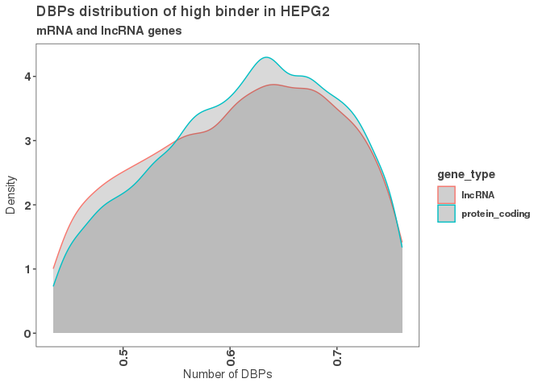
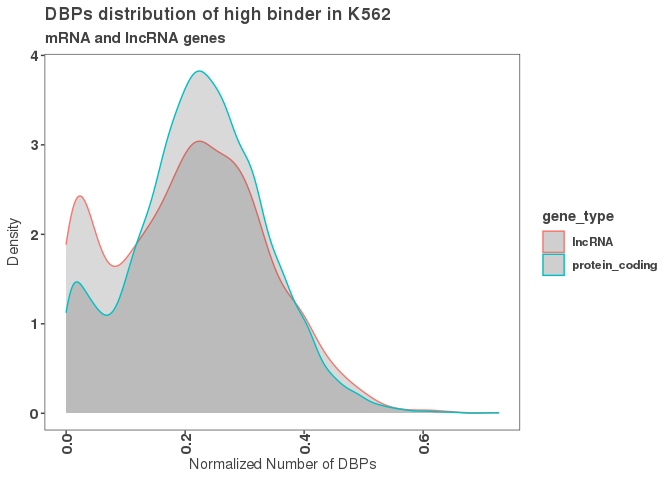

1) Normalizing the number of DBPs bound between K562 and HEPG2.
===============================================================

``` r
#First, we are going to retrieve the peak occurrence data from K562 cells (2020 class data) and HEPG2 cells (2021 class data).
K562_df <- read.csv(file = '/scratch/Shares/rinnclass/data/2020_peak_occurence_df.csv')
HEPG2_df <- read.csv(file = '~/CLASS/Justin/CLASS_2021/analysis/01_global_peak_properties/results/peak_occurence_dataframe.csv')
K562_occ_matrix <- read.csv(file = '/scratch/Shares/rinnclass/data/dbp_promoter_binding_table.csv')

#Next, we want to normalize the number of DBPs bound to promoters between the two cell lines so that we can accurately compare the two. This will be added to each dataframe.
K562_df <- K562_df %>%
  mutate(num_dbp_norm_K562 = number_of_dbp/length(K562_occ_matrix$dbp))

HEPG2_df <- HEPG2_df %>%
  mutate(num_dbp_norm_HEPG2 = number_of_dbp/nrow(promoter_peak_occurence))
```

2) Identifying promoters that bind a high number of DBPs and promoters that are reservoirs.
===========================================================================================

``` r
#Now that we can compare the number of DBPs bound in K562 vs. HEPG2 cells, we want to know which promoters are being bound by the highest number of DBPs. Those greater than 350 DBPs bound, we'll call high binders.
high_binder_df <- HEPG2_df[HEPG2_df$number_of_dbp >= 200&HEPG2_df$number_of_dbp <= 350,]
high_K562_df <- K562_df[K562_df$gene_id %in% high_binder_df$gene_id,]
```

3) Plotting the normalized number of DBPs bound to high-promoters (200~350).
============================================================================

``` r
#We'll plot the distribution of high binding promoters.
g <- ggplot(high_binder_df, aes(x = num_dbp_norm_HEPG2, color = gene_type))

#AES layer will know to make a histogram since there is only one set of values for x.
g + geom_density(alpha = 0.2,  fill = "#424242") +
  xlab(expression("Number of DBPs")) +
  ylab(expression("Density")) +
  ggtitle("DBPs distribution of high binder in HEPG2",
          subtitle = "mRNA and lncRNA genes") 
```



``` r
ggsave("/scratch/Shares/rinnclass/tardigrades/CLASS_2021/analysis/02_content_of_peaks_per_promoter/figures/Distribution_high_genes_num_dbp_HEPG2.png", height = 5, width = 8)

g <- ggplot(high_K562_df, aes(x = num_dbp_norm_K562, color = gene_type))

#AES layer will know to make a histogram since there is only one set of values for x.
g + geom_density(alpha = 0.2,  fill = "#424242") +
  xlab(expression("Normalized Number of DBPs")) +
  ylab(expression("Density")) +
  ggtitle("DBPs distribution of high binder in K562",
          subtitle = "mRNA and lncRNA genes") 
```



``` r
ggsave("/scratch/Shares/rinnclass/tardigrades/CLASS_2021/analysis/02_content_of_peaks_per_promoter/figures/Distribution_high_genes_num_dbp_K562.png", height = 5, width = 8)
```
