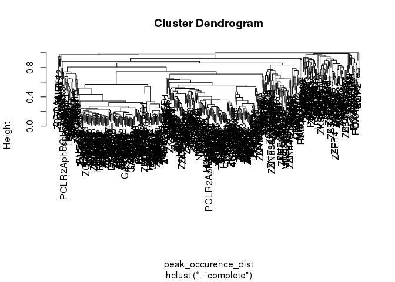
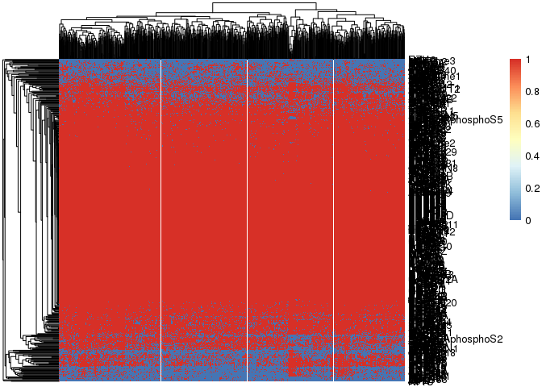

Import dataframe and generate a clustering dendrogram of DBPs.
==============================================================

``` r
peak_occurence_matrix <- read.table("/scratch/Shares/rinnclass/tardigrades/CLASS_2021/analysis/01_global_peak_properties/results/lncrna_mrna_promoter_peak_occurence_matrix.tsv")

peak_occurence_matrix <- peak_occurence_matrix[rowSums(peak_occurence_matrix) > 350, ]

peak_occurence_dist <- dist(peak_occurence_matrix, method = "binary")


# Hierarchical clustering with binary distance measure
bin_hier <- hclust(peak_occurence_dist, method = "complete")

plot(bin_hier)
```



``` r
# To make this bigger, we can plot it as a pdf
pdf("/scratch/Shares/rinnclass/tardigrades/CLASS_2021/analysis/03_global_clustering/figures/dbp_hclust_dendro.pdf", height = 12, width = 70)
plot(bin_hier)
dev.off()
```

    ## RStudioGD 
    ##         2

Generate a heatmap of DBPs that bind super promoters.
=====================================================

``` r
# We'll start with the promoter peak occurrence and filter down to just those that have high numbers of dbps
super_promoter_features <- read.csv("/scratch/Shares/rinnclass/tardigrades/CLASS_2021/analysis/01_global_peak_properties/results/super_promoter_features.csv")

high_binders <- peak_occurence_matrix[,colSums(peak_occurence_matrix) > 350]
min(rowSums(high_binders))
```

    ## [1] 8

``` r
library(pheatmap)

# We don't need to be able to read the promoter names and it takes a long time to plot those.
sup_heatmap <- pheatmap(high_binders, show_colnames = FALSE, clustering_distance_rows = "binary", clustering_distance_cols = "binary")

save_pheatmap_pdf <- function(x, filename, width=100, height=100) {
   stopifnot(!missing(x))
   stopifnot(!missing(filename))
   pdf(filename, width=width, height=height)
   grid::grid.newpage()
   grid::grid.draw(x$gtable)
   dev.off()
}
```



``` r
save_pheatmap_pdf(sup_heatmap, "/scratch/Shares/rinnclass/tardigrades/CLASS_2021/analysis/03_global_clustering/figures/test.pdf")
```

    ## RStudioGD 
    ##         2
