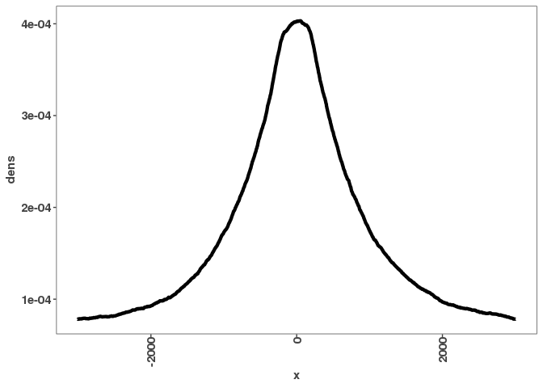

TSS profile plots
=================

Import the data
---------------

-   consensus peaks
-   Gencode gene annotations

``` r
gencode_gr <- rtracklayer::import("/Shares/rinn_class/data/genomes/human/gencode/v32/gencode.v32.annotation.gtf")

data_path <- "/scratch/Shares/rinnclass/tardigrades/CLASS_2021/analysis/"
consensus_peaks <- import_peaks(file.path(data_path, "00_consensus_peaks/results/filtered_consensus"))
```

Step 1: Create promoter windows
-------------------------------

We're going to create a GRanges object that contains 6kb promoter windows for each gene in the Gencode annotation. First we'll need to filter the Gencode GRanges object to just the genes and then we can use the promoter function from GRanges that will allow us to specify how big of a window we want upstream and downstream of the TSS (you can have asymmetrical windows).

``` r
# The gencode annotation contains an entry for each exon, transcript, etc.
# Use table(gencode_gr$type) to see how many of each entry there are. 
# We don't want to create a "promoter" window around each exon for example
# which is why we need to filter to just the genes.
genes <- gencode_gr[gencode_gr$type == "gene"]
# This function is a convenience function built into GenomicRanges
all_promoters_gr <- promoters(genes, upstream = 3e3, downstream = 3e3)
table(width(all_promoters_gr))
```

    ## 
    ##  6000 
    ## 60609

Step 2: Transform peaks into a coverage object
----------------------------------------------

In order to calculate what the peak coverage across each promoter is we'll convert the peaks GRanges object which currently holds a range for each peak into a run-length encoded list where 0 represents the genomic coordinates where there is no peak present and 1 represents the locations where a peak is present. The reason for run length encoding is that storing this vector without this compression means that we would be storing a numeric value for each of the 3.2 billion base pairs. This would mean allocating a vector in memory that's ~180 GB -- instead with run-length encoding we're in the ~100 KB range.

``` r
# We can use any binding protein here (use names(consensus_peaks) to see the available DBPs)
peak_coverage <- coverage(consensus_peaks[["POLR2A"]])
```

### Step 2.1: Some housekeeping to keep our chromosomes straight

This step will accomplish two things: filter out promoters that fall outside the bounds of our coverage vectors and filter out chromosomes that are not in common between the promoters object and the peak coverage object. The reason we need to do this is because the peaks may not extend to the end of each chromosome and therefore there is likely to be promoters that fall outside of the peak coverage vectors -- since we know that there are no peaks on those promoters and therefore they don't give us any extra information about where peaks are relative to promoters we'll filter them out. Also, it creates problems for the Views command that we'll use to subset the coverage vectors to just the promoter windows.

``` r
##### Filter promoters to bounds of peak coverage vectors

# This is the length of each run-length encoded vector in the peak_coverage object
# If the last peak on each chromosome falls near the end of that chromosome then
# these lengths will be approximately the length of the chromosomes.
coverage_length <- elementNROWS(peak_coverage)

# This will create a GRanges object where there is one range per chromosome
# and it is the width of the coverage vector -- we can use these ranges to 
# filter the promoters falling outside of these boundaries in the next step.
# Each DBP will be different here.
coverage_gr <- GRanges(seqnames = names(coverage_length),
                       IRanges(start = rep(1, length(coverage_length)), 
                               end = coverage_length))

# Okay, now we're all ready to filter out those promoters that fall beyond the bounds of the 
# coverage vector. 
all_promoters_gr <- subsetByOverlaps(all_promoters_gr, 
                                  coverage_gr, 
                                  type="within", 
                                  ignore.strand=TRUE)

##### Keep track of the chromosomes that are in common and filter/reorder to match

# This creates a vector of the chromosomes that are in common between the peak_coverage and promoters.
# Keeping track of this will fix a similar problem to the step above since this DBP may not
# bind on all chromosomes. 
chromosomes <- intersect(names(peak_coverage), unique(as.character(seqnames(all_promoters_gr))))
# We can also ensure they're in the same order and contain the same chromosomes
# by indexing with this vector
peak_coverage <- peak_coverage[chromosomes]
# In order to match the list format of the peak_coverage object
# we'll also coerce the GRanges object into an IntegerRangesList.
# If you recall, one of the main features of GRanges object is capturing
# the chromosome information -- when converting to an IRanges list, 
# each chromosome will be represented by a named element in the list.
all_promoters_ir <- as(all_promoters_gr, "IntegerRangesList")[chromosomes]
```

Step 3: Subset the peak coverage vector to just the promoter windows
--------------------------------------------------------------------

Here we'll use the Views function to mask the peak coverage object everywhere but in the windows of the promoters.

``` r
promoter_peak_view <- Views(peak_coverage, all_promoters_ir)
# Note that these are still in run-length encoding format.
promoter_peak_view
```

    ## RleViewsList object of length 24:
    ## $chr1
    ## Views on a 248839276-length Rle subject
    ## 
    ## views:
    ##            start       end width
    ##    [1]      8869     14868  6000 [0 0 0 0 0 0 0 0 0 0 0 0 0 0 0 0 0 0 0 0 0 0 0 0 0 0 0 0 0 0 0 0 0 0 0 0 0 0 0 0 0 0 0 0 0 0 0 0 0 0 0 0 0 0 0 0 0 0 0 0 ...]
    ##    [2]     26571     32570  6000 [0 0 0 0 0 0 0 0 0 0 0 0 0 0 0 0 0 0 0 0 0 0 0 0 0 0 0 0 0 0 0 0 0 0 0 0 0 0 0 0 0 0 0 0 0 0 0 0 0 0 0 0 0 0 0 0 0 0 0 0 ...]
    ##    [3]     14437     20436  6000 [0 0 0 0 0 0 0 0 0 0 0 0 0 0 0 0 0 0 0 0 0 0 0 0 0 0 0 0 0 0 0 0 0 0 0 0 0 0 0 0 0 0 0 0 0 0 0 0 0 0 0 0 0 0 0 0 0 0 0 0 ...]
    ##    [4]     26554     32553  6000 [0 0 0 0 0 0 0 0 0 0 0 0 0 0 0 0 0 0 0 0 0 0 0 0 0 0 0 0 0 0 0 0 0 0 0 0 0 0 0 0 0 0 0 0 0 0 0 0 0 0 0 0 0 0 0 0 0 0 0 0 ...]
    ##    [5]     27366     33365  6000 [0 0 0 0 0 0 0 0 0 0 0 0 0 0 0 0 0 0 0 0 0 0 0 0 0 0 0 0 0 0 0 0 0 0 0 0 0 0 0 0 0 0 0 0 0 0 0 0 0 0 0 0 0 0 0 0 0 0 0 0 ...]
    ##    [6]     33082     39081  6000 [0 0 0 0 0 0 0 0 0 0 0 0 0 0 0 0 0 0 0 0 0 0 0 0 0 0 0 0 0 0 0 0 0 0 0 0 0 0 0 0 0 0 0 0 0 0 0 0 0 0 0 0 0 0 0 0 0 0 0 0 ...]
    ##    [7]     49473     55472  6000 [0 0 0 0 0 0 0 0 0 0 0 0 0 0 0 0 0 0 0 0 0 0 0 0 0 0 0 0 0 0 0 0 0 0 0 0 0 0 0 0 0 0 0 0 0 0 0 0 0 0 0 0 0 0 0 0 0 0 0 0 ...]
    ##    [8]     54598     60597  6000 [0 0 0 0 0 0 0 0 0 0 0 0 0 0 0 0 0 0 0 0 0 0 0 0 0 0 0 0 0 0 0 0 0 0 0 0 0 0 0 0 0 0 0 0 0 0 0 0 0 0 0 0 0 0 0 0 0 0 0 0 ...]
    ##    [9]     62419     68418  6000 [0 0 0 0 0 0 0 0 0 0 0 0 0 0 0 0 0 0 0 0 0 0 0 0 0 0 0 0 0 0 0 0 0 0 0 0 0 0 0 0 0 0 0 0 0 0 0 0 0 0 0 0 0 0 0 0 0 0 0 0 ...]
    ##    ...       ...       ...   ... ...
    ## [5458] 248745350 248751349  6000 [0 0 0 0 0 0 0 0 0 0 0 0 0 0 0 0 0 0 0 0 0 0 0 0 0 0 0 0 0 0 0 0 0 0 0 0 0 0 0 0 0 0 0 0 0 0 0 0 0 0 0 0 0 0 0 0 0 0 0 0 ...]
    ## [5459] 248679329 248685328  6000 [0 0 0 0 0 0 0 0 0 0 0 0 0 0 0 0 0 0 0 0 0 0 0 0 0 0 0 0 0 0 0 0 0 0 0 0 0 0 0 0 0 0 0 0 0 0 0 0 0 0 0 0 0 0 0 0 0 0 0 0 ...]
    ## [5460] 248688760 248694759  6000 [0 0 0 0 0 0 0 0 0 0 0 0 0 0 0 0 0 0 0 0 0 0 0 0 0 0 0 0 0 0 0 0 0 0 0 0 0 0 0 0 0 0 0 0 0 0 0 0 0 0 0 0 0 0 0 0 0 0 0 0 ...]
    ## [5461] 248705202 248711201  6000 [0 0 0 0 0 0 0 0 0 0 0 0 0 0 0 0 0 0 0 0 0 0 0 0 0 0 0 0 0 0 0 0 0 0 0 0 0 0 0 0 0 0 0 0 0 0 0 0 0 0 0 0 0 0 0 0 0 0 0 0 ...]
    ## [5462] 248719202 248725201  6000 [0 0 0 0 0 0 0 0 0 0 0 0 0 0 0 0 0 0 0 0 0 0 0 0 0 0 0 0 0 0 0 0 0 0 0 0 0 0 0 0 0 0 0 0 0 0 0 0 0 0 0 0 0 0 0 0 0 0 0 0 ...]
    ## [5463] 248752760 248758759  6000 [0 0 0 0 0 0 0 0 0 0 0 0 0 0 0 0 0 0 0 0 0 0 0 0 0 0 0 0 0 0 0 0 0 0 0 0 0 0 0 0 0 0 0 0 0 0 0 0 0 0 0 0 0 0 0 0 0 0 0 0 ...]
    ## [5464] 248770793 248776792  6000 [0 0 0 0 0 0 0 0 0 0 0 0 0 0 0 0 0 0 0 0 0 0 0 0 0 0 0 0 0 0 0 0 0 0 0 0 0 0 0 0 0 0 0 0 0 0 0 0 0 0 0 0 0 0 0 0 0 0 0 0 ...]
    ## [5465] 248822916 248828915  6000 [0 0 0 0 0 0 0 0 0 0 0 0 0 0 0 0 0 0 0 0 0 0 0 0 0 0 0 0 0 0 0 0 0 0 0 0 0 0 0 0 0 0 0 0 0 0 0 0 0 0 0 0 0 0 0 0 0 0 0 0 ...]
    ## [5466] 248823377 248829376  6000 [0 0 0 0 0 0 0 0 0 0 0 0 0 0 0 0 0 0 0 0 0 0 0 0 0 0 0 0 0 0 0 0 0 0 0 0 0 0 0 0 0 0 0 0 0 0 0 0 0 0 0 0 0 0 0 0 0 0 0 0 ...]
    ## 
    ## ...
    ## <23 more elements>

Step 4: Contstruct a matrix of the coverage values of each promoter region
--------------------------------------------------------------------------

We'll not just convert the run-length encoding vectors to actual vectors -- note how much larger the object becomes when represented as vectors (use object.size function). Then we'll row bind the vectors into one matrix.

``` r
# Converts the Rle objects to vectors -- this is now a small enough size to do so
# The t() function will transpose the vectors so that the each position in the promoter
# 1 through 6000 is a column. 
promoter_peak_view <- lapply(promoter_peak_view, function(x) t(viewApply(x, as.vector)))

# Convert this to a matrix. 
promoter_peak_matrix <- do.call("rbind", promoter_peak_view)
```

Step 5: Align the positive and negative strand promoters
--------------------------------------------------------

Since the genes that are transcribed from the minus strand will have their upstream and downstream values flipped relative to the plus strand promoters, we need to reverse those vectors so that upstream and downstream values are consistent.

``` r
# We're just going to flip one strand because we want to get them in the same orientation
minus_idx <- which(as.character(strand(all_promoters_gr)) == "-")
promoter_peak_matrix[minus_idx,] <- promoter_peak_matrix[minus_idx, ncol(promoter_peak_matrix):1]

# We can get rid of the rows that have no peaks -- notice
# that this reduces the size of the data quite a bit
# even Pol II is not bound to every promoter

promoter_peak_matrix <- promoter_peak_matrix[rowSums(promoter_peak_matrix) > 0,]
```

Step 6: Sum the columns, normalize, and plot
--------------------------------------------

To summarize this matrix, we'll sum up the number of binding events at each position in this 6kb window. This vector represents the overall peak coverage of each posistion, for the purpose of visualizing this, we'll normalize by the total coverage so that the area under the curve in the plot sums to one.

``` r
peak_sums <- colSums(promoter_peak_matrix)
# Normalization -- this makes it into a sort of density plot -- it sums to 1.
peak_dens <- peak_sums/sum(peak_sums)

# Create a data frame in order to plot this. 
metaplot_df <- data.frame(x = -3e3:(3e3-1), dens = peak_dens)

ggplot(metaplot_df, aes(x = x, y = dens)) + 
  geom_line(size = 1.5)
```


### add legends and title

``` r
# Plot it with ggplot geom_line
ggplot(metaplot_df, aes(x = x, y = dens)) + 
  geom_vline(xintercept = 0, lty = 2) + 
  geom_line(size = 1.5) + 
  ggtitle("POLR2A Promoter Metaplot") + 
  scale_x_continuous(breaks = c(-3000, 0, 3000),
                     labels = c("-3kb", "TSS", "+3kb"),
                     name = "") + 
  ylab("Peak frequency")
```



``` r
ggsave("/scratch/Shares/rinnclass/tardigrades/CLASS_2021/analysis/04_metaplot/figures/POLR2A_promoter_metaplot.pdf")
```

    ## Saving 7 x 5 in image

Let's put all this into a function so we can call it later conveniently.
========================================================================

``` r
profile_tss <- function(peaks, 
                        promoters_gr,
                        upstream = 3e3,
                        downstream = 3e3) {
  

  peak_coverage <- coverage(peaks)
  
  coverage_length <- elementNROWS(peak_coverage)
  coverage_gr <- GRanges(seqnames = names(coverage_length),
                         IRanges(start = rep(1, length(coverage_length)), 
                                 end = coverage_length))
  
  promoters_gr <- subsetByOverlaps(promoters_gr, 
                                       coverage_gr, 
                                       type="within", 
                                       ignore.strand=TRUE)
  chromosomes <- intersect(names(peak_coverage), 
                           unique(as.character(seqnames(promoters_gr))))
  peak_coverage <- peak_coverage[chromosomes]
  
  promoters_ir <- as(promoters_gr, "IntegerRangesList")[chromosomes]
  
  promoter_peak_view <- Views(peak_coverage, promoters_ir)
  
  promoter_peak_view <- lapply(promoter_peak_view, function(x) t(viewApply(x, as.vector)))
  promoter_peak_matrix <- do.call("rbind", promoter_peak_view)
  
  minus_idx <- which(as.character(strand(promoters_gr)) == "-")
  promoter_peak_matrix[minus_idx,] <- promoter_peak_matrix[minus_idx,
                                                           ncol(promoter_peak_matrix):1]
  
  promoter_peak_matrix <- promoter_peak_matrix[rowSums(promoter_peak_matrix) > 1,]
  
  peak_sums <- colSums(promoter_peak_matrix)
  peak_dens <- peak_sums/sum(peak_sums)
  
  metaplot_df <- data.frame(x = -upstream:(downstream-1),
                            dens = peak_dens)
  
  return(metaplot_df)
}
```

Use this function to make separate plots for lncRNA and mRNA
------------------------------------------------------------

First we'll create separate objects for lncRNA promoters and mRNA promoters, then we'll supply each of these to the new function we just made.

``` r
# lncRNA promoter profiles
lncrna_genes <- genes[genes$gene_type == "lncRNA"]
lncrna_promoters <- promoters(lncrna_genes, upstream = 3e3, downstream = 3e3)

lncrna_metaplot_profile <- profile_tss(consensus_peaks[["POLR2A"]], lncrna_promoters)

# mRNA promoter profiles
mrna_genes <- genes[genes$gene_type == "protein_coding"]
mrna_promoters <- promoters(mrna_genes, upstream = 3e3, downstream = 3e3)

mrna_metaplot_profile <- profile_tss(consensus_peaks[["POLR2A"]], mrna_promoters)

# We can row bind these dataframes so that we can plot them on the same plot
mrna_metaplot_profile$gene_type <- "mRNA"
lncrna_metaplot_profile$gene_type <- "lncRNA"
combined_metaplot_profile <- bind_rows(mrna_metaplot_profile, lncrna_metaplot_profile)

ggplot(combined_metaplot_profile, 
       aes(x = x, y = dens, color = gene_type)) +
  geom_vline(xintercept = 0, lty = 2) + 
  geom_line(size = 1.5) + 
  ggtitle("POLR2A Promoter Metaplot") + 
  scale_x_continuous(breaks = c(-3000, 0, 3000),
                     labels = c("-3kb", "TSS", "+3kb"),
                     name = "") + 
  ylab("Peak frequency") + 
  scale_color_manual(values = c("#424242","#a8404c"))
```


``` r
ggsave("/scratch/Shares/rinnclass/tardigrades/CLASS_2021/analysis/04_metaplot/figures/POLR2A_promoter_metaplot_mRNAvsncRNA.pdf")
```

    ## Saving 7 x 5 in image

``` r
# Let's now run this for all off the DBPs and compile it into one data frame.
# Let's first define an empty data.frame to which we can row_bind each new one created.

metaplot_df <- data.frame(x = integer(), dens = numeric(), dbp = character())

# Started run at 9:58 PM -- finished at 1am
# SKIP ZNF382 -- only 19 peaks -- probably none overlap promoters
# Number 391

for(i in c(1:390, 392:length(consensus_peaks))) {
  print(names(consensus_peaks)[[i]])
  tmp_df <- profile_tss(consensus_peaks[[i]], promoters_gr = all_promoters_gr)
  tmp_df$dbp <- names(consensus_peaks)[[i]]
  metaplot_df <- bind_rows(metaplot_df, tmp_df)
}
```

    ## [1] "ADNP"
    ## [1] "AFF4"
    ## [1] "AHDC1"
    ## [1] "AHR"
    ## [1] "AKAP8"
    ## [1] "AKNA"
    ## [1] "ARID3A"
    ## [1] "ARID4A"
    ## [1] "ARID4B"
    ## [1] "ARID5B"
    ## [1] "ARNTL"
    ## [1] "ASH2L"
    ## [1] "ATAD3A"
    ## [1] "ATF2"
    ## [1] "ATF3"
    ## [1] "ATF5"
    ## [1] "ATF6"
    ## [1] "ATF7"
    ## [1] "ATRX"
    ## [1] "BCL3"
    ## [1] "BCL6"
    ## [1] "BHLHE40"
    ## [1] "BRCA1"
    ## [1] "BRD4"
    ## [1] "CAMTA2"
    ## [1] "CBFB"
    ## [1] "CBX5"
    ## [1] "CEBPA"
    ## [1] "CEBPB"
    ## [1] "CEBPD"
    ## [1] "CEBPG"
    ## [1] "CERS6"
    ## [1] "CHD2"
    ## [1] "CREB3"
    ## [1] "CREM"
    ## [1] "CTCF"
    ## [1] "DBP"
    ## [1] "DDIT3"
    ## [1] "DLX6"
    ## [1] "DMAP1"
    ## [1] "DMTF1"
    ## [1] "DNMT1"
    ## [1] "DPF2"
    ## [1] "DRAP1"
    ## [1] "DZIP1"
    ## [1] "E2F1"
    ## [1] "E2F2"
    ## [1] "E2F4"
    ## [1] "E2F5"
    ## [1] "EEA1"
    ## [1] "EED"
    ## [1] "EGR1"
    ## [1] "ELF1"
    ## [1] "ELF3"
    ## [1] "ELF4"
    ## [1] "ELK1"
    ## [1] "EP300"
    ## [1] "ERF"
    ## [1] "ESRRA"
    ## [1] "ETS1"
    ## [1] "ETV5"
    ## [1] "ETV6"
    ## [1] "EZH2"
    ## [1] "FOSL2"
    ## [1] "FOXA1"
    ## [1] "FOXA2"
    ## [1] "FOXA3"
    ## [1] "FOXJ3"
    ## [1] "FOXK1"
    ## [1] "FOXM1"
    ## [1] "FOXO1"
    ## [1] "FOXP1"
    ## [1] "FOXP4"
    ## [1] "FUBP1"
    ## [1] "FUBP3"
    ## [1] "GABPA"
    ## [1] "GABPB1"
    ## [1] "GATA2"
    ## [1] "GATAD1"
    ## [1] "GATAD2A"
    ## [1] "GLI4"
    ## [1] "GMEB1"
    ## [1] "GMEB2"
    ## [1] "GPN1"
    ## [1] "GTF2F1"
    ## [1] "GTF3A"
    ## [1] "GZF1"
    ## [1] "H3K27ac"
    ## [1] "H3K36me3"
    ## [1] "H3K4me1"
    ## [1] "H3K4me2"
    ## [1] "H3K4me3"
    ## [1] "H3K9ac"
    ## [1] "H3K9me3"
    ## [1] "H4K20me1"
    ## [1] "HCFC1"
    ## [1] "HDAC1"
    ## [1] "HDAC2"
    ## [1] "HINFP"
    ## [1] "HIVEP1"
    ## [1] "HMG20A"
    ## [1] "HMG20B"
    ## [1] "HMGXB3"
    ## [1] "HMGXB4"
    ## [1] "HNF1A"
    ## [1] "HNF1B"
    ## [1] "HNF4A"
    ## [1] "HNF4G"
    ## [1] "HOMEZ"
    ## [1] "HOXA3"
    ## [1] "HOXA5"
    ## [1] "HOXD1"
    ## [1] "HSF2"
    ## [1] "IKZF4"
    ## [1] "IKZF5"
    ## [1] "IRF1"
    ## [1] "IRF2"
    ## [1] "IRF5"
    ## [1] "ISL2"
    ## [1] "ISX"
    ## [1] "JUN"
    ## [1] "JUND"
    ## [1] "KAT2B"
    ## [1] "KAT7"
    ## [1] "KAT8"
    ## [1] "KDM1A"
    ## [1] "KDM2A"
    ## [1] "KDM3A"
    ## [1] "KDM4B"
    ## [1] "KDM5B"
    ## [1] "KDM6A"
    ## [1] "KIAA2018"
    ## [1] "KLF11"
    ## [1] "KLF12"
    ## [1] "KLF13"
    ## [1] "KLF16"
    ## [1] "KLF6"
    ## [1] "KLF9"
    ## [1] "KMT2A"
    ## [1] "KMT2B"
    ## [1] "LBX2"
    ## [1] "LCOR"
    ## [1] "LCORL"
    ## [1] "LIN54"
    ## [1] "LRRFIP1"
    ## [1] "MAF1"
    ## [1] "MAFF"
    ## [1] "MAFG"
    ## [1] "MAFK"
    ## [1] "MATR3"
    ## [1] "MAX"
    ## [1] "MAZ"
    ## [1] "MBD4"
    ## [1] "MED1"
    ## [1] "MED13"
    ## [1] "MEF2A"
    ## [1] "MEF2D"
    ## [1] "MIER2"
    ## [1] "MIER3"
    ## [1] "MIXL1"
    ## [1] "MLX"
    ## [1] "MNX1"
    ## [1] "MTA1"
    ## [1] "MTA3"
    ## [1] "MTF1"
    ## [1] "MTF2"
    ## [1] "MXD1"
    ## [1] "MXD3"
    ## [1] "MXD4"
    ## [1] "MXI1"
    ## [1] "MYNN"
    ## [1] "MYRF"
    ## [1] "NAIF1"
    ## [1] "NFAT5"
    ## [1] "NFATC3"
    ## [1] "NFE2"
    ## [1] "NFE2L1"
    ## [1] "NFE2L2"
    ## [1] "NFIA"
    ## [1] "NFIC"
    ## [1] "NFIL3"
    ## [1] "NFKB2"
    ## [1] "NFKBIZ"
    ## [1] "NFYA"
    ## [1] "NFYB"
    ## [1] "NFYC"
    ## [1] "NKX3-1"
    ## [1] "NR0B2"
    ## [1] "NR2C2"
    ## [1] "NR2F1"
    ## [1] "NR2F6"
    ## [1] "NR3C1"
    ## [1] "NR5A1"
    ## [1] "NRF1"
    ## [1] "NRL"
    ## [1] "ONECUT1"
    ## [1] "ONECUT2"
    ## [1] "PAF1"
    ## [1] "PATZ1"
    ## [1] "PAWR"
    ## [1] "PAXIP1"
    ## [1] "PHF20"
    ## [1] "PHF21A"
    ## [1] "PHF8"
    ## [1] "PITX1"
    ## [1] "PLSCR1"
    ## [1] "POGZ"
    ## [1] "POLR2A"
    ## [1] "POLR2AphosphoS2"
    ## [1] "POLR2AphosphoS5"
    ## [1] "PPARG"
    ## [1] "PRDM10"
    ## [1] "PRDM15"
    ## [1] "PREB"
    ## [1] "RAD21"
    ## [1] "RARA"
    ## [1] "RARG"
    ## [1] "RBAK"
    ## [1] "RBPJ"
    ## [1] "RCOR1"
    ## [1] "RCOR2"
    ## [1] "RELA"
    ## [1] "RERE"
    ## [1] "REST"
    ## [1] "RFX3"
    ## [1] "RFX5"
    ## [1] "RFXANK"
    ## [1] "RFXAP"
    ## [1] "RREB1"
    ## [1] "RXRA"
    ## [1] "RXRB"
    ## [1] "SAFB2"
    ## [1] "SAP130"
    ## [1] "SATB2"
    ## [1] "SETDB1"
    ## [1] "SFPQ"
    ## [1] "SIN3A"
    ## [1] "SIN3B"
    ## [1] "SIX1"
    ## [1] "SIX4"
    ## [1] "SMAD1"
    ## [1] "SMAD3"
    ## [1] "SMAD4"
    ## [1] "SMAD9"
    ## [1] "SMC3"
    ## [1] "SNAI1"
    ## [1] "SNAPC4"
    ## [1] "SOX13"
    ## [1] "SOX18"
    ## [1] "SOX6"
    ## [1] "SP1"
    ## [1] "SP140L"
    ## [1] "SP2"
    ## [1] "SP5"
    ## [1] "SPEN"
    ## [1] "SRF"
    ## [1] "STAG1"
    ## [1] "STAT5B"
    ## [1] "STAT6"
    ## [1] "SUZ12"
    ## [1] "TAF1"
    ## [1] "TBL1XR1"
    ## [1] "TBP"
    ## [1] "TBX2"
    ## [1] "TCF12"
    ## [1] "TCF3"
    ## [1] "TCF7L2"
    ## [1] "TEAD1"
    ## [1] "TEAD3"
    ## [1] "TEAD4"
    ## [1] "TEF"
    ## [1] "TFAP4"
    ## [1] "TFDP1"
    ## [1] "TFDP2"
    ## [1] "TFE3"
    ## [1] "THAP11"
    ## [1] "THAP8"
    ## [1] "THAP9"
    ## [1] "THRA"
    ## [1] "THRB"
    ## [1] "TIGD3"
    ## [1] "TIGD6"
    ## [1] "TOE1"
    ## [1] "TP53"
    ## [1] "TRAFD1"
    ## [1] "TSC22D2"
    ## [1] "UBTF"
    ## [1] "USF1"
    ## [1] "USF2"
    ## [1] "WIZ"
    ## [1] "XBP1"
    ## [1] "YEATS2"
    ## [1] "YEATS4"
    ## [1] "YY1"
    ## [1] "ZBED4"
    ## [1] "ZBED5"
    ## [1] "ZBTB1"
    ## [1] "ZBTB10"
    ## [1] "ZBTB14"
    ## [1] "ZBTB21"
    ## [1] "ZBTB24"
    ## [1] "ZBTB25"
    ## [1] "ZBTB26"
    ## [1] "ZBTB33"
    ## [1] "ZBTB38"
    ## [1] "ZBTB39"
    ## [1] "ZBTB4"
    ## [1] "ZBTB42"
    ## [1] "ZBTB43"
    ## [1] "ZBTB44"
    ## [1] "ZBTB46"
    ## [1] "ZBTB49"
    ## [1] "ZBTB7A"
    ## [1] "ZBTB7B"
    ## [1] "ZBTB8A"
    ## [1] "ZC3H4"
    ## [1] "ZC3H8"
    ## [1] "ZCCHC11"
    ## [1] "ZFP1"
    ## [1] "ZFP14"
    ## [1] "ZFP36L2"
    ## [1] "ZFP37"
    ## [1] "ZFP41"
    ## [1] "ZFP64"
    ## [1] "ZFP82"
    ## [1] "ZFY"
    ## [1] "ZGPAT"
    ## [1] "ZHX3"
    ## [1] "ZIK1"
    ## [1] "ZKSCAN1"
    ## [1] "ZKSCAN5"
    ## [1] "ZKSCAN8"
    ## [1] "ZMYM3"
    ## [1] "ZNF101"
    ## [1] "ZNF12"
    ## [1] "ZNF124"
    ## [1] "ZNF138"
    ## [1] "ZNF142"
    ## [1] "ZNF143"
    ## [1] "ZNF180"
    ## [1] "ZNF20"
    ## [1] "ZNF205"
    ## [1] "ZNF217"
    ## [1] "ZNF224"
    ## [1] "ZNF225"
    ## [1] "ZNF230"
    ## [1] "ZNF232"
    ## [1] "ZNF234"
    ## [1] "ZNF25"
    ## [1] "ZNF256"
    ## [1] "ZNF263"
    ## [1] "ZNF264"
    ## [1] "ZNF274"
    ## [1] "ZNF276"
    ## [1] "ZNF280B"
    ## [1] "ZNF280D"
    ## [1] "ZNF281"
    ## [1] "ZNF296"
    ## [1] "ZNF30"
    ## [1] "ZNF317"
    ## [1] "ZNF318"
    ## [1] "ZNF326"
    ## [1] "ZNF331"
    ## [1] "ZNF333"
    ## [1] "ZNF335"
    ## [1] "ZNF337"
    ## [1] "ZNF33A"
    ## [1] "ZNF33B"
    ## [1] "ZNF34"
    ## [1] "ZNF343"
    ## [1] "ZNF350"
    ## [1] "ZNF362"
    ## [1] "ZNF367"
    ## [1] "ZNF383"
    ## [1] "ZNF384"
    ## [1] "ZNF407"
    ## [1] "ZNF414"
    ## [1] "ZNF432"
    ## [1] "ZNF44"
    ## [1] "ZNF446"
    ## [1] "ZNF451"
    ## [1] "ZNF460"
    ## [1] "ZNF483"
    ## [1] "ZNF485"
    ## [1] "ZNF490"
    ## [1] "ZNF501"
    ## [1] "ZNF503"
    ## [1] "ZNF510"
    ## [1] "ZNF511"
    ## [1] "ZNF512"
    ## [1] "ZNF513"
    ## [1] "ZNF526"
    ## [1] "ZNF530"
    ## [1] "ZNF543"
    ## [1] "ZNF547"
    ## [1] "ZNF548"
    ## [1] "ZNF549"
    ## [1] "ZNF550"
    ## [1] "ZNF556"
    ## [1] "ZNF557"
    ## [1] "ZNF569"
    ## [1] "ZNF570"
    ## [1] "ZNF572"
    ## [1] "ZNF574"
    ## [1] "ZNF576"
    ## [1] "ZNF580"
    ## [1] "ZNF598"
    ## [1] "ZNF607"
    ## [1] "ZNF608"
    ## [1] "ZNF609"
    ## [1] "ZNF614"
    ## [1] "ZNF615"
    ## [1] "ZNF616"
    ## [1] "ZNF619"
    ## [1] "ZNF629"
    ## [1] "ZNF639"
    ## [1] "ZNF644"
    ## [1] "ZNF652"
    ## [1] "ZNF660"
    ## [1] "ZNF674"
    ## [1] "ZNF678"
    ## [1] "ZNF687"
    ## [1] "ZNF691"
    ## [1] "ZNF697"
    ## [1] "ZNF703"
    ## [1] "ZNF707"
    ## [1] "ZNF709"
    ## [1] "ZNF710"
    ## [1] "ZNF713"
    ## [1] "ZNF720"
    ## [1] "ZNF737"
    ## [1] "ZNF740"
    ## [1] "ZNF761"
    ## [1] "ZNF766"
    ## [1] "ZNF768"
    ## [1] "ZNF772"
    ## [1] "ZNF773"
    ## [1] "ZNF775"
    ## [1] "ZNF776"
    ## [1] "ZNF777"
    ## [1] "ZNF778"
    ## [1] "ZNF781"
    ## [1] "ZNF782"
    ## [1] "ZNF784"
    ## [1] "ZNF786"
    ## [1] "ZNF788"
    ## [1] "ZNF792"
    ## [1] "ZNF800"
    ## [1] "ZNF83"
    ## [1] "ZNF839"
    ## [1] "ZNF883"
    ## [1] "ZNF891"
    ## [1] "ZSCAN20"
    ## [1] "ZSCAN22"
    ## [1] "ZSCAN29"
    ## [1] "ZSCAN31"
    ## [1] "ZSCAN9"
    ## [1] "ZXDC"
    ## [1] "ZZZ3"

``` r
write_csv(metaplot_df, "/scratch/Shares/rinnclass/tardigrades/CLASS_2021/analysis/04_metaplot/results/metaplot_df.csv")
table(names(consensus_peaks) %in% unique(metaplot_df$dbp))
```

    ## 
    ## FALSE  TRUE 
    ##     1   459

``` r
which(names(consensus_peaks) == "ZNF382")
```

    ## integer(0)

``` r
Sys.time()
```

    ## [1] "2021-04-23 14:22:53 MDT"

``` r
Sys.Date()
```

    ## [1] "2021-04-23"

``` r
# Let's filter out those peaks that don't pass the threshold, since
# in particular here it will make a difference, since the 
# average profile will be very lumpy for those DBPs with few peaks.
passing_peaks <- names(consensus_peaks)[sapply(consensus_peaks, length) > 250]

# Let's cluster the metaplots df. First we need to turn it into a matrix.
metaplot_df <- read_csv("/scratch/Shares/rinnclass/tardigrades/CLASS_2021/analysis/04_metaplot/metaplot_df.csv") %>%
  filter(dbp %in% passing_peaks)
```

    ## 
    ## ── Column specification ────────────────────────────────────────────────────────────────────────────────────────────────────────
    ## cols(
    ##   x = col_double(),
    ##   dens = col_double(),
    ##   dbp = col_character()
    ## )

``` r
# Pivot wider into a matrix
metaplot_matrix <- metaplot_df %>% 
  pivot_wider(names_from = x, values_from = dens) %>%
  column_to_rownames("dbp") %>%
  as.matrix()

# Z-Scale the rows
mm_scaled <- t(scale(t(metaplot_matrix)))

metaplot_hclust <- hclust(dist(mm_scaled), method = "complete")

# Plot the dendrogram
pdf("/scratch/Shares/rinnclass/tardigrades/CLASS_2021/analysis/04_metaplot/figures/tss_profile_dendrogram.pdf", height = 10, width = 27)
par(cex=0.3)
plot(metaplot_hclust)
dev.off()
```

    ## RStudioGD 
    ##         2

``` r
# Cut the tree to make some clusters
clusters <- cutree(metaplot_hclust, h = 75)
```


``` r
table(mm_scaled)
```

    ## mm_scaled
    ## -2.41493122879918 -2.41404207444263 -2.41315292008609 -2.41226376572954 -2.41137461137299 -2.41048545701644  -2.4095963026599 
    ##                 2                 1                 3                 2                 3                 3                 3 
    ## -2.40870714830335  -2.4078179939468 -2.40692883959025 -2.40603968523371 -2.40515053087716 -2.40426137652061 -2.40337222216406 
    ##                 4                 3                 1                 5                 1                 3                 4 
    ## -2.40248306780752 -2.40159391345097 -2.40070475909442 -2.39981560473787 -2.39892645038133 -2.39803729602478 -2.39714814166823 
    ##                 1                 5                 6                 3                 6                 2                 9 
    ## -2.39625898731168 -2.39536983295514 -2.39448067859859 -2.39359152424204 -2.39270236988549 -2.39181321552895  -2.3909240611724 
    ##                 3                 1                 2                 1                 5                 1                 1 
    ## -2.39003490681585 -2.38825659810276 -2.38736744374621 -2.38647828938966 -2.38558913503311 -2.38469998067657 -2.38381082632002 
    ##                 3                 1                 2                 2                 2                 1                 3 
    ## -2.38292167196347 -2.38203251760692 -2.38114336325038 -2.38025420889383 -2.37936505453728 -2.37669759146764 -2.37580843711109 
    ##                 1                 1                 1                 1                 1                 2                 1 
    ## -2.37491928275454   -2.374030128398 -2.37314097404145  -2.3722518196849 -2.37136266532835 -2.37047351097181 -2.36958435661526 
    ##                 4                 4                 1                 1                 1                 3                 2 
    ## -2.36780604790216 -2.36691689354562 -2.36602773918907 -2.36513858483252 -2.36424943047597 -2.36336027611943 -2.36158196740633 
    ##                 2                 1                 3                 1                 1                 1                 1 
    ## -2.36069281304978 -2.35802534998014 -2.35713619562359 -2.35624704126705  -2.3553578869105  -2.3535795781974 -2.35180126948431 
    ##                 1                 1                 2                 2                 4                 1                 1 
    ## -2.35091211512776 -2.34824465205812 -2.34646634334502 -2.34557718898848 -2.34468803463193 -2.34379888027538 -2.34113141720574 
    ##                 2                 1                 3                 1                 1                 1                 1 
    ## -2.34024226284919 -2.33935310849264 -2.33757479977955 -2.33490733670991 -2.33401818235336 -2.33223987364026 -2.33135071928372 
    ##                 1                 1                 1                 1                 1                 1                 1 
    ## -2.33046156492717 -2.32957241057062 -2.32779410185753 -2.32690494750098 -2.32601579314443 -2.32512663878788 -2.32334833007479 
    ##                 1                 1                 2                 1                 1                 3                 1 
    ## -2.32245917571824 -2.31890255829205  -2.3180134039355 -2.31623509522241 -2.31534594086586 -2.31356763215277 -2.31267847779622 
    ##                 1                 2                 1                 1                 1                 1                 2 
    ## -2.31178932343967 -2.31090016908312 -2.31001101472658 -2.30912186037003 -2.30556524294384 -2.30467608858729 -2.30378693423074 
    ##                 1                 2                 2                 1                 5                 3                 1 
    ##  -2.3011194711611 -2.30023031680455 -2.29578454502182 -2.29311708195217 -2.29222792759563 -2.29044961888253 -2.28867131016944 
    ##                 1                 1                 1                 1                 1                 1                 1 
    ## -2.28778215581289  -2.2824472296736 -2.28155807531706 -2.28066892096051 -2.27977976660396 -2.27800145789087 -2.27088822303849 
    ##                 1                 1                 1                 1                 1                 1                 1 
    ## -2.26999906868194 -2.26644245125575 -2.26288583382956 -2.26021837075992 -2.25932921640337 -2.25577259897718 -2.25399429026408 
    ##                 3                 2                 1                 2                 2                 2                 1 
    ## -2.25132682719444 -2.25043767283789  -2.2468810554117 -2.24599190105516 -2.24510274669861 -2.24421359234206 -2.24154612927242 
    ##                 1                 1                 2                 1                 1                 2                 1 
    ## -2.23976782055932 -2.23887866620278 -2.23621120313313 -2.23532204877659 -2.23443289442004 -2.23354374006349  -2.2299871226373 
    ##                 1                 2                 1                 1                 3                 1                 1 
    ## -2.22909796828075 -2.22643050521111 -2.22554135085456 -2.22376304214147 -2.22109557907183 -2.22020642471528 -2.21842811600218 
    ##                 1                 1                 2                 1                 1                 1                 1 
    ## -2.21220403550635 -2.20953657243671 -2.20864741808016 -2.20509080065397 -2.20420164629742 -2.20153418322778 -2.20064502887123 
    ##                 4                 1                 3                 1                 1                 2                 1 
    ## -2.19975587451469 -2.19886672015814 -2.19797756580159 -2.19708841144504  -2.1944209483754 -2.19175348530576 -2.18908602223612 
    ##                 1                 1                 3                 1                 1                 1                 1 
    ## -2.18819686787957 -2.18730771352302 -2.18641855916647 -2.18375109609683 -2.18286194174028 -2.18019447867064 -2.17841616995755 
    ##                 2                 1                 1                 3                 1                 1                 1 
    ## -2.17663786124445 -2.17485955253136 -2.17397039817481 -2.17308124381826 -2.17219208946171 -2.17149659905161 -2.17130293510517 
    ##                 1                 1                 1                 1                 1                95                 1 
    ## -2.17041378074862 -2.16596800896588 -2.16418970025279 -2.16241139153969 -2.15974392847005 -2.15618731104386 -2.15529815668731 
    ##                 1                 2                 1                 1                 2                 1                 1 
    ## -2.15351984797422 -2.15085238490457 -2.14907407619148 -2.14818492183493 -2.14640661312184  -2.1419608413391   -2.140182532626 
    ##                 2                 1                 1                 2                 2                 1                 1 
    ## -2.13662591519981 -2.13573676084327 -2.13395845213017 -2.12773437163434  -2.1250669085647 -2.11973198242541 -2.11795367371232 
    ##                 2                 1                 1                 1                 1                 2                 2 
    ## -2.11706451935577 -2.11350790192958 -2.11261874757303 -2.11172959321648 -2.10995128450339 -2.10906213014684 -2.10550551272065 
    ##                 1                 1                 1                 1                 1                 2                 4 
    ## -2.10372720400756 -2.10283804965101 -2.10194889529446 -2.10105974093791 -2.10017058658137 -2.09928143222482 -2.09750312351172 
    ##                 1                 1                 1                 1                 1                 1                 2 
    ## -2.09661396915518 -2.09572481479863 -2.09394650608553 -2.09305735172899 -2.09216819737244 -2.09038988865934 -2.08861157994625 
    ##                 1                 1                 1                 1                 2                 1                 1 
    ##  -2.0877224255897 -2.08594411687661 -2.08416580816351 -2.08238749945042 -2.07972003638077 -2.07883088202423 -2.07171764717185 
    ##                 1                 1                 1                 1                 1                 1                 1 
    ##  -2.0708284928153 -2.06993933845875 -2.06816102974566 -2.06727187538911 -2.06549356667602 -2.06371525796292 -2.06015864053673 
    ##                 2                 3                 2                 1                 1                 1                 1 
    ## -2.05838033182363 -2.05660202311054 -2.05304540568435  -2.0521562513278 -2.05126709697126 -2.05037794261471 -2.04859963390161 
    ##                 1                 1                 1                 1                 1                 1                 2 
    ## -2.04771047954507 -2.04593217083197 -2.04326470776233 -2.04237555340578 -2.03970809033614 -2.03881893597959  -2.0352623185534 
    ##                 1                 1                 1                 1                 1                 1                 1 
    ## -2.03437316419685 -2.03170570112721 -2.02992739241412 -2.02548162063138 -2.02459246627483 -2.02370331191828 -2.02103584884864 
    ##                 1                 1                 2                 1                 1                 2                 2 
    ## -2.02014669449209   -2.018368385779 -2.01747923142245  -2.0165900770659 -2.01570092270936 -2.01214430528317 -2.01125515092662 
    ##                 1                 1                 3                 1                 1                 1                 1 
    ## -2.00947684221352 -2.00769853350043 -2.00414191607424 -1.99613952686531 -1.99525037250876 -1.99347206379567 -1.98813713765638 
    ##                 1                 1                 2                 1                 1                 1                 1 
    ## -1.98724798329984 -1.98635882894329 -1.98369136587365   -1.981023902804 -1.97835643973436 -1.97746728537781 -1.97479982230817 
    ##                 1                 1                 1                 2                 1                 1                 1 
    ## -1.97391066795162 -1.97302151359508 -1.96946489616889  -1.9641299700296 -1.96235166131651 -1.96146250695996 -1.95879504389032 
    ##                 1                 1                 1                 2                 1                 1                 1 
    ## -1.95612758082067 -1.95257096339448 -1.95079265468139 -1.94990350032484 -1.94812519161175 -1.94634688289865 -1.94190111111591 
    ##                 2                 1                 1                 1                 1                 1                 1 
    ## -1.93923364804627 -1.93834449368972 -1.93389872190699 -1.93212041319389 -1.92767464141115 -1.92233971527187 -1.92145056091532 
    ##                 1                 1                 1                 1                 1                 1                 1 
    ## -1.91878309784568 -1.91700478913258 -1.91611563477604 -1.91471734019648 -1.91433732606294 -1.90722409121056 -1.90633493685401 
    ##                 3                 1                 1               104                 1                 1                 2 
    ## -1.90277831942782 -1.90011085635818 -1.89833254764509 -1.89744339328854 -1.89388677586235  -1.8929976215058 -1.89121931279271 
    ##                 1                 1                 1                 1                 1                 1                 1 
    ## -1.88944100407961 -1.88766269536652 -1.88499523229687 -1.88410607794033 -1.87699284308795  -1.8743253800183 -1.86987960823557 
    ##                 1                 1                 1                 1                 1                 1                 1 
    ## -1.86721214516592 -1.86632299080938 -1.86365552773973 -1.86276637338319 -1.85832060160045 -1.85654229288735 -1.85387482981771 
    ##                 1                 2                 1                 2                 2                 1                 1 
    ## -1.85298567546116 -1.85209652110462 -1.85120736674807 -1.85031821239152 -1.84676159496533 -1.84587244060878 -1.84320497753914 
    ##                 1                 1                 1                 1                 1                 2                 1 
    ## -1.84231582318259 -1.83964836011295 -1.83609174268676 -1.83520258833021 -1.83426081687823 -1.83075681654748  -1.8298525886742 
    ##                 2                 1                 1                 1                 6                 1                19 
    ## -1.82544436047017 -1.82542189040819 -1.82453273605164 -1.82103613226614 -1.82097611862545 -1.82008696426891 -1.81919780991236 
    ##                43                 1                 1                37                 1                 1                 1 
    ## -1.81830865555581 -1.81741950119926 -1.81662790406211 -1.81653034684272 -1.81564119248617 -1.81386288377307 -1.81221967585808 
    ##                 1                 1                35                 1                 1                 2                12 
    ## -1.81030626634688 -1.80781144765405 -1.80586049456415  -1.8049713402076 -1.80340321945002 -1.79899499124599 -1.79874725971177 
    ##                 1                25                 1                 1                11                18                 1 
    ## -1.79696895099867 -1.79458676304196 -1.79341233357248 -1.79017853483793 -1.78896656178974 -1.78627654300259  -1.7857703066339 
    ##                 1                13                 1                12                 1                 7                29 
    ## -1.78540994436355 -1.78452079000701 -1.78363163565046 -1.78185332693736 -1.78136207842987 -1.77829670951117 -1.77740755515463 
    ##                 1                 1                 1                 1                14                 2                 1 
    ## -1.77695385022584 -1.77562924644153 -1.77254562202181 -1.77207262901534 -1.77029432030225 -1.76851601158915 -1.76813739381778 
    ##                 7                 2                11                 3                 1                 1                 5 
    ##  -1.7676268572326 -1.76673770287606 -1.76495939416296 -1.76407023980641 -1.76372916561375 -1.76229193109332 -1.76140277673677 
    ##                 1                 1                 1                 1                10                 1                 2 
    ## -1.75932093740972 -1.75517869624094 -1.75491270920569 -1.75162207881475  -1.7507329244582 -1.75050448100166 -1.74806546138856 
    ##                 5                 1                10                 1                 1                23                 2 
    ## -1.74609625279763 -1.74539799831892 -1.74361968960582 -1.74273053524927 -1.74184138089273  -1.7416880245936 -1.73917391782308 
    ##                16                 1                 1                 1                 1                13                 1 
    ## -1.73739560910999 -1.73727979638957 -1.73561730039689 -1.73472814604035 -1.73294983732725 -1.73287156818554  -1.7320606829707 
    ##                 1                 7                 1                 2                 1                17                 1 
    ## -1.73117152861416 -1.72939321990106 -1.72850406554451 -1.72846333998151 -1.72761491118797 -1.72405511177748 -1.72139083069214 
    ##                 3                 1                 1                21                 1                19                 1 
    ## -1.71964688357344 -1.71872336762249  -1.7169450589094 -1.71523865536941  -1.7151667501963 -1.71427759583975 -1.71161013277011 
    ##                 5                 1                 1                 7                 1                 1                 2 
    ## -1.71083042716538 -1.71072097841357 -1.70716436098738 -1.70627520663083 -1.70449689791773 -1.70360774356119 -1.70271858920464 
    ##                11                 1                 1                 1                 1                 1                 1 
    ## -1.70201397075732 -1.70182943484809 -1.69760574255329 -1.69738366306535 -1.69471619999571 -1.69382704563916 -1.69319751434926 
    ##                14                 1                 3                 1                 1                 1                 1 
    ## -1.69115958256952 -1.68878928614523 -1.68760296514333 -1.68671381078678 -1.68582465643024  -1.6843810579412 -1.68315719336059 
    ##                 1                11                 1                 2                 1                12                 1 
    ## -1.68226803900405 -1.67997282973717 -1.67693311286476 -1.67604395850821 -1.67556460153314 -1.67337649543857 -1.67115637332911 
    ##                 3                 9                 2                 1                16                 1                14 
    ## -1.67070903236893 -1.66981987801238 -1.66893072365583 -1.66751328949916 -1.66715241494274 -1.66674814512508 -1.66537410622964 
    ##                 1                 1                 1                59                 1                 7                 1 
    ##    -1.66270664316 -1.66233991692105 -1.66092833444691 -1.65793808134134 -1.65793168871702 -1.65648256266417 -1.65470425395107 
    ##                 1                14                 1               116                 9                 2                 1 
    ## -1.65352346051299 -1.65292594523798 -1.65114763652488 -1.65025848216834 -1.64911523230896 -1.64759101909869 -1.64670186474215 
    ##                17                 1                 1                 1                 3                 1                 1 
    ## -1.64470700410493  -1.6440344016725 -1.64136693860286  -1.6402987759009 -1.63692116682012 -1.63603201246358 -1.63589054769687 
    ##                20                 2                 1                 9                 2                 1                11 
    ## -1.63573423918987 -1.63425370375048 -1.63336454939393 -1.63158624068084 -1.63148231949284  -1.6271404688981 -1.62707409128881 
    ##                18                 3                 2                 1                14                 1                10 
    ## -1.62536216018501 -1.62269469711536 -1.62266586308478 -1.62180554275882 -1.61825763488075 -1.61824892533263 -1.61735977097608 
    ##                 1                 1                15                 1                10                 1                 1 
    ## -1.61647061661953 -1.61558146226298 -1.61384940667672 -1.61202484483679  -1.6113981740466  -1.6102465361237 -1.60944117847269 
    ##                 2                 2                 8                 1                 3                 1                 5 
    ##  -1.6084682274106 -1.60757907305406 -1.60668991869751 -1.60580076434096 -1.60503295026866 -1.60491160998441 -1.60402245562787 
    ##                 1                 1                 1                 1                16                 1                 1 
    ## -1.60313330127132 -1.60224414691477 -1.60062472206462 -1.59779837513203 -1.59621649386059 -1.59513091206239 -1.59246344899275 
    ##                 1                 1                19                 1                 9                 1                 2 
    ## -1.59180826565656 -1.59068514027965 -1.58979598592311 -1.58801767721001 -1.58740003745253 -1.58712852285346 -1.58623936849692 
    ##                 2                 1                 1                 1                 2                 1                 1 
    ## -1.58421977577518  -1.5829918092485 -1.58268275107073 -1.58179359671418 -1.58090444235763 -1.57912613364454 -1.57858358104447 
    ##                 3                 9                 1                 1                 1                 1                 5 
    ## -1.57480840548862  -1.5746803618618 -1.57417535284044  -1.5729020531487 -1.57201289879216 -1.57112374443561 -1.56976712463641 
    ##                17                 1                 4                 2                 1                 1                10 
    ## -1.56934543572251 -1.56756712700942 -1.56535889643238 -1.56489966393978 -1.56223220087013 -1.56201654335377 -1.56095066822835 
    ##                 3                 3                10                 2                 1                21                10 
    ##  -1.5577864290874 -1.55704137750376 -1.55689727473085 -1.55654244002432  -1.5560081203743 -1.55334065730466 -1.55213421182029 
    ##                 1                23                 1                12                 1                 1                15 
    ## -1.55156234859156 -1.54772598361626 -1.54711657680883 -1.54622742245228 -1.54444911373918 -1.54331775541223 -1.54178165066954 
    ##                 1                20                 1                 1                 1                26                 2 
    ##  -1.5389095272082 -1.53555757017371 -1.53450129900417 -1.53377926146061 -1.53200095274752 -1.53009307080014 -1.52986297923233 
    ##                 4                 1                 3                 1                 2                 9                33 
    ## -1.52755518096478 -1.52568484259611 -1.52399856353859 -1.52310940918204 -1.52267136670234 -1.52127661439208 -1.52095951345154 
    ##                 2                 7                 1                 1               138                 6                83 
    ##  -1.5204419461124 -1.51777448304276 -1.51686838618805 -1.51421786561657 -1.51332871126002 -1.51246015798402 -1.51243955690347 
    ##                 1                 1                 3                 2                 1                 4                 1 
    ## -1.50977209383383 -1.50805192977999 -1.50532632205109 -1.50364370157596 -1.50268458096091  -1.5017697046249 -1.50088055026836 
    ##                 1                 7                 1                12                43                 1                 1 
    ## -1.49923547337193 -1.49821308719871 -1.49732393284217 -1.49606667285198 -1.49554562412907  -1.4948272451679 -1.49465646977252 
    ##                 7                 2                 1                82                 1                 3                 2 
    ## -1.49109985234633 -1.49041901696387 -1.48932154363324 -1.48843238927669 -1.48829884751767 -1.48754323492014 -1.48601078875984 
    ##                 2                 1                 2                 1                97                 1                 5 
    ## -1.48576492620705 -1.48309746313741 -1.48220830878086  -1.4816025605558 -1.48043000006776 -1.47865169135467 -1.47776253699812 
    ##                 1                 1                 1                 6                 1                 1                 1 
    ## -1.47719433235177 -1.47598422828503 -1.47550618268948 -1.47331676521538 -1.47278610414774 -1.47242761085884 -1.46887099343265 
    ##                 4                 1                35                 1                 2                 1                 1 
    ## -1.46837787594371   -1.466203530363 -1.46442522164991 -1.46396964773968 -1.46353606729336 -1.46175775858027 -1.45956141953565 
    ##                 3                 1                 1                12                 2                 1                 5 
    ## -1.45820114115408 -1.45731198679753 -1.45642283244098 -1.45553367808443 -1.45515319133162  -1.4549950167828 -1.45375536937134 
    ##                 3                 3                 2                 2                 3                 7                 1 
    ## -1.45286621501479 -1.45197706065824 -1.45074496312759 -1.45019875194515  -1.4493095975886 -1.44911306812748 -1.44856030057745 
    ##                 3                 4                 6                 1                 1                 3                 1 
    ## -1.44842044323205 -1.44832778441806 -1.44800753302742 -1.44773114925241  -1.4474547654774 -1.44664213451896 -1.44634923037734 
    ##                 1                38                 1                 3                 1                 2                 2 
    ## -1.44633673492356 -1.44579646282732 -1.44552007905231 -1.44524369527729 -1.44469092772727 -1.44441454395225 -1.44413816017724 
    ##                 1                 2                 2                 2                 2                 2                 5 
    ## -1.44397467144932 -1.44358539262721  -1.4433090088522 -1.44308551709277 -1.44303262507719 -1.44220347375215 -1.44192850671953 
    ##                 1                 2                 1                 1                 1                 1                 7 
    ## -1.44165070620212 -1.44130720837967 -1.43999240355204 -1.43971601977703 -1.43952889966658   -1.439163252227 -1.43861048467697 
    ##                 1                 1                 1                 1                 1                 1                 1 
    ## -1.43833410090196 -1.43778133335194 -1.43775059095348  -1.4375202785155 -1.43722856580191 -1.43686143659694 -1.43557026315183 
    ##                 1                 1                 1                 8                 1                 1                 1 
    ## -1.43529387937682 -1.43474111182679 -1.43418834427676 -1.43391196050175 -1.43330481917075 -1.43311205031147  -1.4328064254017 
    ##                 1                 4                 1                 1                 1                 2                 4 
    ## -1.43253004162668 -1.43225365785167 -1.43197727407666 -1.43170089030164  -1.4308717389766  -1.4306373561011 -1.42974820174456 
    ##                 1                 2                 3                 1                 2                 1                 1 
    ## -1.42948982010154 -1.42893705255151 -1.42870382210744  -1.4286606687765 -1.42810790122647 -1.42644959857639 -1.42589683102637 
    ##                 1                 1                10                 1                 2                 1                 1 
    ## -1.42562044725135 -1.42530242996182 -1.42479129592631  -1.4245149121513 -1.42441327560527 -1.42429559390341 -1.42368576082626 
    ##                 2                 1                 1                 1                 1                 8                 2 
    ## -1.42352412124872 -1.42285660950122 -1.42230384195119 -1.42174581253563 -1.42147469062616 -1.42119830685114 -1.42114938614664 
    ##                 3                 1                 1                 1                 1                 1                43 
    ## -1.42064553930112  -1.4203691555261 -1.42009277175109 -1.41996750382253 -1.41988736569938 -1.41981638797608 -1.41907834946599 
    ##                 3                 2                 1                 1                 6                 1                 1 
    ## -1.41871085287602 -1.41732893400096 -1.41732494021533 -1.41730004075289 -1.41705255022594 -1.41677616645093  -1.4162233989009 
    ##                 1                 2               201                 2                 2                 1                 1 
    ## -1.41567063135088  -1.4155217320398 -1.41547913749535 -1.41539424757586 -1.41511786380085 -1.41484148002584 -1.41458115168157 
    ##                 5                 1                 6                 2                 2                 1                71 
    ##  -1.4137434233267 -1.41373594492579 -1.41263040982573 -1.41207764227571 -1.41152487472568 -1.41107090929132 -1.41041933962563 
    ##                 2                 2                 1                 1                 2                 9                 1 
    ## -1.41014295585061 -1.40959018830059 -1.40903742075056 -1.40876103697555 -1.40848465320053 -1.40820826942552 -1.40765550187549 
    ##                 1                 2                 1                 3                 2                 1                 1 
    ## -1.40751934283087 -1.40666268108729 -1.40654996677544 -1.40574103411777  -1.4057208154504 -1.40516804790038 -1.40489166412536 
    ##                 1                20                 1                 1                 2                 2                 1 
    ## -1.40433889657534 -1.40396272540468 -1.40378612902531 -1.40323336147528 -1.40295697770027 -1.40268059392526 -1.40225445288326 
    ##                 1                 1                 1                 1                 1                 1                 4 
    ## -1.40218441669158 -1.40212782637523 -1.40185144260022 -1.40129867505019  -1.4011588224862 -1.40074590750016 -1.40046952372515 
    ##                 1                 1                 3                 1               157                 1                 1 
    ## -1.40019313995014 -1.39991675617512 -1.39964037240011 -1.39951695362194  -1.3993639886251 -1.39908760485009 -1.39881122107507 
    ##                 1                 1                 1                 1                 1                 2                 1 
    ## -1.39853483730006 -1.39825845352505 -1.39784622467923 -1.39773864490885 -1.39715291842499 -1.39660015087497 -1.39604738332494 
    ##                 1                 1                 3                 1                 1                 2                 3 
    ## -1.39596033619575  -1.3952182319999 -1.39494184822489 -1.39466546444987 -1.39411269689985 -1.39397098787521 -1.39383631312483 
    ##                 1                 2                 1                 2                 1                51                 2 
    ##  -1.3934379964752 -1.39329287312611 -1.39300716179979 -1.39273077802478 -1.39217801047475 -1.39190162669974 -1.39162524292473 
    ##                 2                 2                 1                 1                 1                 2                 1 
    ## -1.39151456441301 -1.39134885914971  -1.3910724753747 -1.39062541005647 -1.39024332404966 -1.38996694027465 -1.38941417272462 
    ##                 1                 3                 2                 1                 3                 4                 1 
    ## -1.38902976827117  -1.3888614051746 -1.38884710134337 -1.38858502139958 -1.38830863762457 -1.38803225384956 -1.38775587007454 
    ##                 2                 1                 1                 1                 2                 1                 2 
    ## -1.38720310252452 -1.38706879263028 -1.38665033497449 -1.38637395119948 -1.38609756742446 -1.38554479987444 -1.38529048391718 
    ##                 1                 2                 1                 1                 1                 1                 1 
    ## -1.38499203232441  -1.3847156485494 -1.38462154006714 -1.38443926477438 -1.38416288099937 -1.38305734589932 -1.38278096212431 
    ##                 2                 2                 1                 2                 1                 1                 1 
    ## -1.38250457834929 -1.38195181079927 -1.38167542702425 -1.38139904324924 -1.38084627569921 -1.38084471213444 -1.38029350814919 
    ##                 1                 1                 3                 2                 2                 1                 2 
    ## -1.38021331186311 -1.38001712437417  -1.3799555577779 -1.37974074059916 -1.37918797304913 -1.37891158927412 -1.37863520549911 
    ##                 7                 3                 1                 1                 1                 3                 2 
    ## -1.37835882172409 -1.37780605417407 -1.37752967039905 -1.37725328662404 -1.37670051907401   -1.376424135299 -1.37580508365908 
    ##                 1                 1                 1                 1                 1                 1                 4 
    ## -1.37550978599516 -1.37531860019895 -1.37504221642394 -1.37476583264892 -1.37448944887391 -1.37440573740392 -1.37409282215586 
    ##                 1                 3                 2                 2                 1               151                 3 
    ## -1.37393668132388 -1.37390228386803 -1.37373147728207 -1.37310752999884 -1.37283114622383 -1.37255476244882  -1.3722783786738 
    ##                 2                55                 1                 2                 2                 3                 1 
    ## -1.37195316856897 -1.37194126929242 -1.37172561112378 -1.37144922734876 -1.37139685545505 -1.37117284357375 -1.37034369224871 
    ##                 1                 6                 3                 1                 5                 3                 1 
    ##  -1.3700673084737 -1.36979092469868 -1.36978971642899 -1.36951454092367 -1.36928570549933 -1.36923815714866 -1.36868538959863 
    ##                 1                 3                20                 2                 1                 1                 2 
    ##  -1.3681326220486 -1.36785623827359 -1.36763816356555 -1.36730347072357 -1.36702708694855 -1.36698862725101 -1.36679258960379 
    ##                 1                 1                20                 2                 1                 7                40 
    ## -1.36675070317354 -1.36661824242968 -1.36647431939853 -1.36619793562351  -1.3659215518485 -1.36572908807314 -1.36564516807349 
    ##                 1                 1                 2                 1                 1                 1                 3 
    ## -1.36548661070211 -1.36453963297343 -1.36398686542341 -1.36395077936004 -1.36343409787338 -1.36333505783867 -1.36288133032335 
    ##                 7                 1                 1                 1                 1                27                 1 
    ## -1.36286299102483 -1.36260494654834 -1.36258039904698 -1.36232856277333 -1.36217247064695 -1.36205217899831 -1.36149941144829 
    ##                18                 1                 4                 1                 1                 2                 1 
    ## -1.36118350497524 -1.36094664389826 -1.36067026012325 -1.36039416193385 -1.36039387634823 -1.36011749257322  -1.3595647250232 
    ##                25                 1                 1                 2                 2                 1                 1 
    ##  -1.3595050075773  -1.3590319521118 -1.35901195747317 -1.35861585322076 -1.35818280614813 -1.35817217084295 -1.35790642237312 
    ##                 1                31                 2                 3                 1                 5                 3 
    ## -1.35774301556724 -1.35772669886421 -1.35735365482309 -1.35707727104808 -1.35688039924836 -1.35683754450766 -1.35680088727306 
    ##                 1                 2                 3                 2                38                 2                 2 
    ## -1.35624811972304 -1.35597173594802 -1.35594839015111 -1.35569535217301   -1.355418968398 -1.35514258462298 -1.35486620084797 
    ##                 3                 2                 4                 1                 3                 1                 1 
    ## -1.35472884638492 -1.35458981707296 -1.35431343329794 -1.35376394263892  -1.3534842819729 -1.35328092708147 -1.35293151442288 
    ##                11                 2                 1                 4                 1                 1                 1 
    ## -1.35265513064786 -1.35257729352149 -1.35154959554781 -1.35150261836838 -1.35135821870115  -1.3512732117728 -1.35061346401183 
    ##                 1                 8                 1                 2                10                 3                 2 
    ## -1.35044406044776 -1.35042574065805 -1.34989129289773 -1.34961490912272 -1.34935571443489 -1.34906214157269 -1.34878575779768 
    ##                 2                 7                 3                 4                10                 3                 1 
    ## -1.34827418779461 -1.34795660647264 -1.34794600094219  -1.3471274551476 -1.34657468759757 -1.34629830382256 -1.34612263493117 
    ##                 8                 2                 1                 1                 1                 1                13 
    ## -1.34602192004755 -1.34546915249752 -1.34519276872251 -1.34497342183505 -1.34494748623086 -1.34491638494749 -1.34464000117248 
    ##                 2                 2                 1                21                 4                 3                 1 
    ##   -1.344389383516 -1.34436361739747 -1.34397108206774 -1.34381084984744 -1.34353446607243 -1.34325808229742  -1.3429816985224 
    ##                 1                 3                 6                 1                 1                 2                 1 
    ## -1.34270531474739  -1.3426110748029 -1.34242893097238 -1.34215254719736 -1.34187616342235  -1.3418195292043 -1.34172192044635 
    ##                 1                 1                 1                 2                 1                 9                 1 
    ## -1.34132339587232 -1.34104701209731 -1.34086345584547  -1.3407706283223 -1.34053925802683 -1.34049424454728 -1.34021786077227 
    ##                 4                 1               131                 2                 7                 1                 2 
    ## -1.33966797634086 -1.33966509322224 -1.33961419133237 -1.33938870944723 -1.33911232567222 -1.33858862496896 -1.33858320757869 
    ##                 9                 2                50                 1                 1                19               188 
    ## -1.33828317434718 -1.33773040679715 -1.33751642347742 -1.33717763924712 -1.33634848792209 -1.33628928606628  -1.3361310298228 
    ##                 1                 1                10                 4                 1                 3                 3 
    ## -1.33607210414707 -1.33602059432664 -1.33575190258701 -1.33551933659705 -1.33549783995052 -1.33548321084737 -1.33536487061399 
    ##                 1                 3                 2                 4                 1                 3                15 
    ## -1.33524295282203 -1.33521451910773 -1.33494582736809 -1.33469018527201 -1.33467713562845 -1.33460868559397 -1.33440844388881 
    ##                 1                 1                 1                 1                 1                 1                 2 
    ## -1.33413975214918 -1.33387106040954 -1.33333367693026 -1.33330826639694 -1.33321331775055 -1.33306498519062 
    ##                 2                 2                 2                 2                12                 1 
    ##  [ reached getOption("max.print") -- omitted 1112213 entries ]

``` r
?cutree
clus2 <- mm_scaled[clusters == 2,]
dim(clus2)
```

    ## [1]  132 6000

``` r
# make a heatmap:
col_fun <- colorRamp2(c(-3, 0, 3), c("#5980B3", "#ffffff", "#B9605D"))
split <- data.frame(split = c(rep("-3kb",3000), rep("+3kb", 3000)))

pdf("/scratch/Shares/rinnclass/tardigrades/CLASS_2021/analysis/04_metaplot/results/tss_profile_heatmap.pdf", height = 35, width = 10)
Heatmap(mm_scaled, cluster_columns = F, col = col_fun, border = TRUE, 
        show_column_names = FALSE,
        use_raster = TRUE,
        row_split = 5,
        column_split = split,
        column_gap = unit(0, "mm"),row_names_gp = gpar(fontsize = 7))
dev.off()
```

    ## RStudioGD 
    ##         2

``` r
par(cex = 1)
# plot some individual TSS profiles
plot_tss_profile(metaplot_matrix, "H3K4me1", save_pdf = TRUE, save_dir ="/scratch/Shares/rinnclass/tardigrades/CLASS_2021/analysis/04_metaplot/figures/")
```

    ## NULL


    ## NULL

``` r
plot_tss_profile(metaplot_matrix, "NFIC", save_pdf = TRUE, save_dir ="/scratch/Shares/rinnclass/tardigrades/CLASS_2021/analysis/04_metaplot/figures/")
```

    ## NULL


    ## NULL

``` r
# Look at what the average profiles look like in each cluster.
```
