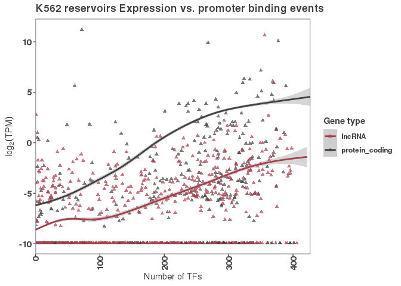
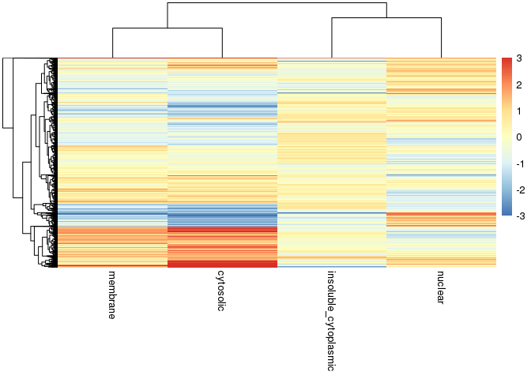

Import Samplesheet with different fractions
===========================================

``` r
samplesheet <- read_csv("/scratch/Shares/rinnclass/JR/CLASS_2021/rnaseq/samplesheet.csv")
```

    ## 
    ## ── Column specification ──────────────────────────────────────────────────────────────────────────────
    ## cols(
    ##   sample_id = col_character(),
    ##   sample_name = col_character(),
    ##   replicate = col_character(),
    ##   condition = col_character(),
    ##   cell_type = col_character(),
    ##   seq_type = col_character(),
    ##   fastq_1 = col_character(),
    ##   fastq_2 = col_character(),
    ##   md5sum_1 = col_character(),
    ##   md5sum_2 = col_character()
    ## )

``` r
# We of course need to swap the labels for total and insoluble cytoplasmic
# From looking in the browser at genes that should be nuclear: NEAT1 for ex.
# We have concluded that 
# hepg2_R2 -- is whole cell / total
# hepg2_insoluble_cytoplasmic_fraction_R2 -- is whole cell / total
# hepg2_R1 -- is insoluble_cytoplasmic
# hepg2_insoluble_cytoplasmic_fraction_R1 -- is insoluble_cytoplasmic

# The cleanest thing to do would be to fix it on the design file and re-run the nf-core pipeline,
# but for now we can swap it here.
samplesheet[which(samplesheet$sample_name == "hepg2_R1"), "condition"] <- "insoluble_cytoplasmic_fraction"
samplesheet[which(samplesheet$sample_name == "hepg2_insoluble_cytoplasmic_fraction_R2"), "condition"] <- "total"
```

Transfer gene annotation into DEseq2 Object
===========================================

``` r
# We want to include the gene annotation info in the DEseq2 object,
# so we'll need to read that in.
gencode_gtf <- rtracklayer::import("/scratch/Shares/rinnclass/data/genomes/gencode.v32.annotation.gtf")
genes <- gencode_gtf[gencode_gtf$type == "gene"]
```



``` r
# Salmon's primary level of quantifying is at the transcript-level.
# Since we're doing differential expression at the gene-level
# Salmon needs to be able to map transcripts to genes.
tx2gene <- gencode_gtf[gencode_gtf$type == "transcript"] %>% 
  as.data.frame() %>%
  dplyr::select(transcript_id, gene_id)

# We'll also create an object that maps gene IDs to gene symbols
# This will come in handy in looking at our results
g2s <- genes %>% as.data.frame() %>%
  dplyr::select(gene_id, gene_name)
```

Import raw counts from salmon
=============================

``` r
# Read in the count data from salmon
# For DESeq2 we want the raw counts
# The easiest way to import it in the proper format is to 
# use the tximport package
files <- file.path("/scratch/Shares/rinnclass/JR/CLASS_2021/rnaseq/results/star_salmon",
                   samplesheet$sample_name, 
                   "quant.sf")
names(files) <- samplesheet$sample_name

txi <- tximport(files, type = c("salmon"), tx2gene = tx2gene)
```

    ## reading in files with read_tsv

    ## 1 2 3 4 5 6 7 8 9 10 
    ## summarizing abundance
    ## summarizing counts
    ## summarizing length

Re-order genes and samples
==========================

``` r
# We'll do the same housekeeping as before to make sure the genes and the samples are in the same order as
# the count data.
names(genes) <- genes$gene_id
genes <- genes[rownames(txi$counts)]
stopifnot(all(genes$gene_id == rownames(txi$counts)))

# Create rownames for the sample sheet and then use that to re-order
samplesheet <- samplesheet %>%
  mutate(row_names = sample_name) %>%
  column_to_rownames("row_names")
samplesheet <- samplesheet[colnames(txi$counts),]
stopifnot(all(rownames(samplesheet) == colnames(txi$counts)))
```

Compare results for each comparion back to total
================================================

``` r
# In order to make the total (whole cell) condition be the one that everything is compared back to
# we will want to set the factor levels with "total" first
samplesheet$condition <- factor(samplesheet$condition, levels = c("total", "membrane_fraction", 
                                                                  "insoluble_cytoplasmic_fraction", 
                                                                  "cytosolic_fraction", "nuclear_fraction"))

dds <- DESeqDataSetFromTximport(txi,
                                design = ~ condition,
                                colData = samplesheet,
                                rowData = genes)
```

    ## using counts and average transcript lengths from tximport

``` r
# Run the DESeq stats
dds <- DESeq(dds)
```

    ## estimating size factors

    ## using 'avgTxLength' from assays(dds), correcting for library size

    ## estimating dispersions

    ## gene-wise dispersion estimates

    ## mean-dispersion relationship

    ## final dispersion estimates

    ## fitting model and testing

``` r
# Okay, now that we have results for each comparison back to total,
# we can combine the fold changes into a matrix and make a heatmap / cluster the genes
# By which cellular fraction they are enriched in.
# A good starting point would be to use a for loop to make a data.frame with all the results
# and then you can make that into a matrix with pivot_wider.
results_names <- resultsNames(dds)
# We don't care about the intercept, so we can leave that out
results_names <- results_names[-1]

res_df <- data.frame("gene_id" = character(), 
                     "baseMean" = numeric(), 
                     "log2FoldChange" = numeric(), 
                     "lfcSE" = numeric(),
                     "stat" = numeric(),
                     "pvalue" = numeric(),
                     "padj" = numeric(),
                     "gene_name" = character(),
                     "result_name" = character())

res_shrunken_df <- data.frame("gene_id" = character(), 
                              "baseMean" = numeric(), 
                              "log2FoldChange" = numeric(), 
                              "lfcSE" = numeric(),
                              "stat" = numeric(),
                              "pvalue" = numeric(),
                              "padj" = numeric(),
                              "gene_name" = character(),
                              "result_name" = character())


for(i in 1:length(results_names)) {
  results_name <- results_names[i]
  res <- results(dds, name = results_name)
  res_shrunken <- lfcShrink(dds, coef = results_name,  res = res)
  
  tmp_res_df <- res %>% as.data.frame() %>%
    rownames_to_column("gene_id") %>%
    merge(g2s) %>%
    mutate(result_name = results_name)
  
  
  tmp_res_shrunken_df <- res_shrunken %>% as.data.frame() %>%
    rownames_to_column("gene_id") %>%
    merge(g2s) %>%
    mutate(result_name = results_name)
  
  # Append to full data.frame
  res_df <- bind_rows(res_df, tmp_res_df)
  res_shrunken_df <- bind_rows(res_shrunken_df, tmp_res_shrunken_df)
}
```

    ## using 'normal' for LFC shrinkage, the Normal prior from Love et al (2014).
    ## 
    ## Note that type='apeglm' and type='ashr' have shown to have less bias than type='normal'.
    ## See ?lfcShrink for more details on shrinkage type, and the DESeq2 vignette.
    ## Reference: https://doi.org/10.1093/bioinformatics/bty895

    ## using 'normal' for LFC shrinkage, the Normal prior from Love et al (2014).
    ## 
    ## Note that type='apeglm' and type='ashr' have shown to have less bias than type='normal'.
    ## See ?lfcShrink for more details on shrinkage type, and the DESeq2 vignette.
    ## Reference: https://doi.org/10.1093/bioinformatics/bty895
    ## using 'normal' for LFC shrinkage, the Normal prior from Love et al (2014).
    ## 
    ## Note that type='apeglm' and type='ashr' have shown to have less bias than type='normal'.
    ## See ?lfcShrink for more details on shrinkage type, and the DESeq2 vignette.
    ## Reference: https://doi.org/10.1093/bioinformatics/bty895
    ## using 'normal' for LFC shrinkage, the Normal prior from Love et al (2014).
    ## 
    ## Note that type='apeglm' and type='ashr' have shown to have less bias than type='normal'.
    ## See ?lfcShrink for more details on shrinkage type, and the DESeq2 vignette.
    ## Reference: https://doi.org/10.1093/bioinformatics/bty895

``` r
# Let's move forward with the shrunken log fold-changes
# First let's label the genes as being significant in any condition or not.
res_shrunken_df <- res_shrunken_df %>%
  group_by(gene_id) %>%
  mutate(sig = ifelse(any(padj < 0.05), "sig", "ns"))

# Let's clean up the column names a little bit
res_shrunken_df <- res_shrunken_df %>%
  mutate(subcellular_fraction = gsub("condition_|_fraction_vs_total", "", result_name))

sig_res_shrunked_df <- res_shrunken_df %>%
  filter(sig == "sig")

lfc_matrix <- sig_res_shrunked_df %>% 
  dplyr::select(gene_id, log2FoldChange, subcellular_fraction) %>% 
  pivot_wider(names_from = "subcellular_fraction", values_from = "log2FoldChange") %>%
  column_to_rownames("gene_id") %>%
  as.matrix()

lfc_heatmap <- pheatmap::pheatmap(lfc_matrix, show_rownames = FALSE, breaks = seq(-3, 3, length.out = 100))

save_pheatmap_pdf <- function(x, filename, width=100, height=100) {
   stopifnot(!missing(x))
   stopifnot(!missing(filename))
   pdf(filename, width=width, height=height)
   grid::grid.newpage()
   grid::grid.draw(x$gtable)
   dev.off()
}
```



``` r
save_pheatmap_pdf(lfc_heatmap, "/scratch/Shares/rinnclass/tardigrades/CLASS_2021/analysis/05_RNA-seq_expression/rnaseq/figures/lfc_heatmap.pdf")
```

    ## RStudioGD 
    ##         2
