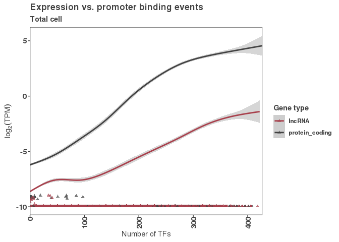
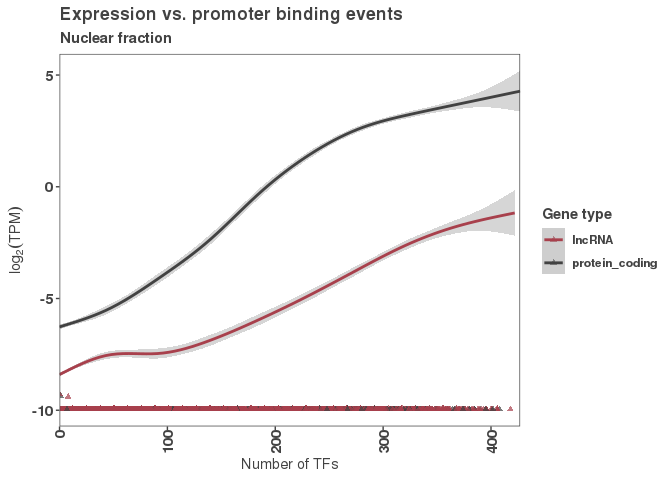
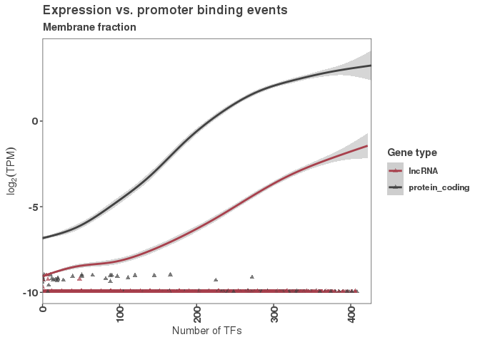
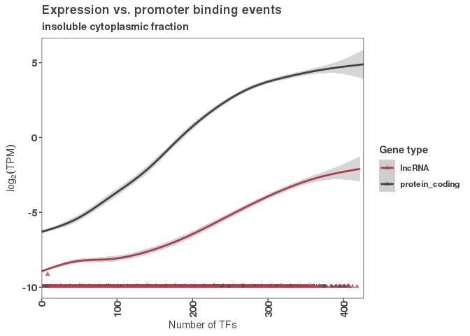
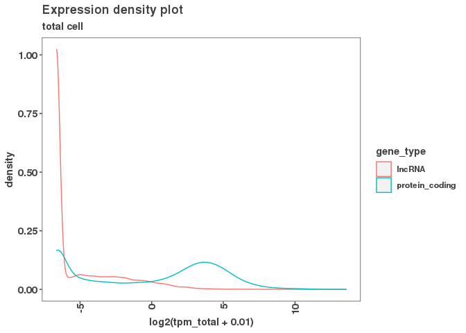

This script will juxtapose the DNA-binding protein data and the gene expression data from the same promoters.
=============================================================================================================

Here we are loading the sample sheet that contains the RNA seq sample identities.
---------------------------------------------------------------------------------

``` r
# load samplessheet in John's folder
samplesheet <- read_csv("/scratch/Shares/rinnclass/JR/CLASS_2021/rnaseq/samplesheet.csv")
```

    ## 
    ## ── Column specification ──────────────────────────────────────────────────────────────────────────────────────────────────────────────
    ## cols(
    ##   sample_id = col_character(),
    ##   sample_name = col_character(),
    ##   replicate = col_character(),
    ##   condition = col_character(),
    ##   cell_type = col_character(),
    ##   seq_type = col_character(),
    ##   fastq_1 = col_character(),
    ##   fastq_2 = col_character(),
    ##   md5sum_1 = col_character(),
    ##   md5sum_2 = col_character()
    ## )

``` r
#  hepg2_R1 and  hepg2_insoluble_cytoplasmic_fraction_R2 are mixed up (in encode). The cleanest thing to do would be to fix it on the design file and re-run the nf-core pipeline,
# but for now we can swap it here: 
samplesheet[which(samplesheet$sample_name == "hepg2_R1"), "condition"] <- "insoluble_cytoplasmic_fraction"
samplesheet[which(samplesheet$sample_name == "hepg2_insoluble_cytoplasmic_fraction_R2"), "condition"] <- "total"
```

Loading the RNA-seq data (TPM) from salmon.
===========================================

``` r
salmon_tpm <- read_tsv("/scratch/Shares/rinnclass/JR/CLASS_2021/rnaseq/results/star_salmon/salmon.merged.gene_tpm.tsv")
```

    ## 
    ## ── Column specification ──────────────────────────────────────────────────────────────────────────────────────────────────────────────
    ## cols(
    ##   gene_id = col_character(),
    ##   hepg2_R1 = col_double(),
    ##   hepg2_R2 = col_double(),
    ##   hepg2_cytosolic_fraction_R1 = col_double(),
    ##   hepg2_cytosolic_fraction_R2 = col_double(),
    ##   hepg2_insoluble_cytoplasmic_fraction_R1 = col_double(),
    ##   hepg2_insoluble_cytoplasmic_fraction_R2 = col_double(),
    ##   hepg2_membrane_fraction_R1 = col_double(),
    ##   hepg2_membrane_fraction_R2 = col_double(),
    ##   hepg2_nuclear_fraction_R1 = col_double(),
    ##   hepg2_nuclear_fraction_R2 = col_double()
    ## )

``` r
# We want to summarize the TPM values for each subcellular fraction, so we'll take the 
# mean of the two replicates
tpm <- salmon_tpm %>% pivot_longer(cols = 2:ncol(.), names_to = "sample_name", values_to = "tpm") %>%
  merge(samplesheet) %>%
  group_by(gene_id, condition) %>%
  summarize(tpm = mean(tpm, na.rm = T)) %>%
  pivot_wider(names_from = condition, values_from = tpm, names_prefix = "tpm_")
```

    ## `summarise()` has grouped output by 'gene_id'. You can override using the `.groups` argument.

Read in the promoter features data. This tells us how many DBPs are bound at each promoter.
-------------------------------------------------------------------------------------------

``` r
promoter_features_df <- read.csv("/scratch/Shares/rinnclass/tardigrades/CLASS_2021/analysis/01_global_peak_properties/results/peak_occurence_dataframe.csv")
# Now we can merge in the TPM data to this data.frame
promoter_features_df <- merge(promoter_features_df, tpm)


#need to ggsave
```

Plot a heatmap of where each gene is expressed
----------------------------------------------

``` r
# We need to turn this into a matrix
tpm_matrix <- tpm %>% 
  column_to_rownames("gene_id") %>%
  as.matrix()

# And z-scale each row.
tpm_scaled <- t(scale(t(tpm_matrix)))

# Remove NAs with the complete.cases function
tpm_scaled <- tpm_scaled[complete.cases(tpm_scaled),]

tpm_scaled_heatmap <- pheatmap::pheatmap(tpm_scaled, show_rownames = FALSE)
```


``` r
save_pheatmap_pdf <- function(x, filename, width=10, height=10) {
   stopifnot(!missing(x))
   stopifnot(!missing(filename))
   pdf(filename, width=width, height=height)
   grid::grid.newpage()
   grid::grid.draw(x$gtable)
   dev.off()
}
save_pheatmap_pdf(tpm_scaled_heatmap, "/scratch/Shares/rinnclass/tardigrades/CLASS_2021/analysis/03_global_clustering/figures/tpm_scaled_heatmap.pdf")
```

    ## png 
    ##   2

Plot the binding vs. expression
-------------------------------

``` r
# Here we are running only the total sample.
# We're plotting only a trend line here with geom_smooth
# But we're also adding in the points for those with no expression (as triangle shapes)
# The ones with high number of DBPs and no expression are our reservoirs
ggplot(promoter_features_df, 
            aes(y = log2(tpm_total + 0.001), x = number_of_dbp, color = gene_type)) + 
  geom_point(data = promoter_features_df %>% filter(tpm_total < 0.001),
             shape = 17, alpha = 0.7) +
  geom_smooth(method = 'gam', formula = y ~ s(x, bs = "cs")) +
  # stat_cor() +
  scale_x_continuous(expand = c(0,0)) +
  scale_color_manual(values = c("#a8404c", "#424242"), name = "Gene type") + 
  ggtitle("Expression vs. promoter binding events", subtitle = 'Total cell') + 
  xlab(expression('Number of TFs')) +
  ylab(expression(log[2](TPM)))
```



``` r
ggsave("/scratch/Shares/rinnclass/tardigrades/CLASS_2021/analysis/06_HEPG2_binding_versus_expression/figures/Expression vs. promoter binding events - total cell.pdf")
```

    ## Saving 7 x 5 in image

Other fractions
---------------

``` r
# Now plot this for each subcellular fraction. tpm_nuclear_fraction, tpm_cytosolic_fraction, tpm_membrane_fraction, tpm_insoluble_cytoplasmic_fraction

#This looks almost the same as the total sample.

#nuclear
ggplot(promoter_features_df, 
            aes(y = log2(tpm_nuclear_fraction + 0.001), x = number_of_dbp, color = gene_type)) + 
  geom_point(data = promoter_features_df %>% filter(tpm_nuclear_fraction < 0.001),
             shape = 17, alpha = 0.7) +
  geom_smooth(method = 'gam', formula = y ~ s(x, bs = "cs")) +
  # stat_cor() +
  scale_x_continuous(expand = c(0,0)) +
  scale_color_manual(values = c("#a8404c", "#424242"), name = "Gene type") + 
  ggtitle("Expression vs. promoter binding events", subtitle = 'Nuclear fraction') + 
  xlab(expression('Number of TFs')) +
  ylab(expression(log[2](TPM)))
```



``` r
ggsave("/scratch/Shares/rinnclass/tardigrades/CLASS_2021/analysis/06_HEPG2_binding_versus_expression/figures/Expression vs. promoter binding events - nuclear fraction.pdf")
```

    ## Saving 7 x 5 in image

``` r
# membrane
ggplot(promoter_features_df, 
            aes(y = log2(tpm_membrane_fraction + 0.001), x = number_of_dbp, color = gene_type)) + 
  geom_point(data = promoter_features_df %>% filter(tpm_membrane_fraction < 0.001),
             shape = 17, alpha = 0.7) +
  geom_smooth(method = 'gam', formula = y ~ s(x, bs = "cs")) +
  # stat_cor() +
  scale_x_continuous(expand = c(0,0)) +
  scale_color_manual(values = c("#a8404c", "#424242"), name = "Gene type") + 
  ggtitle("Expression vs. promoter binding events", subtitle = 'Membrane fraction') +
  xlab(expression('Number of TFs')) +
  ylab(expression(log[2](TPM)))
```



``` r
ggsave("/scratch/Shares/rinnclass/tardigrades/CLASS_2021/analysis/06_HEPG2_binding_versus_expression/figures/Expression vs. promoter binding events - membrane fraction.pdf")
```

    ## Saving 7 x 5 in image

``` r
# tpm_insoluble_cytoplasmic_fraction
ggplot(promoter_features_df, 
            aes(y = log2(tpm_insoluble_cytoplasmic_fraction + 0.001), x = number_of_dbp, color = gene_type)) + 
  geom_point(data = promoter_features_df %>% filter(tpm_insoluble_cytoplasmic_fraction < 0.001),
             shape = 17, alpha = 0.7) +
  geom_smooth(method = 'gam', formula = y ~ s(x, bs = "cs")) +
  # stat_cor() +
  scale_x_continuous(expand = c(0,0)) +
  scale_color_manual(values = c("#a8404c", "#424242"), name = "Gene type") + 
  ggtitle("Expression vs. promoter binding events", subtitle = 'insoluble cytoplasmic fraction') + 
  xlab(expression('Number of TFs')) +
  ylab(expression(log[2](TPM)))
```



``` r
ggsave("/scratch/Shares/rinnclass/tardigrades/CLASS_2021/analysis/06_HEPG2_binding_versus_expression/figures/Expression vs. promoter binding events - insoluble cytoplasmic  fraction.pdf")
```

    ## Saving 7 x 5 in image

``` r
# We can see this from the trend lines that lncRNAs are less expressed,
# but here's another way of looking at that.
ggplot(promoter_features_df, aes(x = log2(tpm_total + 0.01), color = gene_type))+
  geom_density()+
  ggtitle("Expression density plot", subtitle = 'total cell') + ggsave("/scratch/Shares/rinnclass/tardigrades/CLASS_2021/analysis/06_HEPG2_binding_versus_expression/figures/expression_densityplot_lncRNA_vs_mRNA.pdf")
```

    ## Saving 7 x 5 in image



Now we can define reservoirs in HEPG2
-------------------------------------

``` r
# We'll use a cutoff of 100 DBPs here, but we can think more about 
# what would be a reasonable cutoff here.
promoter_features_df$hepg2_reservoir <- 
  as.numeric(promoter_features_df$number_of_dbp > 100 & 
               promoter_features_df$tpm_total < 0.001)

table(promoter_features_df$hepg2_reservoir)
```

    ## 
    ##     0     1 
    ## 35261  1553

Let's read in the reservoirs from last year
-------------------------------------------

``` r
k562_df <- read.csv("/scratch/Shares/rinnclass/data/2020_peak_occurence_df.csv")

# To compare these reservoirs to this year's dataset, we can just merge in the relevant columns
k562_reservoir <- k562_df %>% 
  dplyr::select(gene_id, reservoir, conservative_reservoir) %>%
  dplyr::rename(k562_reservoir = reservoir, 
                k562_conservative_reservoir = conservative_reservoir)

promoter_features_df <- merge(promoter_features_df, k562_reservoir)


# Make a table of reservoir status
res_status <- promoter_features_df %>% 
  group_by(hepg2_reservoir, k562_reservoir, k562_conservative_reservoir) %>%
  summarize(count = n())
```

    ## `summarise()` has grouped output by 'hepg2_reservoir', 'k562_reservoir'. You can override using the `.groups` argument.

``` r
# We can now write these out for safekeeping / use in other analyses
write_csv(promoter_features_df, "/scratch/Shares/rinnclass/tardigrades/CLASS_2021/analysis/06_HEPG2_binding_versus_expression/results/promoter_features_df.csv")
write_csv(tpm, "/scratch/Shares/rinnclass/tardigrades/CLASS_2021/analysis/06_HEPG2_binding_versus_expression/results/mean_tpm_per_condition.csv")
write_csv(samplesheet, "/scratch/Shares/rinnclass/tardigrades/CLASS_2021/analysis/06_HEPG2_binding_versus_expression/results/samplesheet.csv")
```
