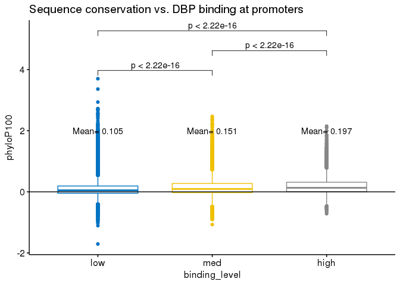
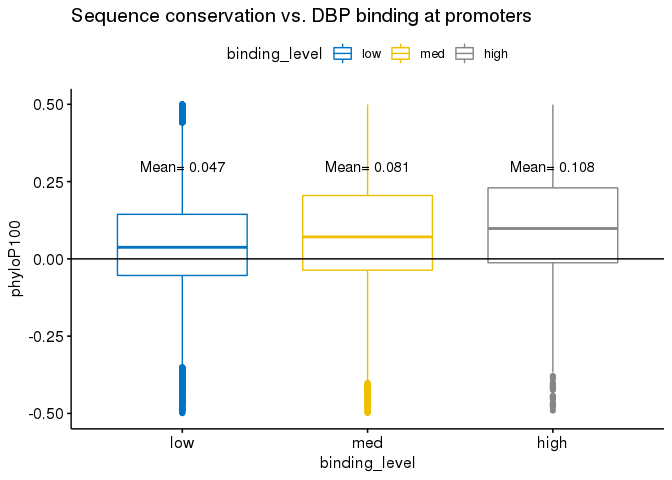
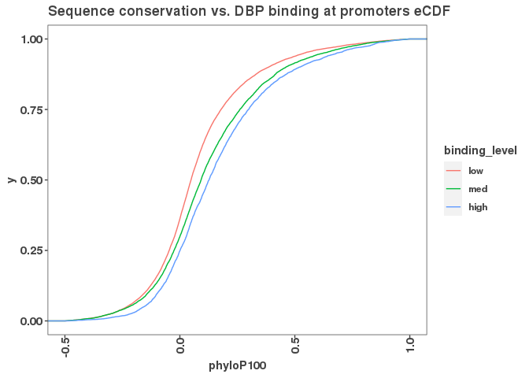
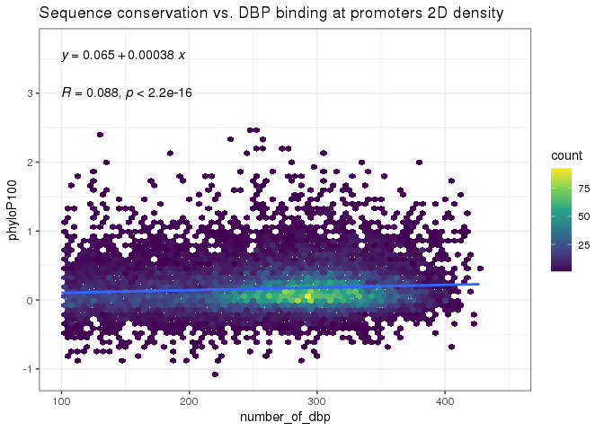

``` r
# http://hgdownload.cse.ucsc.edu/goldenPath/hg38/phyloP100way/hg38.phyloP100way.bw
# promoter_gr <- rtracklayer::import("/scratch/Shares/rinnclass/JR/CLASS_2021/analysis/00_consensus_peaks/results/gene_annotations/lncrna_mrna_promoters.gtf")
# promoter_gr$score <- 0
# promoter_gr$name <- promoter_gr$gene_id
# rtracklayer::export(promoter_gr, "results/lncrna_mrna_promoter.bed")
# cb <- CoverageBigWigFile("data/hg38.phyloP100way.bw")
# cm <- cov.matrix(cb, coordfile = "results/lncrna_mrna_promoter.bed", no_windows = 1, num_cores = 20)
```

``` r
# peak_occurrence_df <- read_csv("/scratch/Shares/rinnclass/JR/CLASS_2021/analysis/01_global_peak_properties/results/peak_occurence_dataframe.csv")
# peak_occurrence_df$phyloP100 <- cm
# write_csv(peak_occurrence_df, "results/peak_occurrence_df_phyloP.csv")

peak_occurrence_df <- read_csv("results/peak_occurrence_df_phyloP.csv")
```

    ## Parsed with column specification:
    ## cols(
    ##   gene_id = col_character(),
    ##   gene_name = col_character(),
    ##   gene_type = col_character(),
    ##   chr = col_character(),
    ##   X3kb_up_tss_start = col_double(),
    ##   strand = col_character(),
    ##   number_of_dbp = col_double(),
    ##   phyloP100 = col_double(),
    ##   binding_level = col_character()
    ## )

``` r
peak_occurrence_df <- peak_occurrence_df %>%
  mutate(binding_level = ifelse(number_of_dbp > 300, "high", ifelse(number_of_dbp > 100, "med", "low")))

peak_occurrence_df$binding_level <- factor(peak_occurrence_df$binding_level, levels = c("low", "med", "high"))

ggboxplot(peak_occurrence_df, x = "binding_level", y = "phyloP100",
          color = "binding_level", palette = "jco") + 
  # ylim(-0.5,0.5) +
  geom_hline(yintercept = 0) +
  stat_compare_means(comparisons = list(c("low", "med"), c("med", "high"), c("low", "high"))) + 
  stat_summary(fun.data = function(x) data.frame(y=2, label = paste("Mean=",round(mean(x), 3))), geom="text") +
  theme(legend.position="none") +
  ggtitle("Sequence conservation vs. DBP binding at promoters")
```



``` r
ggboxplot(peak_occurrence_df, x = "binding_level", y = "phyloP100",
          color = "binding_level", palette = "jco") + 
  ylim(-0.5,0.5) +
  stat_summary(fun.data = function(x) data.frame(y=0.3, label = paste("Mean=",round(mean(x), 3))), geom="text") +
  geom_hline(yintercept = 0) + 
  ggtitle("Sequence conservation vs. DBP binding at promoters")
```

    ## Warning: Removed 3737 rows containing non-finite values (stat_boxplot).

    ## Warning: Removed 3737 rows containing non-finite values (stat_summary).



``` r
peak_occurrence_df %>% group_by(binding_level) %>%
  summarize(mean_cons = mean(phyloP100),
            sd_cons = sd(phyloP100))
```

    ## `summarise()` ungrouping output (override with `.groups` argument)

    ## # A tibble: 3 x 3
    ##   binding_level mean_cons sd_cons
    ##   <fct>             <dbl>   <dbl>
    ## 1 low               0.105   0.304
    ## 2 med               0.151   0.313
    ## 3 high              0.197   0.307

``` r
ggplot(peak_occurrence_df, aes(x = phyloP100, color = binding_level)) + 
  stat_ecdf() + 
  ggtitle("Sequence conservation vs. DBP binding at promoters eCDF") + 
  xlim(-0.5, 1)
```

    ## Warning: Removed 1049 rows containing non-finite values (stat_ecdf).



``` r
ggplot(peak_occurrence_df, aes(x = number_of_dbp, y = phyloP100))   +
  geom_hex(bins = 70) +
  xlim(100,450) +
  scale_fill_continuous(type = "viridis") +
  theme_bw() + 
  geom_smooth(method = "lm") + 
  stat_regline_equation() + 
  ggtitle("Sequence conservation vs. DBP binding at promoters 2D density") +
  stat_cor(label.y = 3)
```

    ## Warning: Removed 20700 rows containing non-finite values (stat_binhex).

    ## `geom_smooth()` using formula 'y ~ x'

    ## Warning: Removed 20700 rows containing non-finite values (stat_smooth).

    ## Warning: Removed 20700 rows containing non-finite values (stat_regline_equation).

    ## Warning: Removed 20700 rows containing non-finite values (stat_cor).

    ## Warning: Removed 8 rows containing missing values (geom_hex).


