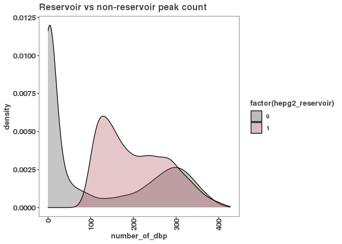
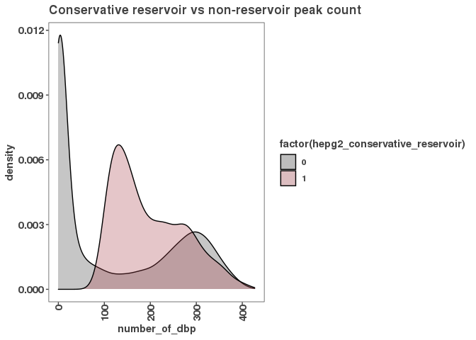
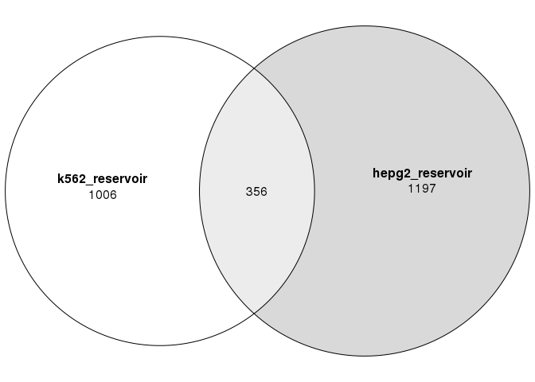
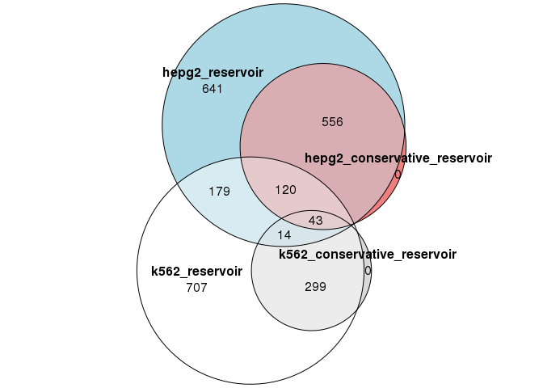

``` r
samplesheet <- read_csv("../../rnaseq/samplesheet.csv")
```

    ## Parsed with column specification:
    ## cols(
    ##   sample_id = col_character(),
    ##   sample_name = col_character(),
    ##   replicate = col_character(),
    ##   condition = col_character(),
    ##   cell_type = col_character(),
    ##   seq_type = col_character(),
    ##   fastq_1 = col_character(),
    ##   fastq_2 = col_character(),
    ##   md5sum_1 = col_character(),
    ##   md5sum_2 = col_character()
    ## )

``` r
# peak_occurrence_df <- read_csv("/scratch/Shares/rinnclass/JR/CLASS_2021/analysis/06_defining_reservoirs/results/promoter_features_df.csv")
# 
# 
# promoters_df <- rtracklayer::import("/scratch/Shares/rinnclass/JR/CLASS_2021/analysis/00_consensus_peaks/results/gene_annotations/lncrna_mrna_promoters.gtf") %>%
#   as.data.frame() %>%
#   dplyr::select("gene_id", "seqnames", "start", "end", "strand") 
# names(promoters_df) <- c("GeneID", "Chr", "Start", "End", "Strand")
# promoters_df[which(promoters_df$Start < 0), "Start"] <- 0
# write.table(promoters_df, "results/gencode_v32_promoters_6kb.SAF", sep = "\t",
#             quote = F, row.names = F)
# 
# # Run feature counts on promoter windows
# fl <- list.files("../../rnaseq/results/star_salmon/", pattern = ".bam$", full.names = TRUE)
# 
# counts <- featureCounts(fl, 
#                         annot.ext = "results/gencode_v32_promoters_6kb.SAF", 
#                         isPairedEnd = TRUE, nthreads = 16)
# 
# write_rds(counts, "promoter_counts.rds")
# promoter_counts <- read_rds("promoter_counts.rds")
```

``` r
# rpk <- promoter_counts$counts / (promoter_counts$annotation$Length/1000)
# expression <- data.frame("rpk" = rpk) %>%
#   rownames_to_column("gene_id") %>%
#   pivot_longer(2:ncol(.), names_to = "sample", values_to = "rpk")
# expression_summary <- expression %>%
#   group_by(sample) %>%
#   summarize(total_rpk = sum(rpk, na.rm = T))
# expression_summary$rpk_m <- expression_summary$total_rpk / 1e6
# expression <- merge(expression, expression_summary)
# expression$tpm <- expression$rpk / expression$rpk_m
# promoter_expression <- expression %>% group_by(gene_id) %>%
#   summarize(promoter_median_tpm = median(tpm),
#             promoter_max_tpm = max(tpm))
# 
# peak_occurrence_df <- merge(peak_occurrence_df, promoter_expression)
# peak_occurrence_df <- peak_occurrence_df %>% mutate(hepg2_conservative_reservoir = ifelse(promoter_median_tpm < 0.01 & hepg2_reservoir == 1, 1, 0))
# table(peak_occurrence_df$hepg2_conservative_reservoir)
# write_csv(peak_occurrence_df, "results/peak_occurrence_df.csv")
```

``` r
peak_occurrence_df <- read_csv("results/peak_occurrence_df.csv")
```

    ## Parsed with column specification:
    ## cols(
    ##   gene_id = col_character(),
    ##   gene_name = col_character(),
    ##   gene_type = col_character(),
    ##   chr = col_character(),
    ##   X3kb_up_tss_start = col_double(),
    ##   strand = col_character(),
    ##   number_of_dbp = col_double(),
    ##   tpm_cytosolic_fraction = col_double(),
    ##   tpm_insoluble_cytoplasmic_fraction = col_double(),
    ##   tpm_membrane_fraction = col_double(),
    ##   tpm_nuclear_fraction = col_double(),
    ##   tpm_total = col_double(),
    ##   hepg2_reservoir = col_double(),
    ##   k562_reservoir = col_double(),
    ##   k562_conservative_reservoir = col_double(),
    ##   promoter_median_tpm = col_double(),
    ##   promoter_max_tpm = col_double(),
    ##   hepg2_conservative_reservoir = col_double()
    ## )

``` r
ggplot(peak_occurrence_df, aes(x = number_of_dbp, fill = factor(hepg2_reservoir))) +
  geom_density(alpha = 0.3) + scale_fill_manual(values = c("#424242","#a8404c")) + 
  ggtitle("Reservoir vs non-reservoir peak count")
```



``` r
ggplot(peak_occurrence_df, aes(x = number_of_dbp, fill = factor(hepg2_conservative_reservoir))) +
  geom_density(alpha = 0.3) + scale_fill_manual(values = c("#424242","#a8404c")) + 
  ggtitle("Conservative reservoir vs non-reservoir peak count")
```



``` r
table(peak_occurrence_df$hepg2_reservoir)
```

    ## 
    ##     0     1 
    ## 35261  1553

``` r
# library(venneuler)
# Let's make a set matrix
set_matrix <- peak_occurrence_df %>%
  dplyr::select(k562_reservoir, hepg2_reservoir) %>%
  as.matrix()

(vd <- euler(set_matrix))
```

    ##                                original fitted residuals regionError
    ## k562_reservoir                     1006   1006         0           0
    ## hepg2_reservoir                    1197   1197         0           0
    ## k562_reservoir&hepg2_reservoir      356    356         0           0
    ## 
    ## diagError: 0 
    ## stress:    0

``` r
evd <- euler(c("K562" = 1006, "HEPG2" = 1197, "K562&HEPG2" = 356), key = TRUE, counts = TRUE)

plot(vd, quantities = TRUE)
```



``` r
set_matrix <- peak_occurrence_df %>%
  dplyr::select(k562_reservoir, k562_conservative_reservoir, hepg2_reservoir, hepg2_conservative_reservoir) %>%
  as.matrix()
(vd <- euler(set_matrix))
```

    ##                                                                                         original
    ## k562_reservoir                                                                               707
    ## k562_conservative_reservoir                                                                    0
    ## hepg2_reservoir                                                                              641
    ## hepg2_conservative_reservoir                                                                   0
    ## k562_reservoir&k562_conservative_reservoir                                                   299
    ## k562_reservoir&hepg2_reservoir                                                               179
    ## k562_reservoir&hepg2_conservative_reservoir                                                    0
    ## k562_conservative_reservoir&hepg2_reservoir                                                    0
    ## k562_conservative_reservoir&hepg2_conservative_reservoir                                       0
    ## hepg2_reservoir&hepg2_conservative_reservoir                                                 556
    ## k562_reservoir&k562_conservative_reservoir&hepg2_reservoir                                    14
    ## k562_reservoir&k562_conservative_reservoir&hepg2_conservative_reservoir                        0
    ## k562_reservoir&hepg2_reservoir&hepg2_conservative_reservoir                                  120
    ## k562_conservative_reservoir&hepg2_reservoir&hepg2_conservative_reservoir                       0
    ## k562_reservoir&k562_conservative_reservoir&hepg2_reservoir&hepg2_conservative_reservoir       43
    ##                                                                                          fitted
    ## k562_reservoir                                                                          708.885
    ## k562_conservative_reservoir                                                              13.634
    ## hepg2_reservoir                                                                         643.206
    ## hepg2_conservative_reservoir                                                             16.557
    ## k562_reservoir&k562_conservative_reservoir                                              295.015
    ## k562_reservoir&hepg2_reservoir                                                          159.136
    ## k562_reservoir&hepg2_conservative_reservoir                                               0.000
    ## k562_conservative_reservoir&hepg2_reservoir                                               0.000
    ## k562_conservative_reservoir&hepg2_conservative_reservoir                                  0.000
    ## hepg2_reservoir&hepg2_conservative_reservoir                                            553.224
    ## k562_reservoir&k562_conservative_reservoir&hepg2_reservoir                               44.887
    ## k562_reservoir&k562_conservative_reservoir&hepg2_conservative_reservoir                   0.000
    ## k562_reservoir&hepg2_reservoir&hepg2_conservative_reservoir                             132.586
    ## k562_conservative_reservoir&hepg2_reservoir&hepg2_conservative_reservoir                  0.000
    ## k562_reservoir&k562_conservative_reservoir&hepg2_reservoir&hepg2_conservative_reservoir  29.364
    ##                                                                                         residuals
    ## k562_reservoir                                                                             -1.885
    ## k562_conservative_reservoir                                                               -13.634
    ## hepg2_reservoir                                                                            -2.206
    ## hepg2_conservative_reservoir                                                              -16.557
    ## k562_reservoir&k562_conservative_reservoir                                                  3.985
    ## k562_reservoir&hepg2_reservoir                                                             19.864
    ## k562_reservoir&hepg2_conservative_reservoir                                                 0.000
    ## k562_conservative_reservoir&hepg2_reservoir                                                 0.000
    ## k562_conservative_reservoir&hepg2_conservative_reservoir                                    0.000
    ## hepg2_reservoir&hepg2_conservative_reservoir                                                2.776
    ## k562_reservoir&k562_conservative_reservoir&hepg2_reservoir                                -30.887
    ## k562_reservoir&k562_conservative_reservoir&hepg2_conservative_reservoir                     0.000
    ## k562_reservoir&hepg2_reservoir&hepg2_conservative_reservoir                               -12.586
    ## k562_conservative_reservoir&hepg2_reservoir&hepg2_conservative_reservoir                    0.000
    ## k562_reservoir&k562_conservative_reservoir&hepg2_reservoir&hepg2_conservative_reservoir    13.636
    ##                                                                                         regionError
    ## k562_reservoir                                                                                0.003
    ## k562_conservative_reservoir                                                                   0.005
    ## hepg2_reservoir                                                                               0.003
    ## hepg2_conservative_reservoir                                                                  0.006
    ## k562_reservoir&k562_conservative_reservoir                                                    0.003
    ## k562_reservoir&hepg2_reservoir                                                                0.009
    ## k562_reservoir&hepg2_conservative_reservoir                                                   0.000
    ## k562_conservative_reservoir&hepg2_reservoir                                                   0.000
    ## k562_conservative_reservoir&hepg2_conservative_reservoir                                      0.000
    ## hepg2_reservoir&hepg2_conservative_reservoir                                                  0.004
    ## k562_reservoir&k562_conservative_reservoir&hepg2_reservoir                                    0.012
    ## k562_reservoir&k562_conservative_reservoir&hepg2_conservative_reservoir                       0.000
    ## k562_reservoir&hepg2_reservoir&hepg2_conservative_reservoir                                   0.004
    ## k562_conservative_reservoir&hepg2_reservoir&hepg2_conservative_reservoir                      0.000
    ## k562_reservoir&k562_conservative_reservoir&hepg2_reservoir&hepg2_conservative_reservoir       0.005
    ## 
    ## diagError: 0.012 
    ## stress:    0.002

``` r
plot(vd, quantities = TRUE)
```


