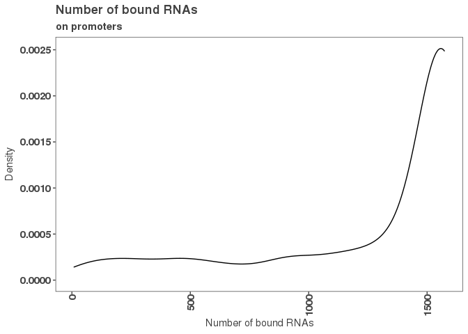
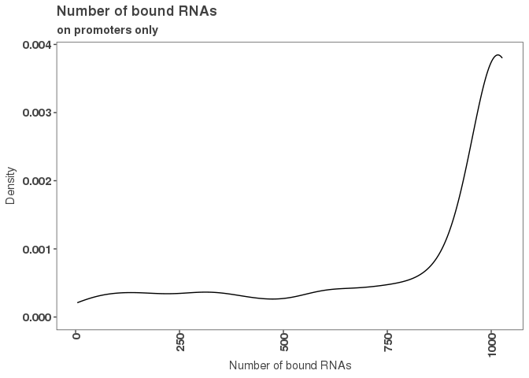
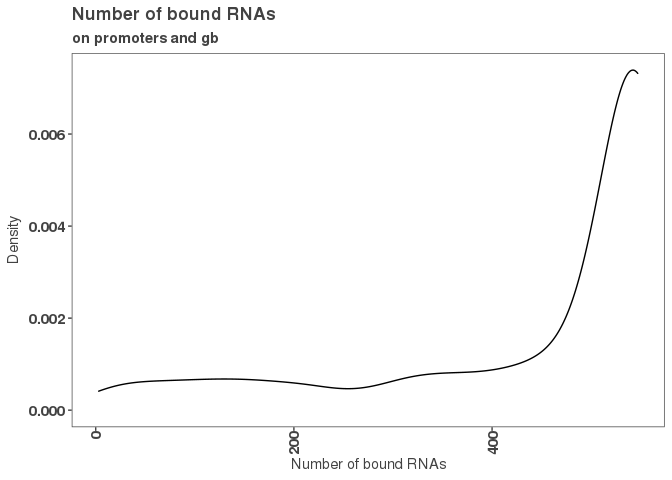
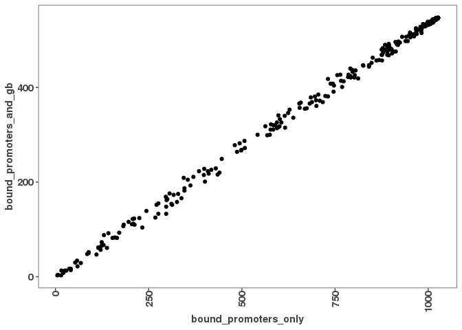
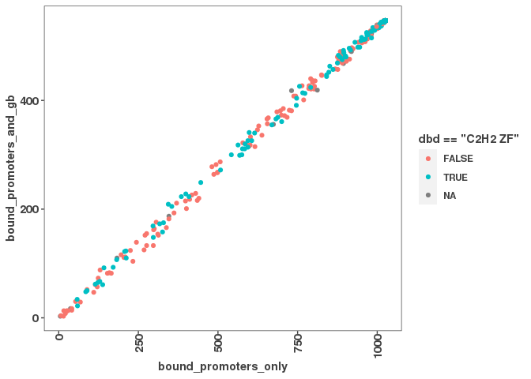

Further analysis of high binders of promoters vs high binders of promoters AND gene body
========================================================================================

analysis in 08\_01 showed that there are two groups, 1) high binders that only bind promoters, 2) that bind to both, promoter and gene body
-------------------------------------------------------------------------------------------------------------------------------------------

### are the ZF binding to both or only to promoters?

``` r
# load peak occurances
# 1)
# !!!! not opening correctly with 2Dimensions
genebodyMinuspromoter_peak_occurence2 <- read.table(file="/scratch/Shares/rinnclass/tardigrades/CLASS_2021/analysis/01_global_peak_properties/results/GenebodyMinuspromoter_peak_occurence_matrix.tsv")

#2)
promoter_peak_occurence <- read.table(file="/scratch/Shares/rinnclass/tardigrades/CLASS_2021/analysis/01_global_peak_properties/results/lncrna_mrna_promoter_peak_occurence_matrix.tsv")

# 3) df with num of dbp to promoter, genebody or genebodyMinusPromoter
peak_occurance_all_df <- read.csv(file = "/scratch/Shares/rinnclass/tardigrades/CLASS_2021/analysis/08_genebody_vs_promoter/results/peak_occurance_all_df.csv")
```

define high binders for both vs only for promoters
==================================================

``` r
#### look only at high binders 
high_binders_promoter_df <- peak_occurance_all_df %>% filter((peak_occurance_all_df$number_of_dbp_promoter >= 350))

high_binders_both_df <- peak_occurance_all_df %>% filter((peak_occurance_all_df$number_of_dbp_promoter >= 350) & (peak_occurance_all_df$number_of_dbp_genebodyNoPromoter >= 350))

high_binders_only_promoter_df <- peak_occurance_all_df %>% filter((peak_occurance_all_df$number_of_dbp_promoter >= 350) & (peak_occurance_all_df$number_of_dbp_genebodyNoPromoter < 250))

nrow(high_binders_promoter_df) #1296
```

    ## [1] 1296

``` r
nrow(high_binders_both_df) # 547
```

    ## [1] 547

``` r
nrow(high_binders_only_promoter_df) #749 if 350, 547 if 250
```

    ## [1] 547

\# define high binders for both vs only for promoters in matrix
===============================================================

``` r
# filter matrix by number_of_dbp >= 350
number_of_dbp_promoter <- colSums(promoter_peak_occurence)
high_binding_promoters <- number_of_dbp_promoter >=350
high_binding_promoter_po <- promoter_peak_occurence[,high_binding_promoters] #1573
#
number_of_dbp_gb_no_promoter <- colSums(genebodyMinuspromoter_peak_occurence2)
high_binding_gb_no_promoter <- number_of_dbp_gb_no_promoter >=350
high_binding_genebody_po <- genebodyMinuspromoter_peak_occurence2[,high_binding_gb_no_promoter]

# low gene body binders
low_binding_gb_no_promoter <- number_of_dbp_gb_no_promoter < 250
low_binding_genebody_po <- genebodyMinuspromoter_peak_occurence2[,low_binding_gb_no_promoter]

# high binding in both
intersect_both <-intersect(colnames(high_binding_promoter_po), colnames(high_binding_genebody_po)) #547
high_binding_both_po <- high_binding_promoter_po[,intersect_both] #547
# only in promoter
diff_both <- setdiff(colnames(high_binding_promoter_po), colnames(low_binding_genebody_po)) 
high_binding_promoter_only_po <- high_binding_promoter_po[,diff_both] #824


# high binding only promoter
ncol(high_binding_promoter_po) #1573
```

    ## [1] 1573

``` r
ncol(high_binding_genebody_po) #1288
```

    ## [1] 1288

``` r
ncol(low_binding_genebody_po) #22524
```

    ## [1] 22524

``` r
ncol(high_binding_both_po) #547
```

    ## [1] 547

``` r
ncol(high_binding_promoter_only_po) #1026
```

    ## [1] 1026

``` r
high_binding_promoter_po_df <- data.frame("dbp" = rownames(high_binding_promoter_po), "number_bound_RNAs" =rowSums(high_binding_promoter_po))

high_binding_promoter_only_po_df <- data.frame("dbp" = rownames(high_binding_promoter_only_po), "number_bound_RNAs" =rowSums(high_binding_promoter_only_po))

high_binding_both_po_df <- data.frame("dbp" = rownames(high_binding_both_po), "number_bound_RNAs" =rowSums(high_binding_both_po))

nrow(high_binding_both_po)# 460
```

    ## [1] 460

``` r
#rename number_bound_RNAs and merge all three
data1 <- high_binding_promoter_po_df %>%
  dplyr::rename(bound_promoters = number_bound_RNAs)
data2 <- high_binding_promoter_only_po_df %>%
  dplyr::rename(bound_promoters_only = number_bound_RNAs)
data3 <- high_binding_both_po_df %>%
  dplyr::rename(bound_promoters_and_gb = number_bound_RNAs)

merge_1 <- merge(data1, data2, by = "dbp")
dbp_binding_df <- merge(merge_1, data3, by = "dbp")

write_csv(dbp_binding_df, "/scratch/Shares/rinnclass/tardigrades/CLASS_2021/analysis/08_genebody_vs_promoter/results/dbp_binding_highly_bound_regions_df.csv")
```

3 merge with TF df
==================

``` r
# The human TFs
# https://www.cell.com/cms/10.1016/j.cell.2018.01.029/attachment/ede37821-fd6f-41b7-9a0e-9d5410855ae6/mmc2.xlsx

suppressWarnings(human_tfs <- readxl::read_excel("/scratch/Shares/rinnclass/data/mmc2.xlsx",
                                sheet = 2, skip = 1))
```

    ## New names:
    ## * `` -> ...4

``` r
names(human_tfs)[4] <- "is_tf"

length(which(tolower(dbp_binding_df$dbp) %in% tolower(human_tfs$Name)))
```

    ## [1] 438

``` r
human_tfs <- human_tfs[tolower(human_tfs$Name) %in% tolower(dbp_binding_df$dbp), 1:4]
names(human_tfs) <- c("ensembl_id",
                      "dbp",
                      "dbd",
                      "tf")

new_bound_promoter_gb_df <- merge(dbp_binding_df, human_tfs, all.x = T, by = "dbp")
```

``` r
g <- ggplot(new_bound_promoter_gb_df, aes(bound_promoters))
g + geom_density(alpha = 0.3) +
  xlab(expression("Number of bound RNAs")) +
  ylab(expression("Density")) +
  ggtitle("Number of bound RNAs",
          subtitle = "on promoters") 
```



``` r
g <- ggplot(new_bound_promoter_gb_df, aes(bound_promoters_only))
g + geom_density(alpha = 0.3) +
  xlab(expression("Number of bound RNAs")) +
  ylab(expression("Density")) +
  ggtitle("Number of bound RNAs",
          subtitle = "on promoters only") 
```



``` r
g <- ggplot(new_bound_promoter_gb_df, aes(bound_promoters_and_gb))
g + geom_density(alpha = 0.3) +
  xlab(expression("Number of bound RNAs")) +
  ylab(expression("Density")) +
  ggtitle("Number of bound RNAs",
          subtitle = "on promoters and gb") 
```



``` r
# 
ggplot(new_bound_promoter_gb_df, aes(x = bound_promoters_only,
                         y = bound_promoters_and_gb)) +
  geom_point()
```



``` r
ggsave("/scratch/Shares/rinnclass/tardigrades/CLASS_2021/analysis/08_genebody_vs_promoter/figures/scatterplot_Number_bound_RNAs.png")
```

    ## Saving 7 x 5 in image

``` r
# scatterplot - tf
ggplot(new_bound_promoter_gb_df, aes(x = bound_promoters_only, 
                 y = bound_promoters_and_gb)) +
  facet_wrap(tf ~ .) +
  geom_point()
```


``` r
ggsave("/scratch/Shares/rinnclass/tardigrades/CLASS_2021/analysis/08_genebody_vs_promoter/figures/scatterplot_Number_bound_RNAs_TF_vs_No.png")
```

    ## Saving 7 x 5 in image

``` r
# scatterplot - dbd
ggplot(new_bound_promoter_gb_df, aes(x = bound_promoters_only, 
                 y = bound_promoters_and_gb,
                 color = dbd == "C2H2 ZF")) +
  geom_point()
```



``` r
ggsave("/scratch/Shares/rinnclass/tardigrades/CLASS_2021/analysis/08_genebody_vs_promoter/figures/scatterplot_Number_bound_RNAs_C2H2.png")
```

    ## Saving 7 x 5 in image
