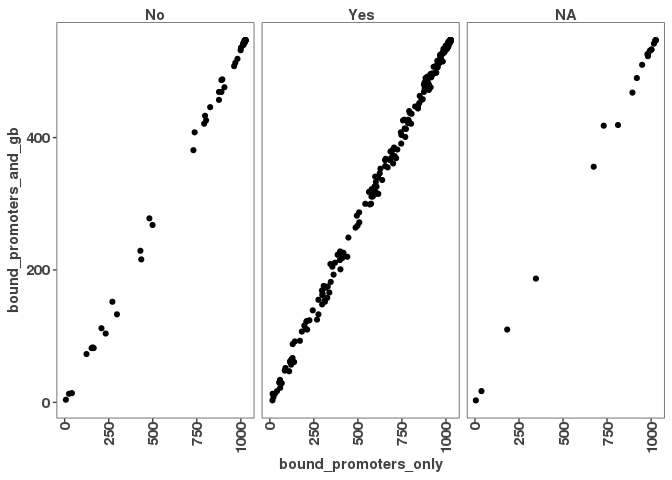

Further analysis of high binders of promoters vs high binders of promoters AND gene body
========================================================================================

analysis in 08\_01 showed that there are two groups, 1) high binders that only bind promoters, 2) that bind to both, promoter and gene body
-------------------------------------------------------------------------------------------------------------------------------------------

### are the ZF binding to both or only to promoters?

``` r
# load peak occurances
# 1)
# !!!! not opening correctly with 2Dimensions
genebodyMinuspromoter_peak_occurence2 <- read.table(file="/scratch/Shares/rinnclass/tardigrades/CLASS_2021/analysis/01_global_peak_properties/results/GenebodyMinuspromoter_peak_occurence_matrix.tsv")

#2)
promoter_peak_occurence <- read.table(file="/scratch/Shares/rinnclass/tardigrades/CLASS_2021/analysis/01_global_peak_properties/results/lncrna_mrna_promoter_peak_occurence_matrix.tsv")

# 3) df with num of dbp to promoter, genebody or genebodyMinusPromoter
peak_occurance_all_df <- read.csv(file = "/scratch/Shares/rinnclass/tardigrades/CLASS_2021/analysis/08_genebody_vs_promoter/results/peak_occurance_all_df.csv")
```

define high binders for both vs only for promoters
==================================================

``` r
#### look only at high binders 
high_binders_promoter_df <- peak_occurance_all_df %>% filter((peak_occurance_all_df$number_of_dbp_promoter >= 350))

high_binders_both_df <- peak_occurance_all_df %>% filter((peak_occurance_all_df$number_of_dbp_promoter >= 350) & (peak_occurance_all_df$number_of_dbp_genebodyNoPromoter >= 350))

high_binders_only_promoter_df <- peak_occurance_all_df %>% filter((peak_occurance_all_df$number_of_dbp_promoter >= 350) & (peak_occurance_all_df$number_of_dbp_genebodyNoPromoter < 250))

nrow(high_binders_promoter_df) #1296
```

    ## [1] 1296

``` r
nrow(high_binders_both_df) # 547
```

    ## [1] 547

``` r
nrow(high_binders_only_promoter_df) #749 if 350, 547 if 250
```

    ## [1] 547

\# define high binders for both vs only for promoters in matrix
===============================================================

``` r
# filter matrix by number_of_dbp >= 350
number_of_dbp_promoter <- colSums(promoter_peak_occurence)
high_binding_promoters <- number_of_dbp_promoter >=350
high_binding_promoter_po <- promoter_peak_occurence[,high_binding_promoters] #1573
#
number_of_dbp_gb_no_promoter <- colSums(genebodyMinuspromoter_peak_occurence2)
high_binding_gb_no_promoter <- number_of_dbp_gb_no_promoter >=350
high_binding_genebody_po <- genebodyMinuspromoter_peak_occurence2[,high_binding_gb_no_promoter]

# low gene body binders
low_binding_gb_no_promoter <- number_of_dbp_gb_no_promoter < 250
low_binding_genebody_po <- genebodyMinuspromoter_peak_occurence2[,low_binding_gb_no_promoter]

# high binding in both
intersect_both <-intersect(colnames(high_binding_promoter_po), colnames(high_binding_genebody_po)) #547
high_binding_both_po <- high_binding_promoter_po[,intersect_both] #547
# only in promoter
diff_both <- setdiff(colnames(high_binding_promoter_po), colnames(low_binding_genebody_po)) 
high_binding_promoter_only_po <- high_binding_promoter_po[,diff_both] #824


# high binding only promoter
ncol(high_binding_promoter_po) #1573
```

    ## [1] 1573

``` r
ncol(high_binding_genebody_po) #1288
```

    ## [1] 1288

``` r
ncol(low_binding_genebody_po) #22524
```

    ## [1] 22524

``` r
ncol(high_binding_both_po) #547
```

    ## [1] 547

``` r
ncol(high_binding_promoter_only_po) #1026
```

    ## [1] 1026

``` r
high_binding_promoter_po_df <- data.frame("dbp" = rownames(high_binding_promoter_po), "number_bound_RNAs" =rowSums(high_binding_promoter_po))

high_binding_promoter_only_po_df <- data.frame("dbp" = rownames(high_binding_promoter_only_po), "number_bound_RNAs" =rowSums(high_binding_promoter_only_po))

high_binding_both_po_df <- data.frame("dbp" = rownames(high_binding_both_po), "number_bound_RNAs" =rowSums(high_binding_both_po))

nrow(high_binding_both_po)# 460
```

    ## [1] 460

``` r
#rename number_bound_RNAs and merge all three
data1 <- high_binding_promoter_po_df %>%
  dplyr::rename(bound_promoters = number_bound_RNAs)
data2 <- high_binding_promoter_only_po_df %>%
  dplyr::rename(bound_promoters_only = number_bound_RNAs)
data3 <- high_binding_both_po_df %>%
  dplyr::rename(bound_promoters_and_gb = number_bound_RNAs)

merge_1 <- merge(data1, data2, by = "dbp")
dbp_binding_df <- merge(merge_1, data3, by = "dbp")

write_csv(dbp_binding_df, "/scratch/Shares/rinnclass/tardigrades/CLASS_2021/analysis/08_genebody_vs_promoter/results/dbp_binding_highly_bound_regions_df.csv")
```

3 merge with TF df
==================

``` r
# The human TFs
# https://www.cell.com/cms/10.1016/j.cell.2018.01.029/attachment/ede37821-fd6f-41b7-9a0e-9d5410855ae6/mmc2.xlsx

human_tfs <- readxl::read_excel("/scratch/Shares/rinnclass/data/mmc2.xlsx",
                                sheet = 2, skip = 1)
```

    ## Warning in read_fun(path = enc2native(normalizePath(path)), sheet_i = sheet, : Expecting logical in
    ## M1006 / R1006C13: got 'Contains a SANT and multiple DNA-binding C2H2 domains. Motif is 99% AA ID from
    ## mouse (Transfac).'

    ## Warning in read_fun(path = enc2native(normalizePath(path)), sheet_i = sheet, : Expecting logical in
    ## M1021 / R1021C13: got 'Close ortholog (PP1RA) binds to mRNA; single-stranded DNA (ssDNA); poly(A) and
    ## poly(G) homopolymers (Uniprot)'

    ## Warning in read_fun(path = enc2native(normalizePath(path)), sheet_i = sheet, : Expecting logical in
    ## M1542 / R1542C13: got 'Contains 1 SANT domain'

    ## Warning in read_fun(path = enc2native(normalizePath(path)), sheet_i = sheet, : Expecting logical in
    ## M1543 / R1543C13: got 'Contains 2 Myb DBDs. Sources of Hocomoco/Transfac motifs are unclear. However
    ## these sequences look similar to in vitro sites selected by SELEX (PMID:11082045)'

    ## Warning in read_fun(path = enc2native(normalizePath(path)), sheet_i = sheet, : Expecting logical in
    ## M1544 / R1544C13: got 'Although CHD2 has weak similarity to a Myb domain (PMID:9326634), it's more
    ## closely related to the non-DNA-binding SANT domain based on our alignment analysis. The data showing
    ## that show that CHD2 binding histone H3.3 (PMID:22569126) further support the conclusion that the Myb
    ## domain is probably a SANT domain facilitating the histone interaction'

    ## Warning in read_fun(path = enc2native(normalizePath(path)), sheet_i = sheet, : Expecting logical in
    ## M1545 / R1545C13: got 'Contains a single SANT domain, no evidence for sequence-specific DNA binding'

    ## Warning in read_fun(path = enc2native(normalizePath(path)), sheet_i = sheet, : Expecting logical in
    ## M1546 / R1546C13: got 'Contains 2 Myb DBDs'

    ## Warning in read_fun(path = enc2native(normalizePath(path)), sheet_i = sheet, : Expecting logical in
    ## M1547 / R1547C13: got 'Contains 2 SANT domains, and no other putative DNA-binding domains'

    ## Warning in read_fun(path = enc2native(normalizePath(path)), sheet_i = sheet, : Expecting logical in
    ## M1548 / R1548C13: got 'Contains 2 SANT domains, and no other putative DNA-binding domains'

    ## Warning in read_fun(path = enc2native(normalizePath(path)), sheet_i = sheet, : Expecting logical in
    ## M1549 / R1549C13: got 'Contains a single SANT domain, no evidence for sequence-specific DNA binding'

    ## Warning in read_fun(path = enc2native(normalizePath(path)), sheet_i = sheet, : Expecting logical in
    ## M1550 / R1550C13: got 'Domain is truncated, and there is nothing known about this gene'

    ## Warning in read_fun(path = enc2native(normalizePath(path)), sheet_i = sheet, : Expecting logical in
    ## M1551 / R1551C13: got 'Contains a single SANT domain, no evidence for sequence-specific DNA binding'

    ## Warning in read_fun(path = enc2native(normalizePath(path)), sheet_i = sheet, : Expecting logical in
    ## M1552 / R1552C13: got 'MIER2's Myb domain is more similar to the non-DNA-binding SANT domain'

    ## Warning in read_fun(path = enc2native(normalizePath(path)), sheet_i = sheet, : Expecting logical in
    ## M1553 / R1553C13: got 'MIER3's Myb domain is more similar to the non-DNA-binding SANT domain'

    ## Warning in read_fun(path = enc2native(normalizePath(path)), sheet_i = sheet, : Expecting logical in
    ## M1554 / R1554C13: got 'Contains 1 SANT domain, and a SANTA domain'

    ## Warning in read_fun(path = enc2native(normalizePath(path)), sheet_i = sheet, : Expecting logical
    ## in M1555 / R1555C13: got 'Contains a single Myb-like domain with an insertion in the middle. It is
    ## ambiguous whether Myb-like domains are DNA or protein binding. Since it has a single domain it's
    ## likely non-specific, but future experiments should be performed to assay it's specificity'

    ## Warning in read_fun(path = enc2native(normalizePath(path)), sheet_i = sheet, : Expecting logical in
    ## M1556 / R1556C13: got 'Contains 3 Myb DBDs'

    ## Warning in read_fun(path = enc2native(normalizePath(path)), sheet_i = sheet, : Expecting logical in
    ## M1557 / R1557C13: got 'Contains 3 Myb DBDs'

    ## Warning in read_fun(path = enc2native(normalizePath(path)), sheet_i = sheet, : Expecting logical in
    ## M1558 / R1558C13: got 'Contains 3 Myb DBDs'

    ## Warning in read_fun(path = enc2native(normalizePath(path)), sheet_i = sheet, : Expecting logical in
    ## M1559 / R1559C13: got 'Contains a single Myb-like domain. Mouse ortholog has motif'

    ## Warning in read_fun(path = enc2native(normalizePath(path)), sheet_i = sheet, : Expecting logical in
    ## M1560 / R1560C13: got 'MYSM1 has been shown to bind DNA ? interaction with DNA requires the MYSM1 Myb
    ## but not the SWIRM domain (PMID:17428495). Domain sequence alignment places it near DNA-binding Myb
    ## domains but scores slightly higher as a SANT rather than Myb domain based on Prosite patterns. Given
    ## that most Myb proteins that bind DNA sequence specifically have multiple Myb domains in an array
    ## this protein could bind DNA sequence non-specifically with it?s single Myb domain. Future experiments
    ## should assay MYSM1?s specificity'

    ## Warning in read_fun(path = enc2native(normalizePath(path)), sheet_i = sheet, : Expecting logical in
    ## M1561 / R1561C13: got 'Contains 2 SANT domains, and no other putative DNA-binding domains'

    ## Warning in read_fun(path = enc2native(normalizePath(path)), sheet_i = sheet, : Expecting logical in
    ## M1562 / R1562C13: got 'Contains 2 SANT domains, and no other putative DNA-binding domains'

    ## Warning in read_fun(path = enc2native(normalizePath(path)), sheet_i = sheet, : Expecting logical in
    ## M1564 / R1564C13: got 'Contains 2 SANT domains, and no other putative DNA-binding domains'

    ## Warning in read_fun(path = enc2native(normalizePath(path)), sheet_i = sheet, : Expecting logical in
    ## M1565 / R1565C13: got 'Contains 2 SANT domains, and no other putative DNA-binding domains'

    ## Warning in read_fun(path = enc2native(normalizePath(path)), sheet_i = sheet, : Expecting logical in
    ## M1566 / R1566C13: got 'Contains 2 SANT domains, and no other putative DNA-binding domains. RCOR3 SANT
    ## domains are known to facilitate PPIs'

    ## Warning in read_fun(path = enc2native(normalizePath(path)), sheet_i = sheet, : Expecting logical in
    ## M1567 / R1567C13: got 'SMARCA1 contains a truncated Myb-like and SANT domain. Given the presence of
    ## the Myb-like domain, and other domains known to associated with DNA (DEAD box helicase) it likely
    ## associates with DNA non-sequence-specifically'

    ## Warning in read_fun(path = enc2native(normalizePath(path)), sheet_i = sheet, : Expecting logical in
    ## M1568 / R1568C13: got 'Contains a SANT, and Myb-like domain'

    ## Warning in read_fun(path = enc2native(normalizePath(path)), sheet_i = sheet, : Expecting logical in
    ## M1569 / R1569C13: got 'Contains 1 SANT domain, and no other putative DNA-binding domains. Motif logos
    ## look like bZIP dimeric binding sites, and are thus likely specificifities of SMARCC1 interactors'

    ## Warning in read_fun(path = enc2native(normalizePath(path)), sheet_i = sheet, : Expecting logical in
    ## M1570 / R1570C13: got 'Contains 1 SANT domain, and no other putative DNA-binding domains. Motif logos
    ## ares likely specificifities of SMARCC2 interactors'

    ## Warning in read_fun(path = enc2native(normalizePath(path)), sheet_i = sheet, : Expecting logical in
    ## M1571 / R1571C13: got 'Contains only Myb DBDs'

    ## Warning in read_fun(path = enc2native(normalizePath(path)), sheet_i = sheet, : Expecting logical in
    ## M1572 / R1572C13: got 'Contains 1 SANT domain'

    ## Warning in read_fun(path = enc2native(normalizePath(path)), sheet_i = sheet, : Expecting logical in
    ## M1573 / R1573C13: got 'TADA2B contains a single SANT domain and is thus unlikely to bind DNA'

    ## Warning in read_fun(path = enc2native(normalizePath(path)), sheet_i = sheet, : Expecting logical in
    ## M1574 / R1574C13: got 'Contains a single Myb domain (with slightly less simialrity to a SANT domain.)
    ## This domain has been shown to be involved in PPIs but this may not be mutually exclusive with DNA-
    ## binding. The sequence-specificity of CCDC79 should be investigated in the future'

    ## Warning in read_fun(path = enc2native(normalizePath(path)), sheet_i = sheet, : Expecting logical in
    ## M1575 / R1575C13: got 'Contains 1 Myb domain, and has structural evidence of DNA-binding'

    ## Warning in read_fun(path = enc2native(normalizePath(path)), sheet_i = sheet, : Expecting logical in
    ## M1576 / R1576C13: got 'Motif is inferred from mouse (92% DBD AA ID)'

    ## Warning in read_fun(path = enc2native(normalizePath(path)), sheet_i = sheet, : Expecting logical
    ## in M1577 / R1577C13: got 'TERF2IP contains a single Myb-like domain. While it's unclear if TERF2IP
    ## (Human Rap1) contacts DNA directly it has been shown to affect the DNA binding activity of TRF2'

    ## Warning in read_fun(path = enc2native(normalizePath(path)), sheet_i = sheet, : Expecting logical in
    ## M1578 / R1578C13: got 'This protein contains Myb, and Myb-like domains and is annotated as a Pol1
    ## terminator. TTF1 DNA-binding has been demonstrated in vitro (PMID: 7597036), but it's specificity has
    ## not been determined'

    ## Warning in read_fun(path = enc2native(normalizePath(path)), sheet_i = sheet, : Expecting logical in
    ## M1579 / R1579C13: got 'Contains 1 Myb DBD'

    ## Warning in read_fun(path = enc2native(normalizePath(path)), sheet_i = sheet, : Expecting logical in
    ## M1580 / R1580C13: got 'Contains a GATA and SANT domain. Unclear whether the GATA domain is a bona
    ## fide DBD as the MTA/RERE family domains are atypical to human GATA domains (see alignment). In CIS-
    ## BP there is one protein from C.elegans that shares domain homology and binds a GATA motif (elg-27,
    ## ChIP-seq). The GATA ZnF domain of MTA1 is required for it's interaction with RBBP4 and RBBP7 (PMID:
    ## 18067919). Full-length protein has been tried in HT-SELEX and did not yield a motif'

    ## Warning in read_fun(path = enc2native(normalizePath(path)), sheet_i = sheet, : Expecting logical in
    ## M1581 / R1581C13: got 'Contains a GATA and SANT domain. Unclear whether the GATA domain is a bona
    ## fide DBD as the MTA/RERE family domains are atypical to human GATA domains (see alignment). In CIS-BP
    ## there is one protein from C.elegans that shares domain homology and binds a GATA motif (elg-27, ChIP-
    ## seq). Full-length protein has been tried in HT-SELEX, and DBD has been tried on PBM - neither yielded
    ## motifs'

    ## Warning in read_fun(path = enc2native(normalizePath(path)), sheet_i = sheet, : Expecting logical in
    ## M1582 / R1582C13: got 'Contains a GATA and SANT domain. Unclear whether the GATA domain is a bona
    ## fide DBD as the MTA/RERE family domains are atypical to human GATA domains (see alignment). In CIS-BP
    ## there is one protein from C.elegans that shares domain homology and binds a GATA motif (elg-27, ChIP-
    ## seq). Hasn't been tried in any in vitro assays'

    ## Warning in read_fun(path = enc2native(normalizePath(path)), sheet_i = sheet, : Expecting logical in
    ## M1583 / R1583C13: got 'Contains a GATA and SANT domain. Unclear whether the GATA domain is a bona
    ## fide DBD as the MTA/RERE family domains are atypical to human GATA domains (see alignment). In CIS-BP
    ## there is one protein from C.elegans that shares domain homology and binds a GATA motif (elg-27, ChIP-
    ## seq). Has been tried as a DBD in HT-SELEX but did not yield a motif'

    ## Warning in read_fun(path = enc2native(normalizePath(path)), sheet_i = sheet, : Expecting logical in
    ## M1791 / R1791C13: got 'CNOT3 is a part of the CCR4-NOT complex involved in mRNA decay'

    ## Warning in read_fun(path = enc2native(normalizePath(path)), sheet_i = sheet, : Expecting logical
    ## in M1932 / R1932C13: got '"Prosite identifies a low-confidence Myb-like domain (e.g. can?t decide
    ## between Myb and SANT) so it?s probably not a TF"'

    ## New names:
    ## * `` -> ...4

``` r
names(human_tfs)[4] <- "is_tf"

length(which(tolower(dbp_binding_df$dbp) %in% tolower(human_tfs$Name)))
```

    ## [1] 438

``` r
human_tfs <- human_tfs[tolower(human_tfs$Name) %in% tolower(dbp_binding_df$dbp), 1:4]
names(human_tfs) <- c("ensembl_id",
                      "dbp",
                      "dbd",
                      "tf")

new_bound_promoter_gb_df <- merge(dbp_binding_df, human_tfs, all.x = T, by = "dbp")
```

``` r
g <- ggplot(new_bound_promoter_gb_df, aes(bound_promoters))
g + geom_density(alpha = 0.3) +
  xlab(expression("Number of bound RNAs")) +
  ylab(expression("Density")) +
  ggtitle("Number of bound RNAs",
          subtitle = "on promoters") 
```


``` r
g <- ggplot(new_bound_promoter_gb_df, aes(bound_promoters_only))
g + geom_density(alpha = 0.3) +
  xlab(expression("Number of bound RNAs")) +
  ylab(expression("Density")) +
  ggtitle("Number of bound RNAs",
          subtitle = "on promoters only") 
```


``` r
g <- ggplot(new_bound_promoter_gb_df, aes(bound_promoters_and_gb))
g + geom_density(alpha = 0.3) +
  xlab(expression("Number of bound RNAs")) +
  ylab(expression("Density")) +
  ggtitle("Number of bound RNAs",
          subtitle = "on promoters and gb") 
```


``` r
# 
ggplot(new_bound_promoter_gb_df, aes(x = bound_promoters_only,
                         y = bound_promoters_and_gb)) +
  geom_point()
```


``` r
ggsave("/scratch/Shares/rinnclass/tardigrades/CLASS_2021/analysis/08_genebody_vs_promoter/figures/scatterplot_Number_bound_RNAs.png")
```

    ## Saving 7 x 5 in image

``` r
# scatterplot - tf
ggplot(new_bound_promoter_gb_df, aes(x = bound_promoters_only, 
                 y = bound_promoters_and_gb)) +
  facet_wrap(tf ~ .) +
  geom_point()
```



``` r
ggsave("/scratch/Shares/rinnclass/tardigrades/CLASS_2021/analysis/08_genebody_vs_promoter/figures/scatterplot_Number_bound_RNAs_TF_vs_No.png")
```

    ## Saving 7 x 5 in image

``` r
# scatterplot - dbd
ggplot(new_bound_promoter_gb_df, aes(x = bound_promoters_only, 
                 y = bound_promoters_and_gb,
                 color = dbd == "C2H2 ZF")) +
  geom_point()
```


``` r
ggsave("/scratch/Shares/rinnclass/tardigrades/CLASS_2021/analysis/08_genebody_vs_promoter/figures/scatterplot_Number_bound_RNAs_C2H2.png")
```

    ## Saving 7 x 5 in image
