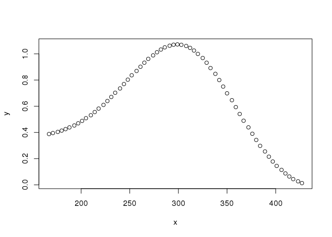

``` r
peak_occurrence_df <- read_csv("../07_conservative_reservoirs/results/peak_occurrence_df.csv")
```

    ## Parsed with column specification:
    ## cols(
    ##   gene_id = col_character(),
    ##   gene_name = col_character(),
    ##   gene_type = col_character(),
    ##   chr = col_character(),
    ##   X3kb_up_tss_start = col_double(),
    ##   strand = col_character(),
    ##   number_of_dbp = col_double(),
    ##   tpm_cytosolic_fraction = col_double(),
    ##   tpm_insoluble_cytoplasmic_fraction = col_double(),
    ##   tpm_membrane_fraction = col_double(),
    ##   tpm_nuclear_fraction = col_double(),
    ##   tpm_total = col_double(),
    ##   hepg2_reservoir = col_double(),
    ##   k562_reservoir = col_double(),
    ##   k562_conservative_reservoir = col_double(),
    ##   promoter_median_tpm = col_double(),
    ##   promoter_max_tpm = col_double(),
    ##   hepg2_conservative_reservoir = col_double()
    ## )

DBP promoter binding density plot
---------------------------------

This plot is intruiging. Since we have an unprecedented number of ChIP-seq experiments in one cell line, it has not likely been previously observed that there are a large number of promoters with ~300 DBPs bound there.

``` r
ggplot(peak_occurrence_df, aes(x = number_of_dbp)) + stat_density(trim = TRUE)
```


This by default the density calculated here from ggplot is using a gaussian kernel and bw.nrd0. It also is not a bounded density estimate which may cause issues especially at the zero boundary. Regardless since ggplot doesn't return this data we will have to recalculate the kernel density estimate and we might as well do it with a bounded estimator from the bde package. The ggplot version also does some smoothing which will cause problems at zero!

Define high-binding promoters
-----------------------------

#### Disclaimer

Note that this may be an artifact -- this paper does a knockout of there TFs they plan to ChIP and find a bunch of peaks still. I don't know if I trust this paper or their conclusions. Additionally their explanation is that active promoters provide this interference. I think in that case we would only see these at genes with RNA-seq read counts here. Firre is a notable counter example with ~250 DBPs bound and no expression -- although there are some reads at the promoter. Anyway, for completeness and later follow up the reference is here: [Jain et al. 2015](https://doi.org/10.1093/nar/gkv637) Also, see: [Teytelman 2013 PNAS](https://dx.doi.org/10.1073%2Fpnas.1316064110), [Worsley Hunt 2015 NAR](https://dx.doi.org/10.1186%2Fs13059-014-0412-4). However, this finding is intriguing enough to follow up on despite these caveats -- especially because we see it at genes with low expression as well.

### Kernel density estimation

``` r
dbp_density <- bde(peak_occurrence_df$number_of_dbp, estimator = "betakernel",
                   lower.limit = 0, upper.limit = max(peak_occurrence_df$number_of_dbp))
dbp_density_df <- data.frame(x = round(seq(1,max(peak_occurrence_df$number_of_dbp), 
                                           length.out = length(dbp_density@densityCache))), 
                             dens = dbp_density@densityCache)
ggplot(dbp_density_df, aes(x = x, y = dens)) + geom_point()
```


``` r
# This looks strikingly different enough. Let's make sure it integrates to ~1
trapz(seq(0,1,length.out = 101), dbp_density_df$dens)
```

    ## [1] 0.8252182

``` r
# This also looks about right because we have ~7k genes with 0 DBPs
# and ~2k with 1 or ~3.5x
dbp_counts <- table(peak_occurrence_df$number_of_dbp)
head(dbp_counts[order(-dbp_counts)])
```

    ## 
    ##    0    1    2    3    4    5 
    ## 6720 1894 1301  945  693  578

So, this looks pretty different which is due to how the boundary conditions are handled. This should look at lot more like the histogram though.

``` r
ggplot(peak_occurrence_df, aes(x = number_of_dbp)) + 
  geom_histogram(bins = 45)
```


Okay, sweet. So now we have a density estimate to fit a model to.

### DBP count model

We can model the leftmost part of this distribution with a zero-inflated negative binomial, since this count data will be overdispersed and enriched for zeros -- which is a bit typical for discrete biological data (RNA-seq counts are also modeled with a negative binomial). The interesting hump at the high binders just looks like a gaussian -- which raises a lot of interesting questions!

Why is there something special at ~300 DBPs? Is that just due to the DBPs that were selected? Are there some constraints on condensate size at 300 or something? Or if this is an artifact of promoters that are always detected as "bound" is this just gaussian noise introduced from the peak calling of these regions? For this last question, maybe look at the distribution of peak enrichment / quality scores for these peaksets at high binders vs other promoters?

That's an aside. Anyway, on to the curve fitting!

``` r
# Here's the model we'll use. It's a mixture model of a gaussian and 
# zero-inflated negative binomial. 
nzibinom_guass_mixture <- function(x, mu_nb, theta_nb, pi_nb, mu_g, sd_g, w1, w2) {
  f <- dzinbinom(x, mu = mu_nb, theta = theta_nb, pi = pi_nb) * w1 +
    dnorm(x, mean = mu_g, sd = sd_g) * w2
  return(f)
}
```

Using this function, we'll do a nonlinear least squares fit to our estimated density. Note that I fiddled around a lot to find the starting values that were reasonable -- it's pretty much an art not a science to find reasonable initial paramters.

``` r
x <- dbp_density_df$x
y <- dbp_density_df$dens
set.seed(9876)
dens_nls_fit <- nls_multstart(y ~ nzibinom_guass_mixture(x, mu_nb, 
                                                         theta_nb, pi_nb, mu_g, sd_g, w1, w2),
                              iter = 10000,
                              start_lower = c(mu_nb = 4,
                                              theta_nb = 0.5, 
                                              pi_nb = 0.3, 
                                              mu_g = 250, 
                                              sd_g = 30, 
                                              w1 = 1000, 
                                              w2 = 30),
                              start_upper = c(mu_nb = 20,
                                              theta_nb = 1, 
                                              pi_nb = 0.99, 
                                              mu_g = 350, 
                                              sd_g = 80, 
                                              w1 = 3000, 
                                              w2 = 100),
                              algorithm = "port",
                              lower = c(0, 0, 0, 0, 0, 0, 0),
                              upper = c(400, 1, 0.99, 400, 200, 4000, 200),
                              control = list(maxiter = 5000),
                              supp_errors = "Y",
                              convergence_count = 100)
# Let's check out the fit.
dens_nls_fit
```

    ## Nonlinear regression model
    ##   model: y ~ nzibinom_guass_mixture(x, mu_nb, theta_nb, pi_nb, mu_g, sd_g,     w1, w2)
    ##    data: data
    ##     mu_nb  theta_nb     pi_nb      mu_g      sd_g        w1        w2 
    ## 4.618e+01 1.916e-01 9.110e-04 2.915e+02 6.076e+01 3.149e+02 1.505e+02 
    ##  residual sum-of-squares: 0.6729
    ## 
    ## Algorithm "port", convergence message: Relative error in the sum of squares is at most `ftol'.

``` r
summary(dens_nls_fit)
```

    ## 
    ## Formula: y ~ nzibinom_guass_mixture(x, mu_nb, theta_nb, pi_nb, mu_g, sd_g, 
    ##     w1, w2)
    ## 
    ## Parameters:
    ##           Estimate Std. Error t value Pr(>|t|)    
    ## mu_nb    4.618e+01  6.959e+00   6.636 2.05e-09 ***
    ## theta_nb 1.916e-01  6.360e-03  30.129  < 2e-16 ***
    ## pi_nb    9.110e-04  5.293e+02   0.000    1.000    
    ## mu_g     2.915e+02  1.521e+00 191.632  < 2e-16 ***
    ## sd_g     6.076e+01  1.818e+00  33.418  < 2e-16 ***
    ## w1       3.149e+02  1.668e+05   0.002    0.998    
    ## w2       1.505e+02  5.168e+00  29.132  < 2e-16 ***
    ## ---
    ## Signif. codes:  0 '***' 0.001 '**' 0.01 '*' 0.05 '.' 0.1 ' ' 1
    ## 
    ## Residual standard error: 0.08461 on 94 degrees of freedom
    ## 
    ## Algorithm "port", convergence message: Relative error in the sum of squares is at most `ftol'.

``` r
plot(dens_nls_fit)
```


``` r
plot(dens_nls_fit, xlim = c(0,3))
```


``` r
# Okay, jesus. That is the strangest residual plot I've ever seen.
# It probably means this is not the right model.
# I'll have to ask a statistician


fit_res <- tidy(dens_nls_fit) %>%
  as.data.frame() # sometimes tibbles are annoying
# Let's add the fit to the data frame and plot it
dbp_density_df$fit <- predict(dens_nls_fit)

ggplot(dbp_density_df, aes(x = x, y = dens)) +
  geom_point() +
  geom_line(aes(y = fit), color = "#a8404c") + 
  ggtitle("Promoter DBP count density", subtitle = "Est. density vs. mixture model fit")
```


Cool, well now that we have some of the parameters let's spice up the plot a bit by adding our selection/ definition of high binding promoters.

``` r
# We mostly care about the gaussian mean and standard deviation, so let's grab those values.
(mu <- fit_res[fit_res$term == "mu_g", "estimate"])
```

    ## [1] 291.5317

``` r
(sd <- fit_res[fit_res$term == "sd_g", "estimate"])
```

    ## [1] 60.7585

``` r
ggplot(dbp_density_df, aes(x = x, y = dens)) +
  geom_point() +
  geom_line(aes(y = fit), color = "#a8404c") + 
  geom_vline(xintercept = mu, lty = 2, color = "#424242") +
  geom_vline(xintercept = mu + 1*sd, lty = 1, color = "#424242") +
  geom_vline(xintercept = mu - 1*sd, lty = 1, color = "#424242") +
  ggtitle("Promoter DBP count density", subtitle = "Est. density vs. mixture model fit")
```


### Define binding level

Okay, now let's annotate the binding level in our data.frame.

``` r
# Max "high binders"
round(mu + sd)
```

    ## [1] 352

``` r
# Min "high binders"
round(mu - sd)
```

    ## [1] 231

``` r
# We'll also use the quartiles for additional categories
quantile(peak_occurrence_df$number_of_dbp)
```

    ##   0%  25%  50%  75% 100% 
    ##    0    2   46  263  427

``` r
peak_occurrence_df$binding_level <- cut(peak_occurrence_df$number_of_dbp, 
                                        breaks = c(-1,0,46, round(mu - sd), round(mu + sd), 461),
                                        labels = c("zero", "low", "moderate", 
                                                   "enriched_bump", "extreme"))
table(peak_occurrence_df$binding_level)
```

    ## 
    ##          zero           low      moderate enriched_bump       extreme 
    ##          6720         11733          6908         10041          1412

``` r
write_csv(peak_occurrence_df, "results/peak_occurrence_df.csv")
```

#### Derivative method

Just for fun, let's see how it would look if we took the derivative approach. It's easy enough to implement, I had to do it as hw for like my first physics class in college :-) but the built in methods usually have better approximations. This will be a very rough estimate. We'll looking for the changepoints. The first derviative should give us the approximate center of the peak. The second derivative should give us the changepoints (inflection points) for either side of the hump.

``` r
library(numDeriv)

# Let's cut it down to just the portion with the hump
x <- x[40:101]
y <- y[40:101]
plot(x,y)
```



``` r
# Man, no wonder that gaussian didn't fit very well.

# Anyway here's the poor man's way of numerical differentiation.
finite_differences <- function(x, y) {
  
  n <- length(x)
  dx <- vector(length = n)
  
  # Forward differencing method
  for (i in 2:n) {
    dx[i-1] <- (y[i-1] - y[i]) / (x[i-1] - x[i])
  }
  # Backwards differencing method for the last point
  dx[n] <- (y[n] - y[n - 1]) / (x[n] - x[n - 1])
  
  return(dx)
}


d1 <- finite_differences(x,y)
# We should smooth it out before taking the second deriv
# otherwise -- propagating errors.
plot(x, d1)
```


``` r
d1 <- smooth(d1)
plot(x, d1)
```


``` r
d2 <- finite_differences(x,d1)

plot(x, d2)
```


``` r
d2 <- smooth(d2)
plot(x, d2)
```


``` r
# That's not too bad! Now we just need to find where they cross zero
plot(x, d1)
```


``` r
indicies <- 1:length(d1)
which.max(indicies[d1 > 0])
```

    ## [1] 31

``` r
d1[31]
```

    ## [1] 0.0005915236

``` r
d1[32]
```

    ## [1] -0.0007823519

``` r
# Jeez, that's really close to our fitted value and .. haha maybe more accurate
mean(x[31], x[32])
```

    ## [1] 295

``` r
mu
```

    ## [1] 291.5317

``` r
# Okay, now for the inflection points in the curve
plot(x, d2)
```


``` r
indicies[d2 > 0]
```

    ##  [1]  1  2  3  4  5  6  7  8  9 10 11 12 13 14 15 16 17 18 46 47 48 49 50 51 52 53 54 55 56 57 58

``` r
d2[18] 
```

    ## [1] 6.342959e-06

``` r
d2[19] # That was easy
```

    ## [1] 0

``` r
d2[20]
```

    ## [1] -6.548538e-05

``` r
d2[44]
```

    ## [1] -4.79965e-05

``` r
d2[45] # Hit it right on again!
```

    ## [1] 0

``` r
d2[46]
```

    ## [1] 4.823539e-05

``` r
# first inflection point
x[19]
```

    ## [1] 244

``` r
mu-sd
```

    ## [1] 230.7732

``` r
# Also pretty close

# Second
x[45]
```

    ## [1] 355

``` r
mu+sd
```

    ## [1] 352.2902

Okay, that's maybe too much fun for one night.
