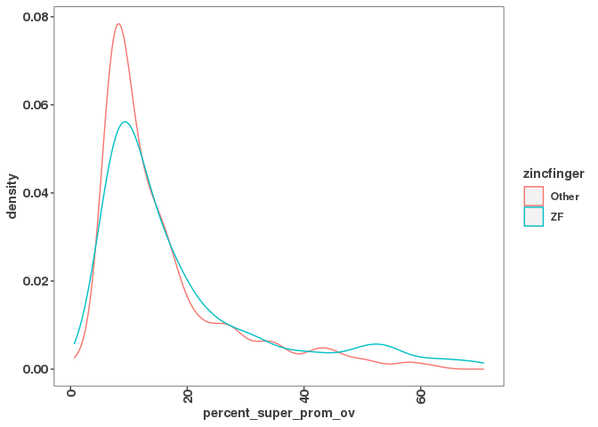
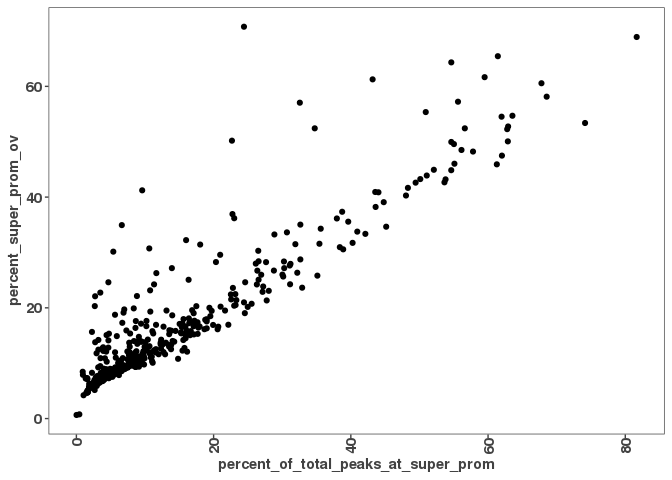

set working directory to 01\_global\_peak\_properties

import filtered consensus peaks and annotations:

``` r
filtered_consensus_peaks_files <- list.files("../00_consensus_peaks/results/chipseq/filtered_consensus", 
                                             pattern = "*.bed",
                                             full.names = TRUE)
filtered_consensus_peaks <- lapply(filtered_consensus_peaks_files, rtracklayer::import)

names(filtered_consensus_peaks) <- gsub("../00_consensus_peaks/results/chipseq/filtered_consensus/|_filtered_consensus_peaks.bed", "", filtered_consensus_peaks_files)

# Import annotations
lncrna_mrna_promoters <- rtracklayer::import("../00_consensus_peaks/results/lncrna_mrna_promoters.gtf")
lncrna_mrna_genebody <- rtracklayer::import("../00_consensus_peaks/results/lncrna_mrna_genebody.gtf")

lncrna_gene_ids <- lncrna_mrna_genebody$gene_id[lncrna_mrna_genebody$gene_type == "lncRNA"]
mrna_gene_ids <- lncrna_mrna_genebody$gene_id[lncrna_mrna_genebody$gene_type == "protein_coding"]
```

make num\_peaks\_df to hold our data:

``` r
num_peaks_df <- data.frame("dbp" = names(filtered_consensus_peaks),
                           "num_peaks" = sapply(filtered_consensus_peaks, length))


num_peaks_df$total_peak_length <- sapply(filtered_consensus_peaks, function(x) sum(width(x)))
```

add DBP info to num\_peaks\_df this counts the number of peaks in each promoter (if there are 2 peaks for one DBP in one promoter that will count as +2)

``` r
#make peak count matrix for each promoter (+- 3kb from TSS)
promoter_peak_counts <- count_peaks_per_feature(lncrna_mrna_promoters, filtered_consensus_peaks, type = "counts")

#add column to num_peaks_df that has the count of peaks in each promoter
num_peaks_df$peaks_overlapping_promoters <- rowSums(promoter_peak_counts)

#add column that has the number of peaks in lncRNA promoters only
num_peaks_df$peaks_overlapping_lncrna_promoters <- rowSums(promoter_peak_counts[,lncrna_gene_ids])

#add column that has the number of peaks in mRNA promoters only
num_peaks_df$peaks_overlapping_mrna_promoters <- rowSums(promoter_peak_counts[,mrna_gene_ids])
```

same as above but for gene bodies instead of promoters

``` r
#make peak count matrix for if a DBP binds in each gene body
genebody_peak_counts <- count_peaks_per_feature(lncrna_mrna_genebody, 
                                                filtered_consensus_peaks, 
                                                type = "counts")
#add info to num_peaks_df like above
num_peaks_df$peaks_overlapping_genebody <- rowSums(genebody_peak_counts)
num_peaks_df$peaks_overlapping_lncrna_genebody <- rowSums(genebody_peak_counts[,lncrna_gene_ids])
num_peaks_df$peaks_overlapping_mrna_genebody <- rowSums(genebody_peak_counts[,mrna_gene_ids])
```

adding if the DBPs were classified as TFs in another study and adding that to num\_peaks\_df

``` r
# The human TFs
# https://www.cell.com/cms/10.1016/j.cell.2018.01.029/attachment/ede37821-fd6f-41b7-9a0e-9d5410855ae6/mmc2.xlsx
human_tfs <- readxl::read_excel("/scratch/Shares/rinnclass/data/mmc2.xlsx",
                                sheet = 2, skip = 1)
```

    ## Warning in read_fun(path = enc2native(normalizePath(path)), sheet_i = sheet, :
    ## Expecting logical in M1006 / R1006C13: got 'Contains a SANT and multiple DNA-binding
    ## C2H2 domains. Motif is 99% AA ID from mouse (Transfac).'

    ## Warning in read_fun(path = enc2native(normalizePath(path)), sheet_i = sheet, :
    ## Expecting logical in M1021 / R1021C13: got 'Close ortholog (PP1RA) binds to mRNA;
    ## single-stranded DNA (ssDNA); poly(A) and poly(G) homopolymers (Uniprot)'

    ## Warning in read_fun(path = enc2native(normalizePath(path)), sheet_i = sheet, :
    ## Expecting logical in M1542 / R1542C13: got 'Contains 1 SANT domain'

    ## Warning in read_fun(path = enc2native(normalizePath(path)), sheet_i = sheet, :
    ## Expecting logical in M1543 / R1543C13: got 'Contains 2 Myb DBDs. Sources of
    ## Hocomoco/Transfac motifs are unclear. However these sequences look similar to in
    ## vitro sites selected by SELEX (PMID:11082045)'

    ## Warning in read_fun(path = enc2native(normalizePath(path)), sheet_i = sheet, :
    ## Expecting logical in M1544 / R1544C13: got 'Although CHD2 has weak similarity to
    ## a Myb domain (PMID:9326634), it's more closely related to the non-DNA-binding SANT
    ## domain based on our alignment analysis. The data showing that show that CHD2 binding
    ## histone H3.3 (PMID:22569126) further support the conclusion that the Myb domain is
    ## probably a SANT domain facilitating the histone interaction'

    ## Warning in read_fun(path = enc2native(normalizePath(path)), sheet_i = sheet, :
    ## Expecting logical in M1545 / R1545C13: got 'Contains a single SANT domain, no
    ## evidence for sequence-specific DNA binding'

    ## Warning in read_fun(path = enc2native(normalizePath(path)), sheet_i = sheet, :
    ## Expecting logical in M1546 / R1546C13: got 'Contains 2 Myb DBDs'

    ## Warning in read_fun(path = enc2native(normalizePath(path)), sheet_i = sheet, :
    ## Expecting logical in M1547 / R1547C13: got 'Contains 2 SANT domains, and no other
    ## putative DNA-binding domains'

    ## Warning in read_fun(path = enc2native(normalizePath(path)), sheet_i = sheet, :
    ## Expecting logical in M1548 / R1548C13: got 'Contains 2 SANT domains, and no other
    ## putative DNA-binding domains'

    ## Warning in read_fun(path = enc2native(normalizePath(path)), sheet_i = sheet, :
    ## Expecting logical in M1549 / R1549C13: got 'Contains a single SANT domain, no
    ## evidence for sequence-specific DNA binding'

    ## Warning in read_fun(path = enc2native(normalizePath(path)), sheet_i = sheet, :
    ## Expecting logical in M1550 / R1550C13: got 'Domain is truncated, and there is
    ## nothing known about this gene'

    ## Warning in read_fun(path = enc2native(normalizePath(path)), sheet_i = sheet, :
    ## Expecting logical in M1551 / R1551C13: got 'Contains a single SANT domain, no
    ## evidence for sequence-specific DNA binding'

    ## Warning in read_fun(path = enc2native(normalizePath(path)), sheet_i = sheet, :
    ## Expecting logical in M1552 / R1552C13: got 'MIER2's Myb domain is more similar to
    ## the non-DNA-binding SANT domain'

    ## Warning in read_fun(path = enc2native(normalizePath(path)), sheet_i = sheet, :
    ## Expecting logical in M1553 / R1553C13: got 'MIER3's Myb domain is more similar to
    ## the non-DNA-binding SANT domain'

    ## Warning in read_fun(path = enc2native(normalizePath(path)), sheet_i = sheet, :
    ## Expecting logical in M1554 / R1554C13: got 'Contains 1 SANT domain, and a SANTA
    ## domain'

    ## Warning in read_fun(path = enc2native(normalizePath(path)), sheet_i = sheet, :
    ## Expecting logical in M1555 / R1555C13: got 'Contains a single Myb-like domain with
    ## an insertion in the middle. It is ambiguous whether Myb-like domains are DNA or
    ## protein binding. Since it has a single domain it's likely non-specific, but future
    ## experiments should be performed to assay it's specificity'

    ## Warning in read_fun(path = enc2native(normalizePath(path)), sheet_i = sheet, :
    ## Expecting logical in M1556 / R1556C13: got 'Contains 3 Myb DBDs'

    ## Warning in read_fun(path = enc2native(normalizePath(path)), sheet_i = sheet, :
    ## Expecting logical in M1557 / R1557C13: got 'Contains 3 Myb DBDs'

    ## Warning in read_fun(path = enc2native(normalizePath(path)), sheet_i = sheet, :
    ## Expecting logical in M1558 / R1558C13: got 'Contains 3 Myb DBDs'

    ## Warning in read_fun(path = enc2native(normalizePath(path)), sheet_i = sheet, :
    ## Expecting logical in M1559 / R1559C13: got 'Contains a single Myb-like domain. Mouse
    ## ortholog has motif'

    ## Warning in read_fun(path = enc2native(normalizePath(path)), sheet_i = sheet, :
    ## Expecting logical in M1560 / R1560C13: got 'MYSM1 has been shown to bind DNA ?
    ## interaction with DNA requires the MYSM1 Myb but not the SWIRM domain (PMID:
    ## 17428495). Domain sequence alignment places it near DNA-binding Myb domains but
    ## scores slightly higher as a SANT rather than Myb domain based on Prosite patterns.
    ## Given that most Myb proteins that bind DNA sequence specifically have multiple Myb
    ## domains in an array this protein could bind DNA sequence non-specifically with it?s
    ## single Myb domain. Future experiments should assay MYSM1?s specificity'

    ## Warning in read_fun(path = enc2native(normalizePath(path)), sheet_i = sheet, :
    ## Expecting logical in M1561 / R1561C13: got 'Contains 2 SANT domains, and no other
    ## putative DNA-binding domains'

    ## Warning in read_fun(path = enc2native(normalizePath(path)), sheet_i = sheet, :
    ## Expecting logical in M1562 / R1562C13: got 'Contains 2 SANT domains, and no other
    ## putative DNA-binding domains'

    ## Warning in read_fun(path = enc2native(normalizePath(path)), sheet_i = sheet, :
    ## Expecting logical in M1564 / R1564C13: got 'Contains 2 SANT domains, and no other
    ## putative DNA-binding domains'

    ## Warning in read_fun(path = enc2native(normalizePath(path)), sheet_i = sheet, :
    ## Expecting logical in M1565 / R1565C13: got 'Contains 2 SANT domains, and no other
    ## putative DNA-binding domains'

    ## Warning in read_fun(path = enc2native(normalizePath(path)), sheet_i = sheet, :
    ## Expecting logical in M1566 / R1566C13: got 'Contains 2 SANT domains, and no other
    ## putative DNA-binding domains. RCOR3 SANT domains are known to facilitate PPIs'

    ## Warning in read_fun(path = enc2native(normalizePath(path)), sheet_i = sheet, :
    ## Expecting logical in M1567 / R1567C13: got 'SMARCA1 contains a truncated Myb-
    ## like and SANT domain. Given the presence of the Myb-like domain, and other domains
    ## known to associated with DNA (DEAD box helicase) it likely associates with DNA non-
    ## sequence-specifically'

    ## Warning in read_fun(path = enc2native(normalizePath(path)), sheet_i = sheet, :
    ## Expecting logical in M1568 / R1568C13: got 'Contains a SANT, and Myb-like domain'

    ## Warning in read_fun(path = enc2native(normalizePath(path)), sheet_i = sheet, :
    ## Expecting logical in M1569 / R1569C13: got 'Contains 1 SANT domain, and no other
    ## putative DNA-binding domains. Motif logos look like bZIP dimeric binding sites, and
    ## are thus likely specificifities of SMARCC1 interactors'

    ## Warning in read_fun(path = enc2native(normalizePath(path)), sheet_i = sheet, :
    ## Expecting logical in M1570 / R1570C13: got 'Contains 1 SANT domain, and no other
    ## putative DNA-binding domains. Motif logos ares likely specificifities of SMARCC2
    ## interactors'

    ## Warning in read_fun(path = enc2native(normalizePath(path)), sheet_i = sheet, :
    ## Expecting logical in M1571 / R1571C13: got 'Contains only Myb DBDs'

    ## Warning in read_fun(path = enc2native(normalizePath(path)), sheet_i = sheet, :
    ## Expecting logical in M1572 / R1572C13: got 'Contains 1 SANT domain'

    ## Warning in read_fun(path = enc2native(normalizePath(path)), sheet_i = sheet, :
    ## Expecting logical in M1573 / R1573C13: got 'TADA2B contains a single SANT domain and
    ## is thus unlikely to bind DNA'

    ## Warning in read_fun(path = enc2native(normalizePath(path)), sheet_i = sheet, :
    ## Expecting logical in M1574 / R1574C13: got 'Contains a single Myb domain (with
    ## slightly less simialrity to a SANT domain.) This domain has been shown to be
    ## involved in PPIs but this may not be mutually exclusive with DNA-binding. The
    ## sequence-specificity of CCDC79 should be investigated in the future'

    ## Warning in read_fun(path = enc2native(normalizePath(path)), sheet_i = sheet, :
    ## Expecting logical in M1575 / R1575C13: got 'Contains 1 Myb domain, and has
    ## structural evidence of DNA-binding'

    ## Warning in read_fun(path = enc2native(normalizePath(path)), sheet_i = sheet, :
    ## Expecting logical in M1576 / R1576C13: got 'Motif is inferred from mouse (92% DBD AA
    ## ID)'

    ## Warning in read_fun(path = enc2native(normalizePath(path)), sheet_i = sheet, :
    ## Expecting logical in M1577 / R1577C13: got 'TERF2IP contains a single Myb-like
    ## domain. While it's unclear if TERF2IP (Human Rap1) contacts DNA directly it has been
    ## shown to affect the DNA binding activity of TRF2'

    ## Warning in read_fun(path = enc2native(normalizePath(path)), sheet_i = sheet, :
    ## Expecting logical in M1578 / R1578C13: got 'This protein contains Myb, and Myb-
    ## like domains and is annotated as a Pol1 terminator. TTF1 DNA-binding has been
    ## demonstrated in vitro (PMID: 7597036), but it's specificity has not been determined'

    ## Warning in read_fun(path = enc2native(normalizePath(path)), sheet_i = sheet, :
    ## Expecting logical in M1579 / R1579C13: got 'Contains 1 Myb DBD'

    ## Warning in read_fun(path = enc2native(normalizePath(path)), sheet_i = sheet, :
    ## Expecting logical in M1580 / R1580C13: got 'Contains a GATA and SANT domain. Unclear
    ## whether the GATA domain is a bona fide DBD as the MTA/RERE family domains are
    ## atypical to human GATA domains (see alignment). In CIS-BP there is one protein from
    ## C.elegans that shares domain homology and binds a GATA motif (elg-27, ChIP-seq). The
    ## GATA ZnF domain of MTA1 is required for it's interaction with RBBP4 and RBBP7 (PMID:
    ## 18067919). Full-length protein has been tried in HT-SELEX and did not yield a motif'

    ## Warning in read_fun(path = enc2native(normalizePath(path)), sheet_i = sheet, :
    ## Expecting logical in M1581 / R1581C13: got 'Contains a GATA and SANT domain. Unclear
    ## whether the GATA domain is a bona fide DBD as the MTA/RERE family domains are
    ## atypical to human GATA domains (see alignment). In CIS-BP there is one protein from
    ## C.elegans that shares domain homology and binds a GATA motif (elg-27, ChIP-seq).
    ## Full-length protein has been tried in HT-SELEX, and DBD has been tried on PBM -
    ## neither yielded motifs'

    ## Warning in read_fun(path = enc2native(normalizePath(path)), sheet_i = sheet, :
    ## Expecting logical in M1582 / R1582C13: got 'Contains a GATA and SANT domain. Unclear
    ## whether the GATA domain is a bona fide DBD as the MTA/RERE family domains are
    ## atypical to human GATA domains (see alignment). In CIS-BP there is one protein from
    ## C.elegans that shares domain homology and binds a GATA motif (elg-27, ChIP-seq).
    ## Hasn't been tried in any in vitro assays'

    ## Warning in read_fun(path = enc2native(normalizePath(path)), sheet_i = sheet, :
    ## Expecting logical in M1583 / R1583C13: got 'Contains a GATA and SANT domain. Unclear
    ## whether the GATA domain is a bona fide DBD as the MTA/RERE family domains are
    ## atypical to human GATA domains (see alignment). In CIS-BP there is one protein from
    ## C.elegans that shares domain homology and binds a GATA motif (elg-27, ChIP-seq). Has
    ## been tried as a DBD in HT-SELEX but did not yield a motif'

    ## Warning in read_fun(path = enc2native(normalizePath(path)), sheet_i = sheet, :
    ## Expecting logical in M1791 / R1791C13: got 'CNOT3 is a part of the CCR4-NOT complex
    ## involved in mRNA decay'

    ## Warning in read_fun(path = enc2native(normalizePath(path)), sheet_i = sheet, :
    ## Expecting logical in M1932 / R1932C13: got '"Prosite identifies a low-confidence
    ## Myb-like domain (e.g. can?t decide between Myb and SANT) so it?s probably not a TF"'

    ## New names:
    ## * `` -> ...4

``` r
names(human_tfs)[4] <- "is_tf"

length(which(tolower(num_peaks_df$dbp) %in% tolower(human_tfs$Name)))
```

    ## [1] 438

``` r
human_tfs <- human_tfs[tolower(human_tfs$Name) %in% tolower(num_peaks_df$dbp), 1:4]
names(human_tfs) <- c("ensembl_id",
                      "dbp",
                      "dbd",
                      "tf")

num_peaks_df <- merge(num_peaks_df, human_tfs, all.x = T)
```

write out num\_peaks\_df

``` r
write_csv(num_peaks_df, "./results/num_peaks_df.csv")
```

make peak occurence matrix and add to num\_peaks\_df like above but using the occurance rather than the counts this is a binary output for if a DBP binds a promoter (if there are two peaks in a promoter for one DBP that will only report a 1)

``` r
promoter_peak_occurence <- count_peaks_per_feature(lncrna_mrna_promoters, filtered_consensus_peaks, 
                                               type = "occurrence")
# Output to promoter_peak_occurecne_matrix
write.table(promoter_peak_occurence, "./results/lncrna_mrna_promoter_peak_occurence_matrix.tsv")
# Now we want to make into a data frame using the promoter annotations as rows and attributes as columns.
# We will use lncrna_mrna_promoters to index "all promoters"
# First make sure promoter_peak_occurence and lncrna_mrna_promoters are in the same order
stopifnot(all(colnames(promoter_peak_occurence) == lncrna_mrna_promoters$gene_id))


#make a df to put our info in
peak_occurence_df <- data.frame("gene_id" = colnames(promoter_peak_occurence),
                                "gene_name" = lncrna_mrna_promoters$gene_name,
                                "gene_type" = lncrna_mrna_promoters$gene_type,
                                "chr" = lncrna_mrna_promoters@seqnames,   
                                "3kb_up_tss_start" = lncrna_mrna_promoters@ranges@start,
                                "strand" = lncrna_mrna_promoters@strand,
                                "number_of_dbp" = colSums(promoter_peak_occurence))
# This is the CSV file we will start building upon adding columns of properties as we analyze them
# The output file name will change based on what is added later, but the "peak_occurence_df" will be used throughout.
write_csv(peak_occurence_df, "./results/peak_occurence_dataframe.csv")
```

looking into super promoters (over 350 DBPs bound) and zinc fingers

``` r
#reload occurence matrix and num_peaks_df if needed and didn't run it in previous chunks
#occurence_matrix <- read.table("./results/lncrna_mrna_promoter_peak_occurence_matrix.tsv")
#num_peaks_df <- read.csv("./results/num_peaks_df.csv")

#making matrix of just super promoters
super_promoter <- occurence_matrix[, colSums(occurence_matrix) > 350]

#make df of all DBPs that bind at super promoters
super_promoter_dbps <- data.frame(dbp = rownames(super_promoter), num_super_promoter_overlaps = rowSums(super_promoter))

#add num_peaks_df info for DBPs that bind at super promoters, and add ZF data
super_prom_features <- merge(super_promoter_dbps, num_peaks_df)

super_prom_features <- dplyr::select(super_prom_features, dbp, num_super_promoter_overlaps, everything() )

super_prom_features <- super_prom_features %>%
  mutate(percent_super_prom_ov = num_super_promoter_overlaps/peaks_overlapping_promoters * 100, 
         percent_of_total_peaks_at_super_prom = num_super_promoter_overlaps/num_peaks * 100,
         zincfinger = ifelse(grepl(" ZF",dbd), "ZF", "Other"))

#check how many of the DBPs in our dataset are 
table(super_prom_features$zincfinger)
```

    ## 
    ## Other    ZF 
    ##   261   199

``` r
#plot likelyhood of ZFs to be in super pomoters vs other DBPs
ggplot(super_prom_features, aes(x = percent_super_prom_ov, color = zincfinger)) +
  geom_density()
```



``` r
#ploting percent of total peaks at super-prom vs percent super prom ov
ggplot(super_prom_features, aes(x = percent_of_total_peaks_at_super_prom, y = percent_super_prom_ov)) + 
  geom_point()
```



``` r
write.csv(super_prom_features, "./results/super_promoter_features.csv")
```
