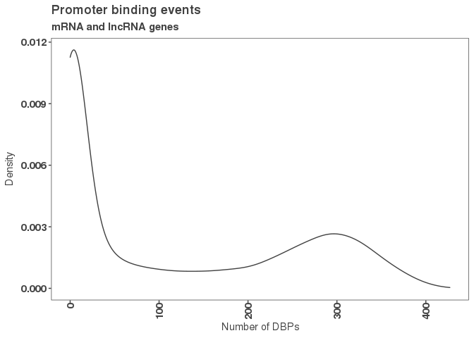
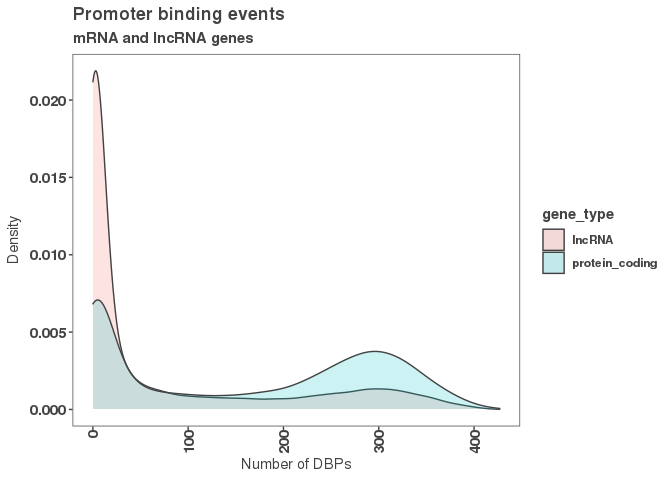
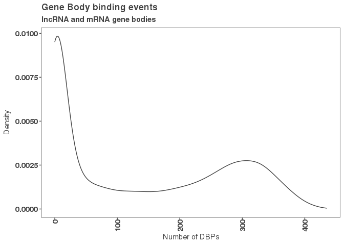
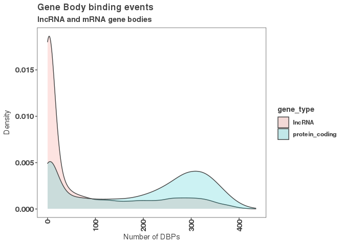

Load in our consensus peaks and peak occurrence matrices.

``` r
filtered_consensus_peaks_files <- list.files("../00_consensus_peaks/results/chipseq/filtered_consensus/",
                                             pattern = "*.bed",
                                             full.names = TRUE)
filtered_consensus_peaks <- lapply(filtered_consensus_peaks_files, rtracklayer::import)
names(filtered_consensus_peaks) <- gsub("../00_consensus_peaks/results/chipseq/filtered_consensus//|_filtered_consensus_peaks.bed", "", filtered_consensus_peaks_files)
num_peaks_df <- read_csv('../01_global_peak_properties/results/num_peaks_df.csv')
```

    ## 
    ## ── Column specification ──────────────────────────────────────────────────────────────────────────────────────
    ## cols(
    ##   dbp = col_character(),
    ##   num_peaks = col_double(),
    ##   total_peak_length = col_double(),
    ##   peaks_overlapping_promoters = col_double(),
    ##   peaks_overlapping_lncrna_promoters = col_double(),
    ##   peaks_overlapping_mrna_promoters = col_double(),
    ##   peaks_overlapping_genebody = col_double(),
    ##   peaks_overlapping_lncrna_genebody = col_double(),
    ##   peaks_overlapping_mrna_genebody = col_double(),
    ##   ensembl_id = col_character(),
    ##   dbd = col_character(),
    ##   tf = col_character()
    ## )

``` r
peak_occurrence_df <- read_csv('../01_global_peak_properties/results/peak_occurence_dataframe.csv')
```

    ## 
    ## ── Column specification ──────────────────────────────────────────────────────────────────────────────────────
    ## cols(
    ##   gene_id = col_character(),
    ##   gene_name = col_character(),
    ##   gene_type = col_character(),
    ##   chr = col_character(),
    ##   X3kb_up_tss_start = col_double(),
    ##   strand = col_character(),
    ##   number_of_dbp = col_double()
    ## )

Now load in promoter and gene body information for lncrnas and mrnas.

``` r
#gene bodies

lncrna_mrna_genebody <- rtracklayer::import("../00_consensus_peaks/results/lncrna_mrna_genebody.gtf")
mrna_genebody <- rtracklayer::import("../00_consensus_peaks/results/mrna_genebody.gtf")
lncrna_genebody <- rtracklayer::import("../00_consensus_peaks/results//lncrna_genebody.gtf")

#promoters
lncrna_mrna_promoters <- rtracklayer::import("../00_consensus_peaks/results/lncrna_mrna_promoters.gtf")
lncrna_promoters <- rtracklayer::import("../00_consensus_peaks/results/lncrna_promoters.gtf")
mrna_promoters <- rtracklayer::import("../00_consensus_peaks/results/mrna_promoters.gtf")
```

Convert GRanges to data frames and filter peak occurrence for lncrna or mrna peaks.

``` r
#g ranges to data frames
mrna_promoters_df <- as.data.frame(mrna_promoters)
lncrna_promoters_df <- as.data.frame(lncrna_promoters)

lncrna_genebodies_df <- as.data.frame(lncrna_genebody)
lncrna_genebodies_df <- as.data.frame(mrna_genebody)
lncrna_mrna_genebodies_df <-as.data.frame(lncrna_mrna_genebody)


#filter out the lncrnas, etc
peak_occurrence_lncrna <- filter(peak_occurrence_df, gene_type == "lncRNA")
peak_occurrence_mrna <- filter(peak_occurrence_df, gene_type == "protein_coding")
```

Convert them to data frames.

``` r
#g ranges to data frames
mrna_promoters_df <- as.data.frame(mrna_promoters)
lncrna_promoters_df <- as.data.frame(lncrna_promoters)

lncrna_genebodies_df <- as.data.frame(lncrna_genebody)
lncrna_genebodies_df <- as.data.frame(mrna_genebody)
lncrna_mrna_genebodies_df <-as.data.frame(lncrna_mrna_genebody)


#filter out the lncrnas, etc
peak_occurence_lncrna <- filter(peak_occurrence_df, gene_type == "lncRNA")
peak_occurence_mrna <- filter(peak_occurrence_df, gene_type == "protein_coding")
```

Now do some plotting! Plot distribution of DBPs for all promoters.

``` r
#plotting
g <- ggplot(peak_occurrence_df, aes(x = number_of_dbp))
g + geom_density(alpha = 0.2, color = "#424242") +
  theme_paperwhite() +
  xlab(expression("Number of DBPs")) +
  ylab(expression("Density")) +
  ggtitle("Promoter binding events",
          subtitle = "mRNA and lncRNA genes")
```



Now do the same, but separate lncRNA and mRNA promoters binding events.

``` r
#now, see if the double peak occurs for lncRNA and mRNA promoters
g <- ggplot(peak_occurrence_df, aes(x = number_of_dbp,fill = gene_type, color = gene_type))
g + geom_density(alpha = 0.2, color = "#424242") +
  theme_paperwhite() +
  xlab(expression("Number of DBPs")) +
  ylab(expression("Density")) +
  ggtitle("Promoter binding events",
          subtitle = "mRNA and lncRNA genes")
```



Now, calculate peak occurrences for gene bodies and see if a similar trend occurs.

``` r
#calculate peak counts for gene bodies
genebody_peak_occurrence <- count_peaks_per_feature(lncrna_mrna_genebody, 
                                                filtered_consensus_peaks, 
                                                type = "occurrence")

genebody_peak_occurrence_df <- data.frame("gene_id" = colnames(genebody_peak_occurrence),
                                "gene_name" = lncrna_mrna_genebody$gene_name,
                                "gene_type" = lncrna_mrna_genebody$gene_type,
                                "chr" = lncrna_mrna_genebody@seqnames,   
                                "3kb_up_tss_start" = lncrna_mrna_genebody@ranges@start,
                                "strand" = lncrna_mrna_genebody@strand,
                                "number_of_dbp" = colSums(genebody_peak_occurrence))
```

Let's plot and see!

``` r
#now, see if the double peak occurs for lncRNA and mRNA promoters
g <- ggplot(genebody_peak_occurrence_df, aes(x = number_of_dbp))
g + geom_density(alpha = 0.2, color = "#424242") +
  theme_paperwhite() +
  xlab(expression("Number of DBPs")) +
  ylab(expression("Density")) +
  ggtitle("Gene Body binding events",
          subtitle = "lncRNA and mRNA gene bodies")
```



And now, separate by gene body type (lncRNA or mRNA).

``` r
#now, see if the double peak occurs for lncRNA and mRNA promoters
g <- ggplot(genebody_peak_occurrence_df, aes(x = number_of_dbp, fill = gene_type, color = gene_type))
g + geom_density(alpha = 0.2, color = "#424242") +
  theme_paperwhite() +
  xlab(expression("Number of DBPs")) +
  ylab(expression("Density")) +
  ggtitle("Gene Body binding events",
          subtitle = "lncRNA and mRNA gene bodies")
```


