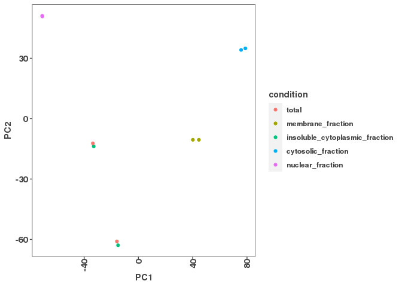
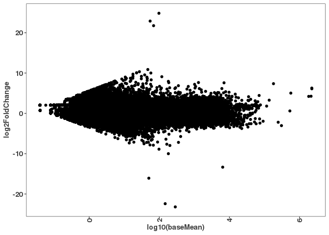
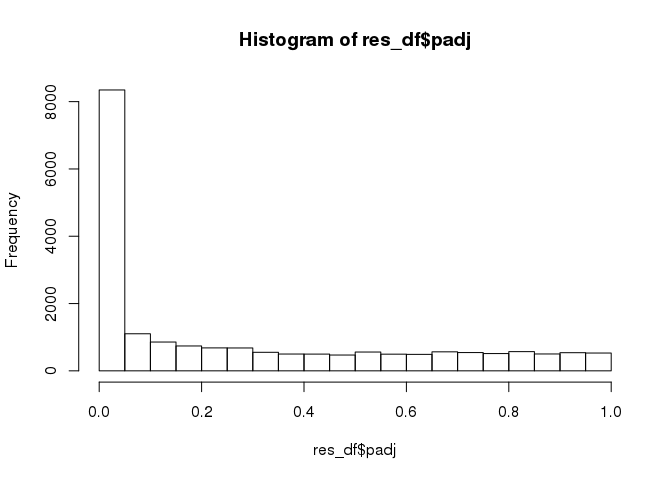
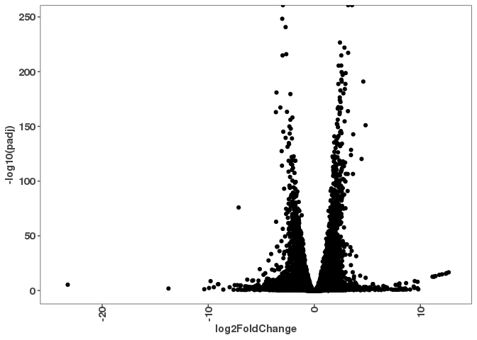
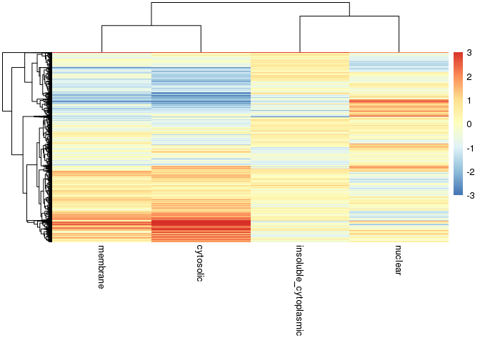
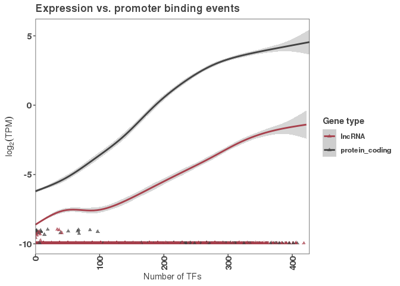

Now that we have our RNAseq data, we can start analyzing these reads and learn more about differential expression in different subcellular fractionations. Additionally, we can use this data set to learn more about the relationship between number of DNA binding proteins that bind to a promoter, and the expression from those promoters. This will let us see if we have resevoirs in our HepG2 cell lines.

First, read in the data from the sample sheet made in the 04\_01 Rmd.

``` r
samplesheet <- read_csv("/scratch/Shares/rinnclass/Group2/CLASS_2021/final_analysis/rnaseq/samplesheet.csv")
```

    ## 
    ## ── Column specification ───────────────────────────────────────────────────────────────────────────────────────────────────────────────────
    ## cols(
    ##   sample_id = col_character(),
    ##   sample_name = col_character(),
    ##   replicate = col_character(),
    ##   condition = col_character(),
    ##   cell_type = col_character(),
    ##   seq_type = col_character(),
    ##   fastq_1 = col_character(),
    ##   fastq_2 = col_character(),
    ##   md5sum_1 = col_character(),
    ##   md5sum_2 = col_character()
    ## )

Next, we are going to see differential expression from each subcellular fraction relative to total cell. The next few chunks will take this step by step to prepare the DESeq2 data frame.

First, we will read in the gene annotations which will let Salmon map transcripts to these different genes. Then we write out a new data frame with the gene names and ID for every gene.

``` r
# We want to include the gene annotation info in the DEseq2 object,
# so we'll need to read that in.
gencode_gtf <- rtracklayer::import("/scratch/Shares/rinnclass/data/genomes/gencode.v32.annotation.gtf")
genes <- gencode_gtf[gencode_gtf$type == "gene"]

# Salmon's primary level of quantifying is at the transcript-level.
# Since we're doing differential expression at the gene-level
# Salmon needs to be able to map transcripts to genes.
tx2gene <- gencode_gtf[gencode_gtf$type == "transcript"] %>% 
  as.data.frame() %>%
  dplyr::select(transcript_id, gene_id)

# We'll also create an object that maps gene IDs to gene symbols
# This will come in handy in looking at our results
g2s <- genes %>% as.data.frame() %>%
  dplyr::select(gene_id, gene_name)
```

Now we are reading in the count data from salmon:

``` r
# Read in the count data from salmon
# For DESeq2 we want the raw counts
# The easiest way to import it in the proper format is to 
# use the tximport package
files <- file.path("/scratch/Shares/rinnclass/Group2/CLASS_2021/final_analysis/rnaseq/results/star_salmon",
                   samplesheet$sample_name, 
                   "quant.sf")
names(files) <- samplesheet$sample_name

txi <- tximport(files, type = c("salmon"), tx2gene = tx2gene)
```

    ## reading in files with read_tsv

    ## 1 2 3 4 5 6 7 8 9 10 
    ## summarizing abundance
    ## summarizing counts
    ## summarizing length

Now we have the data read in from salmon, and the genes read in from gencode, but they are in different formats. To combine these data frames we need to format the two in the same way:

``` r
# Will be adding the gene information, the count data, and the sample information
# to the DESeq function. We want to ensure that all of this data is synced up
# So we need to reorder the data so that it's all matching.
names(genes) <- genes$gene_id
genes <- genes[rownames(txi$counts)]
stopifnot(all(genes$gene_id == rownames(txi$counts)))

# Create rownames for the sample sheet and then use that to re-order
samplesheet <- samplesheet %>%
  mutate(row_names = sample_name) %>%
  column_to_rownames("row_names")
samplesheet <- samplesheet[colnames(txi$counts),]
stopifnot(all(rownames(samplesheet) == colnames(txi$counts)))
```

Now that we have the two data frames in the same format, we can start putting them together and finally start the DESeq workflow.

``` r
samplesheet$condition <- factor(samplesheet$condition, levels = c("total", "membrane_fraction", 
                                                                  "insoluble_cytoplasmic_fraction", 
                                                                  "cytosolic_fraction", "nuclear_fraction"))

# Now we have all the components that we need to add to the 
# DESeq2 function. So now let's create our DEseq2 object
set.seed(789723)
dds <- DESeqDataSetFromTximport(txi,
                                design = ~ condition,
                                colData = samplesheet,
                                rowData = genes)
```

    ## using counts and average transcript lengths from tximport

Now we have the results in a format that DESeq can use, we simply run the DESeq function on that object.

``` r
dds <- DESeq(dds)
```

    ## estimating size factors

    ## using 'avgTxLength' from assays(dds), correcting for library size

    ## estimating dispersions

    ## gene-wise dispersion estimates

    ## mean-dispersion relationship

    ## final dispersion estimates

    ## fitting model and testing

We can start looking at the data, in this case with a PCA plot to see how the different replicates are lining up and if the RNAseq run/cellular fractionations were helpful. We can also plot this as a Volcano plot, MA plot, and P-value histogram to see how significant the differential expression is.

``` r
# The first thing that we'll want to do is make a PCA plot.
rlog_counts <- rlog(dds)

rld_pca <- prcomp(t(assay(rlog_counts)))
rld_prcomps <- rld_pca$x %>% as.data.frame() %>%
  rownames_to_column("sample_name") %>%
  select(sample_name, PC1, PC2)
rld_prcomps <- merge(samplesheet, rld_prcomps)
g <- ggplot(rld_prcomps, aes(x = PC1, y = PC2, color = condition))
g + geom_point() 
```



``` r
# We can now make some standard plots to check out these results

# Volcano plot
ggplot(res_df, aes(x = log2FoldChange, y = -log10(padj))) + 
  geom_point()
```

    ## Warning: Removed 167412 rows containing missing values (geom_point).


``` r
# MA plot
ggplot(res_df, aes(x = log10(baseMean), y = log2FoldChange)) + 
  geom_point()
```

    ## Warning: Removed 121212 rows containing missing values (geom_point).



``` r
# P-value histogram
hist(res_df$padj)
```



Oh no! Encode error! Some of the data has been mislabeled, so we will chet to fix this here:

``` r
# We of course need to swap the labels for total and insoluble cytoplasmic
# From looking in the browser at genes that should be nuclear: NEAT1 for ex.
# We have concluded that 
# hepg2_R2 -- is whole cell / total
# hepg2_insoluble_cytoplasmic_fraction_R2 -- is whole cell / total
# hepg2_R1 -- is insoluble_cytoplasmic
# hepg2_insoluble_cytoplasmic_fraction_R1 -- is insoluble_cytoplasmic

# The cleanest thing to do would be to fix it on the design file and re-run the nf-core pipeline,
# but for now we can swap it here.
samplesheet[which(samplesheet$sample_name == "hepg2_R1"), "condition"] <- "insoluble_cytoplasmic_fraction"
samplesheet[which(samplesheet$sample_name == "hepg2_insoluble_cytoplasmic_fraction_R2"), "condition"] <- "total"
```

Now we will read in the raw counts from each fraction into the samplesheet, and then run DESeq on all of these new sample comparisons.

``` r
# We now won't filter the sample sheet and we'll read in all the data
files <- file.path("/scratch/Shares/rinnclass/Group2/CLASS_2021/final_analysis/rnaseq/results/star_salmon",
                   samplesheet$sample_name, 
                   "quant.sf")
names(files) <- samplesheet$sample_name

txi <- tximport(files, type = c("salmon"), tx2gene = tx2gene)
```

    ## reading in files with read_tsv

    ## 1 2 3 4 5 6 7 8 9 10 
    ## summarizing abundance
    ## summarizing counts
    ## summarizing length

``` r
# We'll do the same housekeeping as before to make sure the genes and the samples are in the same order as
# the count data.
names(genes) <- genes$gene_id
genes <- genes[rownames(txi$counts)]
stopifnot(all(genes$gene_id == rownames(txi$counts)))

# In order to make the total (whole cell) condition be the one that everything is compared back to
# we will want to set the factor levels with "total" first
samplesheet$condition <- factor(samplesheet$condition, levels = c("total", "membrane_fraction", 
                                                                  "insoluble_cytoplasmic_fraction", 
                                                                  "cytosolic_fraction", "nuclear_fraction"))

dds <- DESeqDataSetFromTximport(txi,
                                design = ~ condition,
                                colData = samplesheet,
                                rowData = genes)
```

    ## using counts and average transcript lengths from tximport

``` r
# Run the DESeq stats
dds <- DESeq(dds)
```

    ## estimating size factors
    ## using 'avgTxLength' from assays(dds), correcting for library size
    ## estimating dispersions
    ## gene-wise dispersion estimates
    ## mean-dispersion relationship
    ## final dispersion estimates
    ## fitting model and testing

Now that we have all of the raw counts read in, and the DESeq anlysis done successfully, we can start anaylizing all of this data. We can look at this as raw counts and fold changes, or we can "shrink" this data and look at log2 fold changes. We can plot all of this data and see how the shrunken data set looks.

``` r
# We now have a bunch more results
resultsNames(dds)
```

    ## [1] "Intercept"                                         "condition_membrane_fraction_vs_total"             
    ## [3] "condition_insoluble_cytoplasmic_fraction_vs_total" "condition_cytosolic_fraction_vs_total"            
    ## [5] "condition_nuclear_fraction_vs_total"

``` r
# Let's just look at one of the results


res <- results(dds, name = "condition_membrane_fraction_vs_total")

res_shrunken <- lfcShrink(dds, coef = "condition_membrane_fraction_vs_total",  res = res)
```

    ## using 'normal' for LFC shrinkage, the Normal prior from Love et al (2014).
    ## 
    ## Note that type='apeglm' and type='ashr' have shown to have less bias than type='normal'.
    ## See ?lfcShrink for more details on shrinkage type, and the DESeq2 vignette.
    ## Reference: https://doi.org/10.1093/bioinformatics/bty895

``` r
# Let's quickly compare the unshrunken vs shrunken fold changes.
res_df <- res %>% as.data.frame() %>%
  rownames_to_column("gene_id") %>%
  merge(g2s) %>%
  mutate(result_name = "condition_membrane_fraction_vs_total")

# Set the x-axes the same.
summary(res_df$log2FoldChange)
```

    ##    Min. 1st Qu.  Median    Mean 3rd Qu.    Max.    NA's 
    ## -23.246  -0.778   0.038   0.141   1.302  22.345   30303

``` r
ggplot(res_df, aes(x = log2FoldChange, y = -log10(padj))) + 
  geom_point() + xlim(-24, 13)
```

    ## Warning: Removed 41994 rows containing missing values (geom_point).



``` r
res_shrunken_df <- res_shrunken %>% as.data.frame() %>%
  rownames_to_column("gene_id") %>%
  merge(g2s) %>%
  mutate(result_name = "condition_membrane_fraction_vs_total")

ggplot(res_shrunken_df, aes(x = log2FoldChange, y = -log10(padj))) + 
  geom_point() + xlim(-24, 13)
```

    ## Warning: Removed 41992 rows containing missing values (geom_point).

 Now that all of the data is read in, the DESeq is done, and we have checked that the log2 fold change worked correctly, we can start building our results data frame some more. We will have a data frame with the gene\_id, the mean counts, the log2 fold change, the shrunken changes, and the statistcal significance of these fold changes. We will use a for loop to put this together in a few lines of code instead of manually running this for all of the condition comparisons. Finally, we can cluster this data into a heatmap and look at gene expression in various subsellular fractions.

``` r
# Okay, now that we have results for each comparison back to total,
# we can combine the fold changes into a matrix and make a heatmap / cluster the genes
# By which cellular fraction they are enriched in.
# A good starting point would be to use a for loop to make a data.frame with all the results
# and then you can make that into a matrix with pivot_wider.
results_names <- resultsNames(dds)
# We don't care about the intercept, so we can leave that out
results_names <- results_names[-1]

res_df <- data.frame("gene_id" = character(), 
                     "baseMean" = numeric(), 
                     "log2FoldChange" = numeric(), 
                     "lfcSE" = numeric(),
                     "stat" = numeric(),
                     "pvalue" = numeric(),
                     "padj" = numeric(),
                     "gene_name" = character(),
                     "result_name" = character())

res_shrunken_df <- data.frame("gene_id" = character(), 
                              "baseMean" = numeric(), 
                              "log2FoldChange" = numeric(), 
                              "lfcSE" = numeric(),
                              "stat" = numeric(),
                              "pvalue" = numeric(),
                              "padj" = numeric(),
                              "gene_name" = character(),
                              "result_name" = character())


for(i in 1:length(results_names)) {
  results_name <- results_names[i]
  res <- results(dds, name = results_name)
  res_shrunken <- lfcShrink(dds, coef = results_name,  res = res)
  
  tmp_res_df <- res %>% as.data.frame() %>%
    rownames_to_column("gene_id") %>%
    merge(g2s) %>%
    mutate(result_name = results_name)
  
  
  tmp_res_shrunken_df <- res_shrunken %>% as.data.frame() %>%
    rownames_to_column("gene_id") %>%
    merge(g2s) %>%
    mutate(result_name = results_name)
  
  # Append to full data.frame
  res_df <- bind_rows(res_df, tmp_res_df)
  res_shrunken_df <- bind_rows(res_shrunken_df, tmp_res_shrunken_df)
}
```

    ## using 'normal' for LFC shrinkage, the Normal prior from Love et al (2014).
    ## 
    ## Note that type='apeglm' and type='ashr' have shown to have less bias than type='normal'.
    ## See ?lfcShrink for more details on shrinkage type, and the DESeq2 vignette.
    ## Reference: https://doi.org/10.1093/bioinformatics/bty895
    ## using 'normal' for LFC shrinkage, the Normal prior from Love et al (2014).
    ## 
    ## Note that type='apeglm' and type='ashr' have shown to have less bias than type='normal'.
    ## See ?lfcShrink for more details on shrinkage type, and the DESeq2 vignette.
    ## Reference: https://doi.org/10.1093/bioinformatics/bty895
    ## using 'normal' for LFC shrinkage, the Normal prior from Love et al (2014).
    ## 
    ## Note that type='apeglm' and type='ashr' have shown to have less bias than type='normal'.
    ## See ?lfcShrink for more details on shrinkage type, and the DESeq2 vignette.
    ## Reference: https://doi.org/10.1093/bioinformatics/bty895
    ## using 'normal' for LFC shrinkage, the Normal prior from Love et al (2014).
    ## 
    ## Note that type='apeglm' and type='ashr' have shown to have less bias than type='normal'.
    ## See ?lfcShrink for more details on shrinkage type, and the DESeq2 vignette.
    ## Reference: https://doi.org/10.1093/bioinformatics/bty895

``` r
# Let's move forward with the shrunken log fold-changes
# First let's label the genes as being significant in any condition or not.
res_shrunken_df <- res_shrunken_df %>%
  group_by(gene_id) %>%
  mutate(sig = ifelse(any(padj < 0.05), "sig", "ns"))

# Let's clean up the column names a little bit
res_shrunken_df <- res_shrunken_df %>%
  mutate(subcellular_fraction = gsub("condition_|_fraction_vs_total", "", result_name))

sig_res_shrunked_df <- res_shrunken_df %>%
  filter(sig == "sig")

lfc_matrix <- sig_res_shrunked_df %>% 
  dplyr::select(gene_id, log2FoldChange, subcellular_fraction) %>% 
  pivot_wider(names_from = "subcellular_fraction", values_from = "log2FoldChange") %>%
  column_to_rownames("gene_id") %>%
  as.matrix()

pheatmap::pheatmap(lfc_matrix, show_rownames = FALSE, breaks = seq(-3, 3, length.out = 100))
```



Ok, now that we have all of the RNAseq data read in, and the DESeq has successfully run, we can start putting together a master data frame that allows us to compare gene expression to promoter binding events at all of the promoters in our large data set.

Lets start by reading in the TPM counts from Salmon.

``` r
salmon_tpm <- read_tsv("/scratch/Shares/rinnclass/JR/CLASS_2021/rnaseq/results/star_salmon/salmon.merged.gene_tpm.tsv")
```

    ## 
    ## ── Column specification ───────────────────────────────────────────────────────────────────────────────────────────────────────────────────
    ## cols(
    ##   gene_id = col_character(),
    ##   hepg2_R1 = col_double(),
    ##   hepg2_R2 = col_double(),
    ##   hepg2_cytosolic_fraction_R1 = col_double(),
    ##   hepg2_cytosolic_fraction_R2 = col_double(),
    ##   hepg2_insoluble_cytoplasmic_fraction_R1 = col_double(),
    ##   hepg2_insoluble_cytoplasmic_fraction_R2 = col_double(),
    ##   hepg2_membrane_fraction_R1 = col_double(),
    ##   hepg2_membrane_fraction_R2 = col_double(),
    ##   hepg2_nuclear_fraction_R1 = col_double(),
    ##   hepg2_nuclear_fraction_R2 = col_double()
    ## )

``` r
# We want to summarize the TPM values for each subcellular fraction, so we'll take the 
# mean of the two replicates
tpm <- salmon_tpm %>% pivot_longer(cols = 2:ncol(.), names_to = "sample_name", values_to = "tpm") %>%
  merge(samplesheet) %>%
  group_by(gene_id, condition) %>%
  summarize(tpm = mean(tpm, na.rm = T)) %>%
  pivot_wider(names_from = condition, values_from = tpm, names_prefix = "tpm_")
```

    ## `summarise()` has grouped output by 'gene_id'. You can override using the `.groups` argument.

Next, lets read in the promoter\_features\_df and merge our data frames together.

``` r
promoter_features_df <- read.csv("/scratch/Shares/rinnclass/JR/CLASS_2021/analysis/01_global_peak_properties/results/peak_occurence_dataframe.csv")
# Now we can merge in the TPM data to this data.frame
promoter_features_df <- merge(promoter_features_df, tpm)
```

We can cluster these TPMs and plot as a heat map to see normalized counts across cellular fractions.

``` r
# We need to turn this into a matrix
tpm_matrix <- tpm %>% 
  column_to_rownames("gene_id") %>%
  as.matrix()

# And z-scale each row.
tpm_scaled <- t(scale(t(tpm_matrix)))

# Remove NAs with the complete.cases function
?complete.cases
tpm_scaled <- tpm_scaled[complete.cases(tpm_scaled),]

pheatmap::pheatmap(tpm_scaled, show_rownames = FALSE)
```


Ok, so now we have a data frame that has the TPM for each gene, as well as the number of DNA binding proteins on each promoter, so lets take a look at the relationship between gene expression and DNA binding protein binding events on the promoter:

``` r
# Total
# We're plotting only a trend line here with geom_smooth
# But we're also adding in the points for those with no expression (as triangle shapes)
# The ones with high number of DBPs and no expression are our reservoirs
ggplot(promoter_features_df, 
            aes(y = log2(tpm_total + 0.001), x = number_of_dbp, color = gene_type)) + 
  geom_point(data = promoter_features_df %>% filter(tpm_total < 0.001),
             shape = 17, alpha = 0.7) +
  geom_smooth(method = 'gam', formula = y ~ s(x, bs = "cs")) +
  # stat_cor() +
  scale_x_continuous(expand = c(0,0)) +
  scale_color_manual(values = c("#a8404c", "#424242"), name = "Gene type") + 
  ggtitle("Expression vs. promoter binding events") + 
  xlab(expression('Number of TFs')) +
  ylab(expression(log[2](TPM)))
```



``` r
# Do all of the high binder genes with no expression have a TF that is shared in all cases, i.e a trxn shut off protein?
```

So we saw that there are some genes with a high number of binding events that have no gene expression! This likely means that we have resevoirs in the HepG2 cell line, so lets add in a new column to our promoter\_features\_df that defines a resevoir as a promoter with over 100 DBP and TPM expression of 0.

``` r
# We'll use a cutoff of 100 DBPs here, but we can think more about 
# what would be a reasonable cutoff here.
promoter_features_df$hepg2_reservoir <- 
  as.numeric(promoter_features_df$number_of_dbp > 100 & 
               promoter_features_df$tpm_total < 0.001)

table(promoter_features_df$hepg2_reservoir)
```

    ## 
    ##     0     1 
    ## 35261  1553

This is interesting, but lets also read in the resevoirs from the previous K562 cell line so we can see if there are promoters that are resevoirs across cell lines:

``` r
k562_df <- read.csv("/scratch/Shares/rinnclass/data/2020_peak_occurence_df.csv")

# To compare these reservoirs to this year's dataset, we can just merge in the relevant columns
k562_reservoir <- k562_df %>% 
  dplyr::select(gene_id, reservoir, conservative_reservoir) %>%
  dplyr::rename(k562_reservoir = reservoir, 
                k562_conservative_reservoir = conservative_reservoir)

promoter_features_df <- merge(promoter_features_df, k562_reservoir)

# Make a table of reservoir status
res_status <- promoter_features_df %>% 
  group_by(hepg2_reservoir, k562_reservoir, k562_conservative_reservoir) %>%
  summarize(count = n())
```

    ## `summarise()` has grouped output by 'hepg2_reservoir', 'k562_reservoir'. You can override using the `.groups` argument.

Ok, we have a ton of data now, so lets read out our data frames as csv to easier read in the future.

``` r
# We can now write these out for safekeeping / use in other analyses
write_csv(promoter_features_df, "/scratch/Shares/rinnclass/Group2/CLASS_2021/final_analysis/results/promoter_features_df.csv")
write_csv(tpm, "/scratch/Shares/rinnclass/Group2/CLASS_2021/final_analysis/results/mean_tpm_per_condition.csv")
write_csv(samplesheet, "/scratch/Shares/rinnclass/Group2/CLASS_2021/final_analysis/results/samplesheet.csv")
```

Wasn't that fun?!
