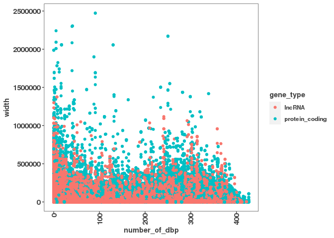
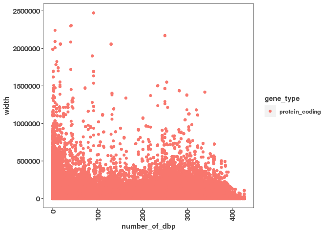
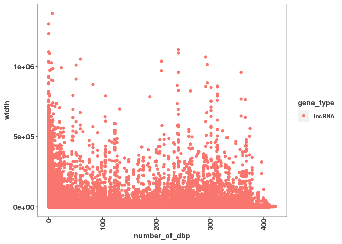

Read in the gencode data

``` r
gencode_gr <- rtracklayer::import("/scratch/Shares/rinnclass/data/gencode.v32.annotation.gtf")
```

Filter the gencode\_gr to give a data frame with the gene names, gene type, and gene length

``` r
gene_length_df <- data.frame("gene_id" = gencode_gr@elementMetadata$gene_id,
                              "gene_name" = gencode_gr@elementMetadata$gene_name,
                              "gene_type" = gencode_gr@elementMetadata$gene_type,
                              "type" = gencode_gr@elementMetadata$type,
                              "start" = gencode_gr@ranges@start,
                              "width" = gencode_gr@ranges@width)

mrna_gene_length_df <- filter(gene_length_df, gene_type == "protein_coding", type == "gene")
lncRNA_gene_length_df <- filter(gene_length_df, gene_type == "lncRNA", type == "gene")

gene_length_filtered_df <- rbind(mrna_gene_length_df, lncRNA_gene_length_df)
```

Combine this data frame with the peak\_occurrence\_df to add in gene length column and find if longer genes are enriched in the second peak.

``` r
peak_occurrence_df <- read_csv('../01_global_peak_properties/results/peak_occurence_dataframe.csv')
```

    ## 
    ## ── Column specification ────────────────────────────────────────────────────────────────────────────────────
    ## cols(
    ##   gene_id = col_character(),
    ##   gene_name = col_character(),
    ##   gene_type = col_character(),
    ##   chr = col_character(),
    ##   X3kb_up_tss_start = col_double(),
    ##   strand = col_character(),
    ##   number_of_dbp = col_double()
    ## )

``` r
#peak_occurrence_df <- column_to_rownames(peak_occurrence_df, var = "gene_name")

#gene_length_df <- column_to_rownames(gene_length_df, var = "gene_name")

peak_occurrence_gene_length_df <- merge(gene_length_df, peak_occurrence_df)

mrna_peak_occurrence_gene_length_df <- filter(peak_occurrence_gene_length_df, gene_type == "protein_coding")

lncRNA_peak_occurrence_gene_length_df <- filter(peak_occurrence_gene_length_df, gene_type == "lncRNA")
```

Find how gene length correlates with number of DBPs bound

``` r
ggplot(peak_occurrence_gene_length_df, aes(x = number_of_dbp,
                         y = width, color = gene_type)) +
  geom_point()
```



``` r
ggplot(mrna_peak_occurrence_gene_length_df, aes(x = number_of_dbp,
                         y = width, color = gene_type)) +
  geom_point()
```



``` r
ggplot(lncRNA_peak_occurrence_gene_length_df, aes(x = number_of_dbp,
                         y = width, color = gene_type)) +
  geom_point()
```



Filter the peak\_occurrence\_gene\_length\_df to give a data frame for each bump.
